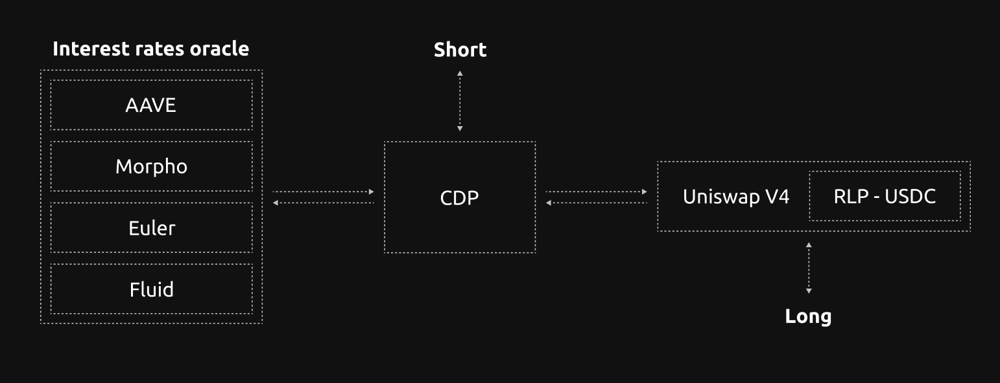

# RLD Paper

On-chain synthetic bonds and credit-default swaps.

## Abstract

Decentralized lending markets have matured into a multi-billion dollar ecosystem, yet participants remain exposed to extreme interest rate volatility and systemic liquidity risks. Current solutions, such as fixed-term interest rate swaps, suffer from liquidity fragmentation and capital inefficiency due to rigid expiration dates. 

This paper introduces Rate-Level Derivatives (RLD), a derivative structure that tracks the interest rate of a lending pool rather than an asset price, enabling one to go long/short on interest rates. By defining the index price as a scalar of the borrowing rate $P = K \cdot r_t$, RLD converts abstract yield volatility into a tradable, liquid asset. We demonstrate how using a lending protocol deposit tokens (e.g., aUSDC) as collateral, combined with a linear unwind powered by the Time-Weighted Average Market Maker (TWAMM) mechanisms, we can engineer **Synthetic Bonds** with fixed-yield or borrowing costs over any duration ranging from 1 block to 5 years without liquidity fragmentation. Finally, we demonstrate how RLD acts as a **Credit Default Swap (CDS),** creating an automated insurance market to protect against collateral bankruptcy. This architecture unifies fixed-income structuring, yield & volatility speculation, and protocol solvency insurance into a single, scalable liquidity layer built on Uniswap V4.

## 1. Introduction

Interest rates are the fundamental "price of money," serving as the bedrock for all capital asset pricing. In traditional finance (TradFi), the Interest Rate Derivatives (IRD) market dwarfs the spot market, processing trillions in daily volume to stabilize the global economy. As Decentralized Finance (DeFi) matures into a multi-billion dollar lending ecosystem, the need for similar stabilization mechanisms has become acute. However, the nature of interest rates in DeFi fundamentally differs from its traditional counterpart, requiring a novel approach to market structure.

### **1.1 Discretionary vs. Algorithmic Rates**

In TradFi, interest rates are largely **discretionary**. They move in predictable, measured increments (e.g., 25 basis points) following scheduled meetings by central banks or committees. Risk is often political or macroeconomic, unfolding over months.

In contrast, DeFi interest rates are **algorithmic** and governed by rigid smart contract logic -specifically, the "Utilization Rate" curve. When capital is abundant, rates hover near a practical floor linked to the Federal Reserve rate (4-4.25% as of Nov 2025). However, when demand spikes or liquidity contracts, the algorithm executes a deterministic "kink," sending borrowing costs from 5% to 20%, 50%, or even 100% within a single block. This creates a market structure defined by natural asymmetry: rates have a hard floor but an uncapped, explosive ceiling.

For market participants, this volatility is not a bug; it is a feature of the system designed to protect protocol solvency. Yet, for the borrower managing a portfolio or a DAO treasury planning a budget, this unpredictability is a critical liability.

### **1.2 The "Leveraged Beta" to Market Volatility**

Crucially, these algorithmic rates exhibit a distinct feedback loop with the broader crypto market, often acting as a leveraged proxy for asset prices. When asset prices rise, traders aggressively open leveraged long positions, draining stablecoin liquidity and driving up utilization. Consequently, borrowing costs do not merely track market activity; they amplify it.

.png)

Empirical data reveal that interest rates often exhibit higher sensitivity to market moves than even dedicated volatility indices. For instance, during the Bitcoin rally from $60k to $110k **(+83%)** in late 2024, USDC borrowing rates surged by **237%** (from 6.7% to 40+%). In contrast, the Deribit Volatility Index (DVOL) increased by only **5.4%** during the same period. This demonstrates that interest rates function as a "super-volatile" asset class, reacting far more violently to market exuberance than traditional volatility metrics suggest.

### **1.3 Liquidity fragmentation**

Attempts to handle this volatility have historically mirrored TradFi structures: fixed-term zero-coupon bonds or dated interest rate swaps. While functional, these models suffer from liquidity fragmentation. By splitting liquidity across specific maturities (e.g., expiring in March, June, and December), these protocols dilute the market depth, making entering or exiting a position costly and inefficient + need to handle execution rollover.

The market demands a solution that unifies liquidity into a single perpetual stream while retaining the precision required for fixed-income structuring.

### **1.4 The Default Mechanic: Interest Rates as Solvency Defense**

Beyond standard volatility, algorithmic rates serve a critical security function during crisis events, such as a stablecoin depeg or a protocol run-on-the-bank. When a collateral asset fails or depegs, market participants withdraw liquidity en masse, driving utilization to 100%.

](Code_Generated_Image_(4).png)

Source: [https://eulerscan.xyz/vault?chain=plasma&vault=0x57c582346b7d49a46af3745a8278917d1c1311b8](https://eulerscan.xyz/vault?chain=plasma&vault=0x57c582346b7d49a46af3745a8278917d1c1311b8)

Real-world events validate this mechanic. During the Stream Finance default on November 3, 2025, the protocol experienced a total liquidity freeze where `Total Borrows` equaled `Total Deposits`. In response, the algorithmic interest rate model instantly spiked borrowing costs from a baseline of ~12% to the cap of **75.0% APY**.

This deterministic behavior creates a unique opportunity: the interest rate effectively becomes a binary indicator of protocol solvency. A rate of 12% indicates health; a rate of 75% indicates a crisis. This predictability allows interest rate derivatives to function structurally as **Credit Default Swaps (CDS)**. A Long position that profits from a rate spike to 75% provides a mathematical payout of **~6.3x** relative to the baseline entry, effectively insuring the depositor against the frozen liquidity of the underlying protocol.

### **1.5 Rate-Level Perps: A Unified Primitive**

We propose **Rate-Level Perps (RLP)**, a financial primitive that transforms the ephemeral concept of "yield" into a persistent, tradable asset. 

This paper explores the evolution of RLP through three distinct layers of utility:

1. **The Instrument:** We first establish the core mechanism of the perpetual contract, utilizing concentrated liquidity to capture the mean-reverting nature of interest rates.
2. **Synthetic Bonds:** We demonstrate how wrapping RLP with automated market-making hooks allows users to construct "Synthetic Bonds." By mathematically unwinding the perpetual position over a set timeframe, we can synthesize fixed-rate behavior for any duration - from 1 block to 5 years - without fragmenting liquidity.
3. **CDS:** Finally, utilizing the crisis mechanics observed in November 2025, we address "tail risk." We show how RLP positions function as automated solvency insurance policies, protecting large depositors against depegs and liquidity freezes by monetizing the algorithmic rate spike.

By consolidating these functions into a single primitive, RLP offers a scalable foundation for the next generation of on-chain fixed income and risk transfer.

## 2. Mechanism

The Rate-Level Perp (RLP) utilizes a **Collateralized Debt Position (CDP)** architecture inspired by Power Perpetuals. This design allows for the creation of a fungible ERC-20 token that tracks the borrowing interest rate of a specific on-chain lending pool (e.g., Aave USDC, Morpho USDT).

### **2.1 The CDP Architecture**

The RLP Index Price transforms the annualized borrowing rate $r_t$ into a scalar value:

$$
P_{index}(t) = K \cdot r_t
$$

With $K=100$, a 5% interest rate ($r=0.05$) equals a $5.00 price. This linear scaling ensures that the derivative's payouts are intuitive: a doubling of the interest rate results in a doubling of the position value: at 5% → P = $5; at 10% → P = $10.

**2.1.1 Minting (Short Exposure)**

To open a Short RLP position (betting on stable or falling rates), a liquidity provider or yield hedger interacts with the Vault contract:

1. The user deposits eligible assets (e.g., aUSDC, ETH, sUSDe) into the Vault.
2. The user mints a specific quantity $Q$ of RLP tokens.
3. The contract records a debt of $NF (t) * P_{index}(t)$, where $P_{index}(t)$ is the current index price and $NF(t)$ is a normalization factor that accumulates a continuous funding rate.
4. The contract can be repaid at any time after repaying the whole debt value including any outstanding funding. 
5. The contract requires collateral be worth more than the debt. If the value of collateral falls below some multiple the debt value, the contract liquidates the collateral to repay the loan.

This mechanism creates a fungible asset that tracks $P_{index}$ and avoids machinery for paying or receiving cash funding. The perpetual should trade close to its debt value (adjusted for funding) in an external market - concentrated RLP/ USDC pool on Uniswap V4.

**2.1.2 Continuous Funding (Normalization Factor)**

Unlike traditional perpetuals that swap cash payments every hour, RLP employs **in-kind funding** by adjusting the global Normalization Factor. This continuously updates the debt burden for all minters without requiring active transactions.

The Funding Rate $F$ is calculated based on the divergence between the Market Price $P_{mkt}$, derived from the Uniswap pool) and the Index Price $P_{index}$:

$$
\text{Funding} = \frac{P_{mkt} - P_{index}}{P_{index}}
$$

The Normalization Factor updates each block to reflect this funding flow:

$$
NF(t+\Delta t) = NF(t) \cdot (1 - F \cdot \Delta t)
$$

- **$P_{mkt} > P_{index}$** the funding rate is positive. The Normalization Factor **decreases**. This reduces the debt burden for Shorts, effectively transferring value from Longs (who hold the overpriced token) to Shorts (who owe less debt).
- **$P_{mkt} < P_{index}$** the funding rate is negative. The Normalization Factor **increases**. Shorts see their debt inflate, effectively paying Longs a subsidy to hold the position.

**2.1.3 Long Exposure**

Users seeking exposure to rising interest rates (e.g., borrowers hedging variable loans) do not mint tokens. Instead, they simply **buy RLP tokens** on the Uniswap V4 pool.

- Payoff: The value of the RLP token tracks the Index Price $100 \times \text{Rate}$. If interest rates rise from 5% to 10%, the fundamental value of the token doubles from $5 to $10.
- Cost of Carry: If the market is bullish on rates, the token may trade at a premium $P_{mkt} > P_{index}$ While the Long holder does not pay an explicit fee, they pay implicitly through the funding rate.
- Funding Drag: the token price will tend to converge downward toward the Index Price over time as arbitrageurs mint new tokens to capture the premium.

Example: Long RLP (index = $5 → $10)

- Trader use $1,000 to buy `Q = 1000 / $5 = 200` RLP
- Price go from $5 to $10
- $\text{PnL} = \text{contracts}* (\text{P}_1 - \text{P}_0)$

Net profit $1000 or 2× on notional, before trading fees/funding.

**2.1.4 Repayment and Liquidation**

To close a Short position, the minter must return the borrowed quantity of RLP tokens to the Vault:

1. The Short buys RLP from the pool (or uses held tokens).
2. The tokens are burned to offset the debt.
3. The collateral is released.

**Liquidation:** The protocol requires a minimum сollateralization ratio (e.g., 109%). If a rate spike causes the Index Price $P_{index}$ to surge, the value of the Short's debt $Q \times NF \times P_{index}$ rises. If the debt value exceeds the liquidation threshold relative to collateral, the protocol auctions the collateral to buy back and burn the RLP debt.

### **2.2 Oracle Design**

The integrity of the Rate-Level Perp relies entirely on the accuracy and resilience of its index price feed. Unlike spot assets (e.g., ETH/USD), interest rates are purely on-chain values that can be mathematically derived and verified. To capitalize on this property, RLP employs a decentralized computation network powered by **Symbiotic**, designed to withstand flash-loan attacks, governance manipulation, and protocol insolvencies.

**2.2.1 Time-Weighted Average Rate (TWAR)**

DeFi interest rates are highly volatile and susceptible to ephemeral spikes caused by atomic transactions (e.g., flash loans) or short-term utilization shocks. A derivative settling on an instantaneous spot rate would expose users to unfair liquidations during these transient events.

To mitigate this, the oracle calculates a **Time-Weighted Average Rate (TWAR)** over a configurable window (typically 30-60 minutes). This smoothing function ensures the index tracks the *trend* of the cost of capital:

$$
P_{index}(t) = K \cdot \left( \frac{\sum_{i=1}^{N} r_i \cdot \Delta t_i}{\sum \Delta t_i} \right)
$$

This ensures that a single block spiking to 100% APR (due to a flash loan) has a negligible impact on the index price, while a sustained liquidity crisis (lasting hours) will correctly pull the price upward.

**2.2.2 Boundary Limits and Safety Caps**

To prevent catastrophic failure modes such as integer overflows or infinite debt spirals during a "hard default" of the underlying protocol, the oracle enforces strict boundary conditions on the raw data stream.

$$
r_{final} = \max(r_{min}, \min(r_{raw}, r_{max}))
$$

- Floor **$r_{min} = 0\%$:** Prevents negative interest rates, which will economically broke our derivative structure.
- Ceiling **$r_{max} = 100\%$:** The rate is capped at 100% (or the specific protocol's "Slope 2" maximum). This reflects the economic reality of a liquidity crisis—where rates hit a punitive ceiling to incentivize repayment—without allowing the rate to drift to infinity, which would break the solvency of the RLP system itself.

**2.2.3 Utilization Validity Check**

Since DeFi interest rates are deterministic functions of pool utilization, the oracle can perform a "Sanity Check" to verify that the reported interest rate matches the state of the pool. This protects against **Governance Attacks** (where a malicious DAO proposal alters the Interest Rate Model parameters to liquidate RLP positions).

For every update, the oracle performs a dual-verification:

1. State Query: Fetches totalBorrows and totalLiquidity to calculate Real Utilization $U_{real}$.
$U_{real} = \frac{\text{Total Borrows}}{\text{Total Liquidity}}$
2. Theoretical Calculation: Inputs $U_{real}$ into the protocol's immutable Interest Rate Model (IRM) logic locally to derive $r_{theoretical}$.
3. Deviation Check: $\Delta = |r_{reported} - r_{theoretical}|$
If $\Delta > \epsilon$, where $\epsilon$ is a safety threshold, e.g., 3%), the oracle rejects the update. This ensures RLP settles only on the *intended* algorithmic rate, effectively "forking away" from a compromised underlying protocol.

**2.2.4 Future Roadmap: ZK-Verified Storage Proofs**

The current design relies on cryptoeconomic consensus via Symbiotic. The roadmap evolves this into a trustless model using Zero-Knowledge (ZK) Storage Proofs.

- Concept: Instead of relying on operator consensus, a ZK-prover generates a validity proof attesting that:
    1. The storage slot for `borrowRate` on the Aave contract had value $X$ at block $N$.
    2. The TWAR calculation $f(X_1...X_n)$ was performed correctly according to the circuit logic.
- Benefit: This removes the need for trusted oracle operators entirely, allowing the RLP contract to mathematically verify the interest rate history of the underlying chain directly from block headers.

### 2.3 LPs on Uniswap

The Rate-Level Perp utilizes **Uniswap V4** as its primary trading venue. This choice is not merely for infrastructure, but because the market structure of interest rates is fundamentally distinct from directional assets (like ETH or BTC), making it uniquely suited for concentrated liquidity provisioning.

**The Mean-Reversion Advantage**

Standard directional assets typically exhibit "trending" behavior, where price discovery drives the asset into new ranges permanently (e.g., ETH moving from $1,000 to $3,000). For Liquidity Providers (LPs) in Automated Market Makers (AMMs), this creates Impermanent Loss (IL): as the price moves away from their liquidity range, they are effectively "selling the winner" and suffering relative losses.

Interest rates, however, exhibit strong mean-reversion. While they can spike violently during crises, economic forces invariably pull them back toward a central equilibrium (typically 4%–12%) over time.

- Low Volatility Regime: Rates hover near the "practical floor" linked to the Fed rate (~4%).
- High Volatility Regime: Rates spike during demand shocks but are forced down by loan repayments or new liquidity entering the pool.

This mean-reverting property transforms the LP strategy. Instead of chasing a moving target, LPs can provide liquidity in fixed, high-density ranges (e.g., 4%–15%) with a high probability that the price will oscillate within this band, generating consistent trading fees while minimizing the risk of permanent divergence.

## 3. Synthetic Bonds & Fixed Income Structuring

While Rate-Level Perps enable raw speculation, their primary utility lies in unlocking the **fixed-income markets.** By wrapping the perpetual contract with specific execution logic, RLP allows users to synthesize fixed-rate loans and guaranteed-yield bonds without the liquidity fragmentation that plagues existing solutions.

### **3.1 Fixed Yield**

Lenders can lock in a guaranteed return on their floating-rate assets (e.g., aUSDC, sUSDe) with a single transaction. This transforms a passive, volatile deposit into a deterministic financial instrument.

- The Problem: A lender depositing $100,000 into a lending protocol might see 15% APY during a bull run, but suffer a collapse to 2% during a "Crypto Winter." This volatility makes cash-flow planning impossible for DAOs and treasuries.
- The RLP Solution: The lender opens a **Short RLP** position.
    - Rates Fall: The protocol yield drops, but the Short RLP position gains massive value, mathematically offsetting the lost interest income.
    - Rates Rise: The protocol yield increases, covering the loss on the Short RLP position.
- The Result: The user walks away with a fixed yield (e.g., 10%) regardless of whether market rates crash to 0% or spike to 20%. This effectively creates an on-chain **"Synthetic Bond"** that turns uncertain future cash flows into a secured, predictable annuity.

### **3.2 Generalized Pricing Model**

**The Lifecycle Step-by-Step (Rates 5%):**

1. Initial Deposit: The user deposits $100,000 of **aUSDC** (Aave interest-bearing token) into the RLP Vault. This asset continues to earn the underlying Aave supply rate.
2. Minting (Short): The Vault calculates the required hedge size $Q$ and mints Short RLP tokens.
3. Monetization (Sell): The minted RLP tokens are immediately sold into the Uniswap V4 pool for USDC.
4. Looping: This newly acquired USDC is deposited back into Aave to mint *more* **aUSDC**.
5. Re-Collateralization: The new aUSDC is added to the Vault's collateral balance.

*Result:* The user now holds, e.g., $105,000 of aUSDC collateral against the RLP debt. They earn yield on $105k instead of $100k, creating a "Leveraged Yield" effect that helps offset funding costs.

To achieve precision, the Vault calculates the exact Hedge Quantity $Q$ required. This is not a simple 1:1 ratio; it must account for the specific mechanics of the underlying protocol, including continuous compounding and the divergence between supply and borrow rates.

We define the generalized hedge formula as:

$$
Q_{hedge} = \underbrace{\left( \frac{N}{K} \times T \right)}_{\text{Base Duration}} \times \underbrace{\gamma}_{\text{Compounding Scalar}} \times \underbrace{\beta}_{\text{Utilization Beta}}
$$

Where:

- **$N$** (Notional Principal): The dollar amount of capital being fixed.
- Base Duration**:** The linear relationship between Principal, the Index Constant $K=100$, and Tenor $T$.
- Compounding Scalar **$\gamma$:** Since protocols like Aave compound interest per second, a linear hedge underperforms over time. We apply a convexity multiplier to capture the "interest on interest":

$$
\gamma = \frac{e^{r \cdot t} - 1}{r \cdot t}
$$

      (For a 5-year bond at 5%, $\gamma \approx 1.136$, requiring a 13.6% larger hedge).

- Utilization Beta **$\beta$:** Lenders earn the Supply Rate $R_s$, but RLP tracks the Borrow Rate $R_b$. Since $R_s = R_b \times U \times (1 - \sigma)$, the hedge must be scaled down by the pool's Utilization $U$ and Reserve Factor $\sigma$:

$$
\beta = U_{avg} \times (1 - \sigma)
$$

---

### **3.3 Duration Risk & TWAMM**

The fundamental mismatch in DeFi derivatives is between **Perpetual Instruments** (infinite duration) and **Fixed Income** (finite duration). A 1-year bond has 365 days of interest rate risk on Day 1, but only 1 day of risk on Day 364. A standard perpetual hedge, however, remains static.

The "Over-Hedge" Trap

If a user holds a static RLP hedge until maturity without adjusting size, they become massively over-hedged as time passes. Consider a scenario where a user fixes a 10% rate for 1 year:

Day 1: Rate is 10%. Hedge is perfectly sized.

Day 180: Rate drops to 5%. The Short RLP position is highly profitable, offsetting the lost yield.

Day 364: Rate spikes back to 10%.

*Impact:* The user loses the accumulated profit on the Short RLP position because the price $100 \times 10\%$ returned to the entry level.

*Result:* The user suffered 6 months of low yield (5%) but has **zero hedge profit** to show for it because they held the full Short position until the end. They significantly underperform the promised fixed rate.

Mechanism: The TWAMM Unwind Hook

To solve this, we employ a **Time-Weighted Average Market Maker (TWAMM)** hook, leveraging the mechanism originally proposed by Paradigm to execute large orders over time with minimal price impact. In the context of RLP, we adapt this logic to programmatically reduce the user's hedge position size linearly over the lifespan of the bond, creating a Synthetic Expiry Date.

$$
Q(t) = Q_{initial} \times \left(1 - \frac{t}{T_{maturity}}\right)
$$

This linear decay ensures that the hedge size perfectly matches the remaining interest rate risk at every block.

- In the "Trap" scenario above, the TWAMM would have sold 50% of the position by Day 180, **locking in the profit** from the rate drop.
- When rates spiked back to 10% on Day 364, the user would hold almost zero debt, protecting their realized gains.

### 3.4 Liquidation Risk

A primary concern for any DeFi user is liquidation risk. Derivative strategies are typically associated with high leverage and volatility. However, the RLP Synthetic Bond is engineered to operate in a low-leverage, liquidation-resistant regime. This allows users to fix yields with the safety profile of a spot product rather than a leveraged gamble.

**Natural Over-Collateralization**

The safety of the structure is derived from the linear relationship between the interest rate and the hedge cost. Since the RLP Index Price is a scalar of the rate $P = 100 \cdot r$, the capital required to hedge a yield is proportional to the yield itself.

To hedge a 10% yield, the user must mint Short RLP debt equivalent to roughly 10% of their principal. 

Crucially, because RLP utilizes an Isolated Loop, the capital generated from selling the Short position is not lost; it is re-supplied as collateral, further boosting safety.

Example: Hedging a 10% Yield on $100,000

- Initial Principal: $100,000
- Minted Debt: ~$10,000 (Short RLP)
- Proceeds Re-supplied: $10,000 (Converted to aUSDC)
- Total Collateral: $110,000
- Initial LTV: $$\frac{10,000}{110,000} \approx {9.09\%}$

This implies a massive Collateralization Ratio (CR) of ~1,100% at inception, far exceeding the 109% liquidation threshold.

.png)

Because the position starts with such low LTV, it can withstand any volatility shocks of interest rates up to 100%. As the max LTV is 92% → 109% CR, liquidation for a 1-year bond will be only in the case of total bankruptcy. So, as long as the underlying market is solvent, there is no risk of liquidation. Also, as we gradually close our short position to achieve a fixed yield, we also reduce our risk as our debt becomes smaller with each block while accumulating interest.

### **3.5 Monte-Carlo simulation**

To validate the robustness of the Synthetic Bond architecture, we performed a Monte-Carlo simulation involving 1,000 randomized market scenarios over a 365-day maturity period. The simulation utilizes an Ornstein-Uhlenbeck (OU) process to model the mean-reverting stochastic behavior of DeFi interest rates, testing the protocol against three distinct market regimes: **Strong Bull** (Rates drifting to 25%), **Strong Bear** (Rates collapsing to 2%), and **Chaotic Volatility** (High variance).

**3.5.1 Methodology**

The simulation assumes a user opens a 1-year Synthetic Bond with a target fixed yield of 10% $r_{initial}=0.10$. The strategy employs the "Leveraged Loop" described in **Section 3.4**, where proceeds from the Short RLP sale are re-supplied to the lending protocol to generate a "Leveraged Yield" effect. The position is managed via the TWAMM mechanism, which linearly unwinds the hedge size $Q$ to zero over the duration of the bond.

**Simulation Parameters:**

- **Principal:** $100,000
- **Initial Rate:** 10.0%
- **Re-Supply Leverage:** ~1.1x (derived from Short proceeds)
- **Unwind Logic:** Linear decay via TWAMM $dQ/dt = constant$

**3.5.2 Yield Consistency Analysis**

The primary objective of the Synthetic Bond is to convert variable volatility into a deterministic fixed return. The results below demonstrate the efficacy of this conversion across 1,000 iterations per scenario.

.png)

1. **Strong Bull (Rates 10% → 25%):** The strategy effectively neutralizes the rising interest rate liability. The final effective yield averaged **11.62%**, slightly outperforming the 10% target. This "bonus yield" is attributable to the leveraged collateral earning the higher floating rate on the re-supplied portion of the capital.
2. **Strong Bear (Rates 10% → 2%):** Despite the underlying protocol yield collapsing to near-zero, the Short RLP position generated significant profit, compensating for the loss. The strategy delivered a floor yield of **10.87%**, proving that the hedge successfully locks the initial rate even during a liquidity surplus.
3. **Chaotic Volatility:** In scenarios with extreme variance $\sigma=0.40$, the TWAMM mechanism smoothed the daily noise, resulting in a stable mean yield of **11.78%** with a tight standard deviation.

**Key Finding:** The RLP Synthetic Bond functions not merely as a fixed-rate product, but as a "Floor + Upside" instrument. It guarantees the base rate during downturns while capturing a marginal spread during upturns due to the structural leverage of the hedge, while additional profit is enough to cover funding payments in a different market scenarios.

**3.5.3 Solvency & LTV Stress Test**

A critical concern for on-chain derivatives is liquidation risk. We tracked the Loan-to-Value (LTV) ratio of the position at every block to verify the "Natural Over-Collateralization" thesis presented in Section 3.4. The simulation results confirm that the strategy maintains a substantial safety margin across all market regimes.

- **Initial Safety:** The position opens with an LTV of ~9.09%, far below the liquidation limit of ~91.7% (which corresponds to a 109% Collateralization Ratio).
- **Bull Market Stress:** In the most adverse scenario (Green Line), where rates triple from 10% to 25%, the value of the Short debt increases significantly. However, the simulation reveals that the Maximum Observed LTV remains below 30%. This is because the programmed linear unwind reduces the notional debt size fast enough to counteract the rising index price.
- **Chaotic Market Stability:** In the chaotic scenario (Blue Line), characterized by extreme bidirectional volatility $\sigma=0.40$, the LTV remained stable, generally oscillating below **15%** with a max observed LTV of 50.5%. This demonstrates that the strategy is resilient not just to directional drift, but also to the high-frequency "noise" and sharp spikes typical of crypto market stress events.
- **Convergence:** In all scenarios, including the chaotic one, the LTV trends reliably toward 0% as the bond matures because of linear TWAMM unwind. This confirms that holding the position becomes mathematically safer over time, as the debt liability is systematically extinguished.

**3.5.4 Simulation Summary Table**

The following table summarizes the performance metrics of the Synthetic Bond across all three simulated market regimes (1,000 iterations per scenario).

| **Market Regime** | **Rate Behavior** | **Final Yield (Mean)** | **Yield Volatility (σ)** | **Max Observed LTV** | **Outcome** |
| --- | --- | --- | --- | --- | --- |
| Strong Bull | Rates rise 10%→25% | 11.62% | Low (±0.20%) | 26.1% | Outperformance
(Leveraged Yield Effect) |
| Strong Bear | Rates fall 10%→2% | 10.87% | Very Low (±0.13%) | 14.9% | Capital Protection
(Hedge Offset) |
| Chaotic | High Volatility (Mean 10%) | 11.78% | Moderate (±0.81%) | 50.5% | Noise Cancellation
(TWAMM Smoothing) |

*Note: The "Final Yield" consistently exceeds the 10% target due to the strategy's ability to compound returns on the re-supplied collateral, effectively creating a yield floor with upside potential.*

### 3.6 Custom Duration: Programmable Maturity

In traditional finance and current DeFi protocols, liquidity is fragmented across specific expiration dates (e.g., quarterly futures or dated zero-coupon bonds). This creates a liquidity trap: users must choose between an illiquid "perfect match" (e.g., a specific date bond with high slippage) or a liquid "mismatch" (e.g., a generic perpetual with duration risk).

**One Pool, Infinite Maturities**

RLP solves this by decoupling **liquidity** from **duration**. Because RLP is a perpetual instrument, duration is not a fixed property of the token but a programmable parameter of the user's Vault.

- **Unified Liquidity:** A single, deep liquidity pool (`RLP-USDC` on Uniswap V4) serves every possible time horizon. A user hedging a 1-week bond trader against the exact same liquidity as a treasury locking a 5-year bond. This aggregation minimizes slippage for all participants.
- **Precision:** Maturity can be defined down to the second. A corporate treasurer can structure a bond for exactly **47 days** to match a specific payroll liability, or a DAO can lock a **3.65-year** yield for its treasury, with zero penalty.
- **Flexibility:** Ranges can span from **1 block** to **10 years**, allowing for diverse strategies from high-frequency arbitrage to long-term solvency matching.

Technical Details: The Mathematics of Unwind

The duration of the synthetic bond is strictly determined by the rate of change of the hedge quantity $Q$ over time. This is governed by the TWAMM execution logic, which enforces a linear decay schedule. Let $T_{target}$ be the target duration (in seconds) and $Q_{initial}$ be the calculated hedge size. The Vault establishes a position function $Q(t)$ such that the hedge is fully closed exactly when $t = T_{target}$.

$$
Q(t) = Q_{initial} \cdot \left( 1 - \frac{t - t_{start}}{T_{target}} \right)
$$

**The Execution Rate:**

To achieve this schedule, the TWAMM hook executes a constant stream of sell orders every block. The rate of sale $\frac{dQ}{dt}$ is derived as:

$$
\frac{dQ}{dt} = - \frac{Q_{initial}}{T_{target}}
$$

This implies that for a 1-year bond $T = 31,536,000$ seconds, the protocol automatically sells $\frac{1}{31,536,000}$ of the initial position every second.

Continuous Duration Matching: at any specific moment $t$ during the lifecycle $0 < t < T_{target}$, the remaining size of the user's RLP position $Q_t$ is mathematically equivalent to a new bond with duration $T_{remaining} = T_{target} - (t - t_{start})$. This ensures that the user is never over-hedged or under-hedged; the "Size" of the position always equals the "Time" remaining in the contract. By executing this unwind via TWAMM, the user effectively realizes the Time-Weighted Average Price (TWAP) of the interest rate over the entire period, mathematically smoothing out volatility spikes and ensuring fair execution.

### 3.7 RWA Integration: The On-Chain Treasury

The Rate-Level Perp architecture is asset-agnostic. While its immediate application is hedging DeFi lending rates (Aave/Morpho), its most scalable utility lies in bringing the **$25 trillion US Treasury market** on-chain.

By swapping the underlying components - collateral and oracle - RLP allows users to synthesize United States Treasury Bills with programmable duration, 24/7 liquidity, and complete composability, effectively creating a "DeFi Prime Brokerage" for sovereign debt.

**Synthesizing the Risk-Free Rate**

Current tokenized T-Bill products (e.g., BlackRock’s BUIDL, Ondo’s USDY) offer excellent exposure to the floating "risk-free" rate but lack the duration management of traditional bond markets. A user cannot easily buy a "2-Year On-Chain Treasury" without facing liquidity fragmentation.

RLP solves this by allowing users to structure **Synthetic T-Bills** of any maturity.

- Programmable Duration: A user can construct a synthetic Treasury Note that matures in exactly 30 days or 10 years, perfectly matching their liability profile.
- 24/7 Liquidity: Unlike traditional bond markets which close on weekends and holidays, the RLP-synthesized bond relies on the Uniswap V4 perpetual pool, providing continuous liquidity.
- Boosted Yields: By utilizing the "Isolated Loop" architecture, advanced users can leverage their BUIDL exposure (e.g., 5x leverage) while hedging the rate risk. This allows them to amplify the base sovereign yield, capturing a "Boosted Risk-Free Rate" driven by the efficiency of on-chain capital markets.

**Technical Details: The SOFR Standard**

To construct a sovereign-grade bond, we modify the Vault's configuration to track the traditional finance benchmark rather than DeFi utilization curves.

Collateral (Tokenized T-Bills): In place of crypto-native assets, the Vault accepts tokenized securities such as BlackRock’s BUIDL, Ondo’s USDY, or Superstate’s USTB.

Oracle (SOFR): Instead of tracking Aave’s utilization curve, the RLP Index Price tracks the Secured Overnight Financing Rate (SOFR) - the global standard for dollar-denominated derivatives.

- Source: The Symbiotic network ingests the daily SOFR rate published by the Federal Reserve Bank of New York.
- Index Construction: $P_{index} = 100 \cdot \text{SOFR}$.
- Trading Venue: This creates a liquid market for the "Risk-Free Rate" directly on Uniswap V4.

**The Sovereign Loop:**

1. Deposit: User deposits BUIDL (earning floating T-Bill yield).
2. Mint: Vault mints Short RLP tokens tracking SOFR.
3. Sell & Loop: RLP tokens are sold for stablecoins to purchase more BUIDL.
4. Result: The user creates a position economically identical to a fixed-rate Treasury Bond, but with the added utility of being native to DeFi.

**Use Case: Tokenized Structured Products Issuers**

This infrastructure is critical for tokenized structured products issuers, such as Ethena or Resolv. 

Using RLP, an issuer can deposit capital into tokenized T-bill products and use the “Boosted Yield” loop to generate higher net interest income on their reserves while operating with fully custom maturities. By executing all yield management on-chain, issuers eliminate the friction and delay of traditional off-chain custodian interactions.

## 4. Fixed-rate borrow

While Section 3 focused on lenders seeking fixed yields, the inverse demand - **Fixed-Rate Borrowing** - is equally critical. In DeFi, variable-rate loans are a liability trap: a DAO or fintech lender might borrow at 4%, only to face 20% rates during a liquidity crunch. RLP solves this by allowing borrowers to hedge their interest rate liability, converting variable loans into **Fixed-Term Debt Obligations**.

### **4.1 Mechanism: Fixed-Term Debt Obligations**

To fix a borrowing cost, the user neutralizes the risk of rising rates by essentially "pre-paying" the interest at the current price by buying **Long RLP** tokens. The profit from this position during a rate spike $P_{index} \uparrow$ perfectly offsets the increased interest expense payable to the lending protocol.

Crucially, a fixed-rate loan requires the hedge to cover the interest risk **only for the remaining duration**. A static hedge would become "oversized" as time passes.

The RLP Vault utilizes a **TWAMM Unwind** to perfectly match the loan's amortization. The Long RLP position size $Q(t)$ is programmed to decay linearly:

$$
Q(t) = Q_{initial} \times \left(1 - \frac{t}{T_{maturity}}\right)
$$

This ensures that at any moment $t$, the hedge notional exactly equals the time value of the remaining debt.

Mechanism: The user holds a Long RLP position equal to the loan's duration.

Offset: If borrowing rates spike (Cost $\uparrow$), the Long RLP value rises (Hedge Profit $\uparrow$).

Result: The hedge profit subsidizes the extra interest. The borrower effectively pays the initial locked rate regardless of market volatility.

### **4.2 Case Study: Leveraged Basis-Trade Strategy**

The "Basis Trade" is currently DeFi's largest structured yield strategy. Users maximize capital efficiency by depositing a high-yield asset (e.g., Ethena’s **sUSDe**) and borrowing a low-cost stablecoin (e.g., **USDC**) to loop the exposure. Risk: if borrowing costs spike to match asset yields, the position’s profitability collapses.

RLP transforms this into a fixed-income strategy by using the debt capacity itself to fund a hedge.

**The Setup: 3x Hedged Loop:**

A trader starts with $100,000 capital. They target 3x Leverage on the spread between sUSDe (Yield) and USDC (Cost).

- Principal: $100,000
- Initial Rates: Asset Yield 5%, Borrow Cost 4%.
- Target Collateral: $300,000 sUSDe
- Base Debt: $200,000 USDC
- The Hedge: To lock the 4% Borrow Rate, the user buys Long RLP tokens covering the $200k liability.
    - *Cost:* $200,000 Liability $\times$ 4% Rate = $8,000
    - *Financing:* The user borrows this additional $8k.
- Initial LTV: $208k / 300k = \mathbf{69.3\%}$

**Bull Market Case:**

sUSDe yield rises to 10%, but USDC borrow costs rise to 9%.

1. **PnL:**
    - Gross Yield: $300,000 Collateral $\times$ 10% = +$30,000
    - Interest Expense: $208,000 Debt $\times$ 9% = -$18,720
        - *Note: Expense is higher because rates rose from 4% → 9%.*
2. **The Hedge Payoff:**
    - Rate Shift: 4% → 9%.
    - RLP Price Change: $4.00 → $9.00 (+$5.00/token).
    - Hedge Profit: 2,000 units $\times$ $5.00 = +$10,000
3. **Net Performance Comparison:**

| **Metric** | **Unhedged Loop (3x)** | **Hedged Loop (3x + RLP)** |
| --- | --- | --- |
| Gross Yield | $30,000 | $30,000 |
| Interest Expense | ($18,000) @ 9% on $200k | ($18,720) @ 9% on $208k |
| Hedge Profit | $0 | +$10,000 |
| Net Profit | $12,000 | $21,280 |
| ROI (on $100k) | 12.00% | 21.28% |

While the unhedged trader suffered from the rate hike, the hedged trader outperformed by 77%.

Effective Cost of Borrowing:

$$
\frac{\$18,720 \text{ (Interest)} - \$10,000 \text{ (Hedge PnL)}}{\$208,000 \text{ (Total Debt)}} = \mathbf{4.19\%}
$$

Even though market rates hit 9%, the user effectively paid ~4%. (The slight drift from 4.00% to 4.19% accounts for the interest paid on the $8k hedge financing).

### **4.3 Case Study: Fintech Lenders (The NIM Guarantee)**

Credit protocols lending to real-world businesses (RWAs) face a fatal asset-liability mismatch: they originate loans off-chain at Fixed Rates but borrow capital on-chain at Floating Rates.

The Setup: A protocol lends to a business at 10% Fixed APR $R_{asset}$ and borrows USDC on Aave at 5% Variable $r_{borrow}$.

The Risk: If DeFi rates spike to 12%, the protocol suffers a negative carry -2%, leading to insolvency.

The RLP Solution: The lender buys Long RLP to lock their cost of funds at the current market rate $r_{locked} = 6\%$.

Even if the Aave borrowing rate $r_t$ explodes to 20%, the Net Interest Margin (NIM) remains preserved:

$$
NIM = R_{asset} - \underbrace{(r_t - \text{HedgePayout})}_{\text{Effective Cost}}
$$

Since the Hedge  $\text{PnL}\approx (r_t - r_{locked})$, the term simplifies to:

$$
NIM = 10\% - (r_t - (r_t - 6\%)) = \mathbf{+4\% }
$$

### **4.4 Rate Arbitrage**

Beyond simple hedging, RLP enables a new class of ****Rate Arbitrage. In an efficient market, borrowing USDC on Aave and lending USDT on Euler should yield a spread near zero. In DeFi, liquidity fragmentation often creates massive, persistent spreads (e.g., Aave Borrow at 4% vs. Euler Supply at 8%).

**The Strategy: Synthetic Fixed Spread**

The goal is to lock in the **4% Net Spread** between Aave (Borrow) and Euler (Supply) without taking any rate risk.

**Leg 1: Fixed Liability (Aave)**

- Action: Borrow $1M USDC on Aave at 4%.
- Hedge: Buy Long RLP-Aave-USDC.
- Result: You have fixed your cost of capital at exactly 4% APY.

**Leg 2: Fixed Asset (Euler or Pendle)**

- Option A (RLP Synthetic Bond): Swap USDC for USDT, deposit into Euler, and mint Short RLP-Euler-USDT. This fixes the variable Euler yield at 8%.
- Option B (Pendle PT): Swap USDC for a Pendle Principal Token (PT) offering a guaranteed 8% fixed yield.

**The Outcome: Locked Pure Profit**

By combining a **Fixed-Rate Loan** (Leg 1) with a **Fixed-Yield Asset** (Leg 2), you construct a delta-neutral position. If Aave rates spike to 20%, your Long RLP pays you. If Euler rates crash to 1%, your Short RLP (or Pendle PT) protects your yield.

Gross Spread: $8\% - 4\% = 4\%$.

Both hedges are managed via the TWAMM mechanism, auto-deleveraging as the trade matures.
This effectively allows market makers to bridge liquidity between protocols, forcing borrowing rates to converge across the ecosystem while capturing a guaranteed, risk-free yield.

**Timing the Credit Cycle**

This structure is most powerful when used to Time the Macro Credit Cycle.

- Bear Market (Accumulation): During crypto winters, borrowing demand is low, and rates often floor at ~2%. Funds can lock in 2% borrowing costs for 3-5 years using Long RLP.
- Bull Market (Expansion): As the cycle turns and yields explode (e.g., 20%+ on farming opportunities), the fund deploys its cheap, locked capital.
- Opportunity: While competitors are forced to borrow at 15% to chase the new yields, the RLP user is still paying 2%. Their Net Interest Margin is structurally 13% higher than the market average, purely because they "bought the dip" on interest rates.

## 5. Volatility trading

While fixed income is the primary utility of RLP, the instrument also functions as a unique volatility derivative. Empirical analysis of DeFi markets reveals a profound structural link: **Interest Rate Volatility is a leveraged proxy for Crypto Asset Volatility.**

Just as the VIX Index measures expected volatility in the S&P 500, RLP prices measure the **expected demand for leverage** in crypto. Because borrowing rates are the "cost of leverage," an RLP position is effectively a bet on future (implied) market volatility. If traders expect a massive move (up or down), they demand leverage, driving rates up. Therefore, **Long RLP is structurally equivalent to Long Volatility.**

The chart below visualizes the relationship between ETH Price (Blue) and USDC Borrow Rates (Red) throughout 2025. While the assets generally move in tandem, periods of dislocation - specifically in Q4 - reveal the exact inefficiency RLP is positioned to capture.

.png)

### 5.1 Empirical Analysis: Cointegration & The "Lag" Thesis

Our analysis of the 2025 market cycle confirms that ETH Prices and DeFi Interest Rates are **Cointegrated**. This means that while they may drift apart due to inefficiencies, a fundamental economic force (leverage demand) always pulls them back into equilibrium.

- **The Mechanism:** In traditional finance, rates are set by central banks (slow). In DeFi, rates are set by algorithmic utilization curves (reactive). As prices break out, leverage builds up, but the corresponding spike in borrowing costs often trails the initial price move by 7–14 days.
- **The Structural Break (Q4 2025):** Notice in the charts above how Q1 and Q2 show tight coupling (Correlation > 0.90), while Q4 shows a complete decoupling (Correlation < 0.10). This regime change represents great opportunity for statistical arbitrage.

**Summary Statistics: ETH Price vs. Borrow Rates (2025)**

| **Period** | **Correlation** | **Correlation (7D MA)** | **Lag-7 Corr** | **Lag-14 Corr** | **Coint 
p-value** | **Regime** |
| --- | --- | --- | --- | --- | --- | --- |
| Full Year 2025 | 0.23 | 0.231 | 0.291 | 0.336 | 0.02 | Cointegrated (Equilibrium) |
| Q1 2025 | 0.96 | 0.977 | 0.955 | 0.912 | 0.0098 | Efficient Coupling |
| Q2 2025 | 0.77 | 0.899 | 0.869 | 0.777 | 0 | Efficient Coupling |
| Q3 2025 | 0.79 | 0.829 | 0.885 | 0.832 | 0.0675 | Weakening Link |
| Q4 2025 | 0.1 | 0.073 | 0.29 | 0.256 | 0.2413 | Dislocation (Arb Window) |

**Key Findings:**

1. **Long-Term Equilibrium:** The Full Year p-value of **0.02** (<0.05) rejects the null hypothesis of no cointegration. This statistically proves that borrowing rates and asset prices share a common stochastic drift - they are tied together by the physics of the market.
2. **The "Lag" Effect:** The correlation consistently *improves* as we introduce a time lag (Lag-14 Corr > Lag-0 Corr). This confirms that interest rates are reactive, repricing 1–2 weeks *after* the asset price moves.
3. **The Q4 Anomaly:** In Q4, cointegration temporarily broke (p=0.24). This "Decoupling" was not random - it was a structural failure caused by the **Stream Finance** liquidity crisis, representing opportunity where prices remain relatively stable but rates went up.For a statistical arbitrageur, this is a signal that the spread is mean-reverting and a correction is imminent.

### 5.2 Case Study: The Stream Finance Liquidity Crunch (Nov 2025)

The sharp rate spike observed in November 2025 serves as the textbook definition of a "Statistical Arbitrage" window.

- **The Event:** On November 4, 2025, the yield-optimization protocol **Stream Finance** suffered a $93M bankruptcy.
- **The Contagion:** This triggered a panic-driven ****outflow from lending pools (Euler, Morpho, Aave).
- **The Rate Impact:** This massive supply shock caused utilization rates to skyrocket, driving USDC borrowing costs from **4% to >20%** overnight for some of the USDC markets.
- **The Arbitrage:** Crucially, this rate spike was *not* driven by ETH price volatility (which remained stable).
    - *Signal:* Price Volatility Z-Score was Neutral (0.0), but Rate Z-Score was Extreme (+4.0).
    - *Trade:* **Short RLP** (Betting on mean reversion).
    - *Outcome:* As the panic subsided and liquidity returned, rates normalized to 5% within 14 days. Short sellers captured the entire spread of the liquidity crunch, profiting from market structure failure rather than price direction.

### 5.3 Monetizing Convexity

One of the most powerful applications of RLP is convex basis-trade. Empirical data reveal that during parabolic rallies, borrowing rates exhibit **Positive Convexity** - they rise exponentially relative to the asset price due to the "kink" in Interest Rate Models.

**Empirical Basis (Late 2024 Rally):**

- Asset Move: Bitcoin rallied from $60k → $110k (**+83%**).
- Rate Response: Smoothed USDC borrowing rates (7d MA) surged from 7.6% → 45.5% **(+502%).**
- *Observation:* The interest rate moved **6x faster** than the asset price.
- The Trade: Rate-Asset Straddle (delta-neutral-at-inception portfolio):
    - **Leg 1:** Short BTC-PERP (To receive funding).
    - **Leg 2:** Long RLP-USDC (Betting on leverage exhaustion).
    - **Scenario: The "Melt-Up" (Price +83%)**
        - **Short BTC PnL:** The short position suffers a linear loss of **-83%**.
        - **Long RLP PnL:** The massive demand for leverage drives RLP prices from $7.60 → $45.50. The position generates a **+502%** return.
        - **Net Outcome:**
        
        $$
        Net \ PnL = (+502\%_{RLP}) + (-83\%_{BTC}) = \mathbf{+419\%}
        $$
        

*Result:* The trader profits massively on his delta-neutral portfolio, because the **convexity of the rate spike** overwhelmed the linear loss of the asset.

**Funding Dynamics:** 

Crucially, this position is often **Carry Neutral:**

- **Short BTC:** In a bull market, shorts *receive* massive funding payments from longs.
- **Long RLP:** Typically pays funding as rates rise.
- **Net Result:** The funding income from the Short BTC leg generally offsets the cost of the Long RLP leg, allowing the trader to hold this convex hedge with minimal bleed.

## 6. CDS: Credit-Default Swaps

The final utility of the Rate-Level Perp is its ability to function as a **Credit Default Swap (CDS)**. Unlike traditional insurance, which relies on governance votes, RLP provides **Parametric Insurance** based purely on the mechanics of the Interest Rate Model. This creates a liquid market for insuring protocol solvency, specifically tailored for the new wave of exotic yield-bearing protocols (e.g., Stream Finance). 

### **6.1 Background**

In DeFi lending markets, a "Default" or "Bank Run" is mathematically identifiable via the Interest Rate Model. When utilization hits 100%, rates are programmed to spike to their maximum cap (often 100%+ or a "Jump Multiplier"):

- **Normal State:** Rate = 10%. RLP Price $\approx$ $10.00.
- **Default Event:** Rate = 100%. RLP Price $\approx$ $100.00.
- **The Payout:** A Long RLP holder receives a **10x return** instantly.

The RLP architecture essentially creates a liquid **Put Option** on the underlying lending market.

In traditional finance, a Put Option gains value as the underlying asset's price falls. In DeFi lending, "Price" is analogous to **Liquidity Solvency**. When a protocol enters a crisis (e.g., a bank run or hack), liquidity dries up, driving Utilization to 100%.

.png)

The chart above plots the actual Borrow APY vs. Utilization during the Stream Finance liquidity crisis.

- **Phase 1 (OTM):** Utilization < 90%. Rates are flat (~10-12%). The "Option" costs little (low funding).
- **Phase 2 (The Strike):** Utilization hits the "Kink" (~90%). Rates begin to accelerate.
- **Phase 3 (ITM Payout):** Utilization hits 100%. The rate spikes vertically to **75%**.
    - *Result:* A Long RLP holder effectively exercised a Put Option, turning a small premium into a massive, immediate payout that hedged the frozen capital.

### 6.2 Collateral Contagion

We cannot use the standard RLP market architecture - originally designed for Rate Locking - to facilitate Credit Default Swaps. The reason is **Correlation Risk**.

In a standard Rate Lock, the goal is efficiency, so users might cross-margin positions. However, for Insurance, the goal is **Solvency**.

**The Contagion Trap**

Consider a user insuring a $1M deposit in Aave against a "USDC Depeg" or "Aave Hack."

- If the insurance protocol uses `aUSDC` (Aave Deposit Tokens) as collateral for the underwriters:
- **The Event:** Aave is hacked or USDC depegged. `aUSDC` value drops to zero.
- **The Payout:** The user's insurance claim is valid, but the collateral backing that claim is now worth 0.
- **Result:** The user loses their deposit *and* their insurance premium.

**The Solution**

To guarantee that the insurance is **Recession-Proof**, RLP CDS markets must function as isolated clearinghouses with strict collateral rules:

- **Uncorrelated Collateral:** Underwriters can post **ETH** or **stETH** to write protection. This ensures the "Insurance Pot" remains solvent even if the underlying protocol goes to zero.
- **The "Lock & Seize" Model:**
    - **Lock:** Short Sellers are subject to a **7-Day Withdrawal Delay**. They cannot front-run a hack by pulling liquidity.
    - **Seize:** If the Oracle detects a "Default Event" (Utilization > 99% + Rates > 80% for 24h), the protocol triggers **Global Settlement**. Short collateral is seized and distributed pro-rata to Long holders.

### **6.3 Demand Side**

Consider a Whale holding **$1 billion in `wstETH`** on Aave.

- **Strategy:** They deposit `wstETH` as collateral to borrow stablecoins for lifestyle spending or farming, while maintaining long exposure to ETH price appreciation.
- **The Risk:** Protocol Failure. If Aave suffers a smart contract exploit or governance attack, the $1B of `wstETH` locked in the protocol could be drained.
- **The Problem:** Traditional insurance is too expensive or lacks capacity for this size.

**The RLP Solution: Self-Funded Solvency**
Because the underlying asset (`wstETH`) generates a native yield (~2.5%), the Whale can allocate this passive income to purchase RLP CDS protection.

1. **Gross Yield:** $25 Million / year (2.5%).
2. **Insurance Cost:** $25 Million / year (2.5% Premium).

**The Payoff:**

- **Scenario A (Normal Market):** The Whale effectively use staking rewards to cover principal risk.
- **Scenario B (The Hack):** Aave is exploited.
    - The $1B `wstETH` collateral is lost.
    - **The CDS Payout:** The RLP Short positions are seized. The Whale's RLP holdings reprice from the premium cost to the full face value.
    - **Result:** The Whale recovers their **$1 Billion** principal from the insurance payout, effectively rendering the hack a non-event for their portfolio.

**Strategic Advantage: Diversified Coverage**

The user can even acquire CDS for **multiple markets** on Aave (e.g., insuring the USDC pool *and* the ETH pool separately) using the same staking yield, creating a comprehensive "Solvency Firewall".

### 6.4 Supply Side

Why would a rational actor underwrite insurance on a protocol that might go to zero? For sophisticated market makers and whales, Shorting RLP (Selling Insurance) is not just a yield play - it is a **Delta-Neutral Hedge** that monetizes the structural cointegration between Crypto Prices and DeFi Interest Rates.

**Portfolio Variance Reduction**

The "Natural Hedge" works because of the demonstrated cointegration between the asset price $P_{ETH}$ and the borrowing rate $r_t$ (see Section 5.1).

We define the Underwriter's Portfolio Value $V_P$ as:

$$
V_P = (Q_{stETH} \cdot P_{ETH}) - (Q_{CDS} \cdot P_{CDS})
$$

Since the CDS price tracks the interest rate $P_{CDS} \approx K \cdot r$ and rates are correlated to price $\Delta r \approx \beta \Delta P_{ETH}$, the change in portfolio value is:

$$
\Delta V_P \approx Q_{stETH} \Delta P_{ETH} - Q_{CDS} K (\beta \Delta P_{ETH})
$$

$$
\Delta V_P \approx \Delta P_{ETH} (Q_{stETH} - \beta K Q_{CDS})
$$

By optimizing the hedge ratio $Q_{CDS}$, the Underwriter effectively can **neutralize the beta** of their stETH holding:

- **Bull Market:** Collateral gains > Rate losses.
- **Bear Market:** Short Rate profits > Collateral losses.

**The Strategy: "The Looped Underwriter"**

The most efficient execution involves a collateral loop to compound yields while maintaining this hedge:

1. Collateralize: Whale posts 100 wstETH into the RLP Vault.
    - Base Yield: ~2.5% (Staking Reward).
2. Mint & Sell: Whale mints 10 ETH worth of CDS (Short RLP) and sells it for wstETH.
3.  ****Resupply: The proceeds are deposited back into the vault.
    - New Collateral: 110 wstETH.
    - Liability: Short 10 RLP Units.
4. **Result:** The Whale is now earning **2.5% on 110 stETH + Insurance Premiums on the Short.**

**The Theoretical Yield Constraint**
To incentivize underwriting, the yield from selling CDS must mathematically exceed the risk-free supply rate of the underlying protocol *plus* a premium for the RLP smart contract risk.

$$
Yield_{CDS} > r_{Supply} + \alpha_{Counterparty}
$$

**$r_{Supply}$**: The base yield you could earn by depositing directly into Aave.

**$\alpha_{Counterparty}$**: The additional premium demanded for locking capital in the RLP "Lock & Seize" contract (typically +1-3%).

By effectively capturing the **Borrow/Supply Spread** plus this **Risk Premium**, Underwriters can generate significantly higher yields than passive USDC lenders of AAVE v3:

- Supply rate: ~4.7%
- Estimated CDS Yield: ~6.9%
- Spread: 2.2%

Achieving a delta-neutral portfolio that yields on both legs and monetizes convexity.

## 7. Conclusion

**Rate-Level Derivatives (RLD)** solve DeFi’s two critical failures—interest rate volatility and liquidity fragmentation—by converting the algorithmic "cost of money" into a tradable asset class.

This paper and the accompanying simulations demonstrate that the **Rate-Level Perp (RLP)** serves as a unified primitive for three distinct markets:

1. **Fixed Income (Synthetic Bonds):** Monte-Carlo simulations confirm that coupling RLP with TWAMM unwinds transforms volatile variable rates into deterministic fixed yields. The strategy proved robust across all regimes, maintaining solvency (**<20% Max LTV**) and delivering consistent returns (~11% mean yield) for a targeted 10% fixed yield whether rates spiked to 25% or collapsed to 2%.
2. **Volatility Arbitrage:** Empirical analysis validates the **"Lag Thesis"**. Because algorithmic rates lag asset prices by 7–14 days, RLP allows traders to front-run the utilization curve, monetizing the structural inefficiency between price volatility and leverage demand.
3. **Solvency Insurance (CDS):** Real-world data from the Stream Finance crisis identifies a precise solvency trigger at **95% utilization**. The RLP payout curve functions as a trustless **Parametric Put Option**, creating an automated backstop for depositors that triggers exactly when liquidity freezes.

By consolidating liquidity into a single Uniswap V4 pool rather than fragmenting it across dated maturities, RLD provides the scalable infrastructure required to bring trillion-dollar fixed-income markets on-chain.