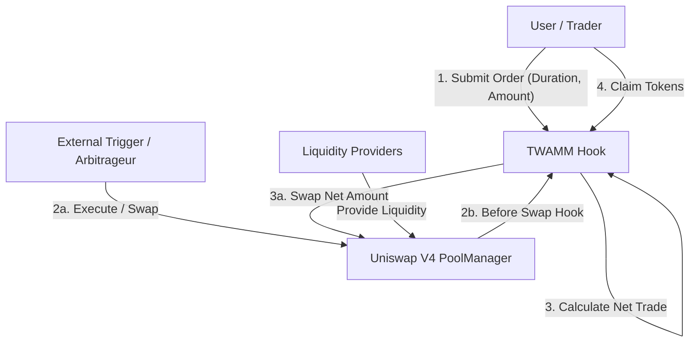
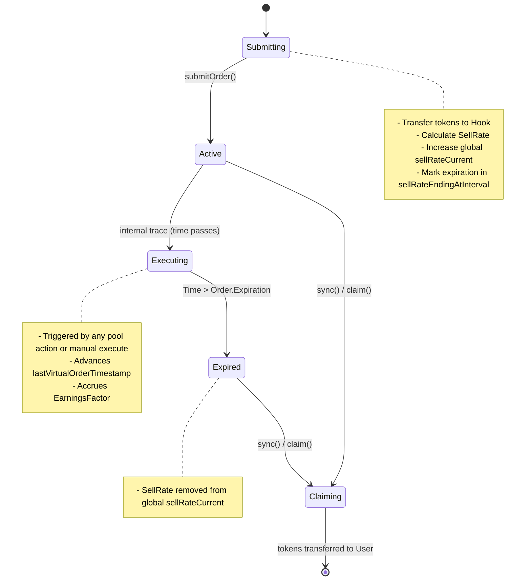
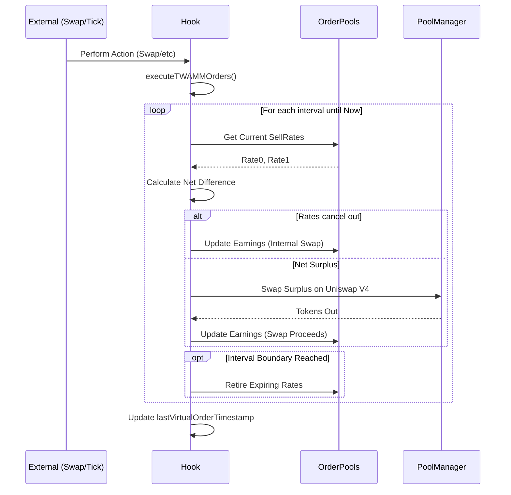

# TWAMM Hook Developer Manual

This manual provides a comprehensive overview of the TWAMM (Time-Weighted Average Market Maker) Hook for Uniswap V4. It is designed to help new developers understand the architecture, core logic, and state transitions of the system.

## Table of Contents

1. [High-Level Overview](#high-level-overview)
2. [Architecture](#architecture)
3. [Core Concepts](#core-concepts)
4. [State Transitions & Order Lifecycle](#state-transitions--order-lifecycle)
5. [Execution Logic (The Heart of TWAMM)](#execution-logic)
6. [Key Contracts & Libraries](#key-contracts--libraries)
7. [Glossary](#glossary)

---

## High-Level Overview

The TWAMM Hook allows users to execute large orders over a fixed period of time (Trade Intervals) to reduce price impact. Instead of executing a large swap all at once, the order is broken down into infinitely small virtual orders executed over time.

- **Objective**: Smooth out large trades to minimize slippage and price impact.
- **Mechanism**:
  - Users submit "Long Term Orders" (LTOs).
  - These orders specify a `duration` and `amount`.
  - The hook calculates a `sellRate` (tokens per second).
  - The hook automatically executes these orders against the Uniswap V4 pool whenever interactions (swaps, liquidity changes) occur, or when explicitly triggered.
  - Opposite direction orders (0->1 and 1->0) are matched against each other first (netted), and only the difference is traded against the pool.

---

## Architecture

The system consists of the Hook contract (`TWAMM.sol`) acting as an intermediary between Users and the `PoolManager`.

### Interactions

1.  **Users** deposit tokens into the Hook.
2.  **The Hook** holds these tokens and tracks the `sellRate`.
3.  **Market Activity** (swaps/liquidity adds) triggers the `executeTWAMMOrders` function on the Hook.
4.  **The Hook** calculates how much time has passed since the last execution, determines the amount to trade, and performs a swap on the `PoolManager`.
5.  **Users** can subsequently claim their bought tokens.

---

## Core Concepts

### 1. Sell Rate

The core unit of a TWAMM order is the **Sell Rate**.
$$ \text{SellRate} = \frac{\text{AmountIn}}{\text{Duration}} $$
It represents how many tokens are being sold per second.

### 2. Order Pools

To save gas, individual orders are not iterated over during execution. Instead, all orders for a specific direction (e.g., Token0 -> Token1) are aggregated into an **Order Pool**.

- **`sellRateCurrent`**: The sum of all active sell rates for this direction.
- **`sellRateEndingAtInterval[timestamp]`**: Maps a future timestamp to the amount of sell rate that expires at that time.

### 3. Earnings Factor

Because orders are pooled, we track "Earnings per Sell Rate" (similar to Fee Growth in Uniswap V3) to calculate individual user returns.

- **`earningsFactor`**: Cumulative earnings per unit of sell rate.
- When a user syncs their order, their owed tokens are calculated as:
  $$ \text{Owed} = (\text{CurrentEarningsFactor} - \text{OrderLastEarningsFactor}) \times \text{OrderSellRate} $$

### 4. Intervals

Time is quantized into discrete `expirationInterval`s (e.g., 1 hour). Orders must expire at a multiple of this interval. This groups expirations, reducing the number of state updates required during execution.

---

## State Transitions & Order Lifecycle

The lifecycle of a TWAMM order involves four main states:

### Detailed Flow

1.  **Submit**:
    - User calls `submitOrder(key, amount, duration, ...)`.
    - Hook verifies expiration is valid (multiple of interval).
    - `orderPool.sellRateCurrent += newOrderRate`.
    - `orderPool.sellRateEndingAtInterval[expiration] += newOrderRate`.

2.  **Execute (The "Virtual" Trade)**:
    - Called via `executeTWAMMOrders`.
    - Moves the "virtual time" from `lastVirtualOrderTimestamp` to `block.timestamp`.
    - If `block.timestamp` crosses an expiration boundary, the execution is split.
    - At the boundary, expired sell rates are subtracted from `sellRateCurrent`.

3.  **Sync/Claim**:
    - User calls `sync(orderKey)`.
    - System calculates earnings based on the difference in `earningsFactor` since the last sync.
    - Updates `tokensOwed[token][user]`.
    - `claim` actually transfers the tokens.

---

## Execution Logic

The `executeTWAMMOrders` function is the engine. It ensures that long-term orders are executed smoothly over time.

### The Algorithm

1.  **Check Time**: Calculate `secondsElapsed = block.timestamp - lastVirtualOrderTimestamp`.
2.  **Netting**: Compare `sellRate0->1` and `sellRate1->0`.
    - If $Rate_{0\to1} \approx Rate_{1\to0}$ (in value terms), they cancel out. The specific logic allows for "infinite" internal matching without price impact (just swapping assets between the two pools).
    - The `earningsFactor` is updated for both sides based on this internal match.
3.  **Trading**: If there is a net difference (e.g., much more 0->1 selling), the excess is swapped against the Uniswap V4 Pool.
    - The price moves along the bonding curve.
    - The `earningsFactor` is updated with the proceeds from the swap.
4.  **Advance Time**: `lastVirtualOrderTimestamp` is updated to the current time.

---

## Key Contracts & Libraries

| Contract / Library | Description                                                                                                                                                                                   |
| ------------------ | --------------------------------------------------------------------------------------------------------------------------------------------------------------------------------------------- |
| `TWAMM.sol`        | **Main Entry Contract**. Handles hook permissions, order submission, and orchestration of execution.                                                                                          |
| `OrderPool.sol`    | **State Library**. Manages the aggregated state of orders (`sellRate`, `earningsFactor`) for a single direction. Crucially, it uses the "earnings per share" algorithm to track user rewards. |
| `ITWAMM.sol`       | **Interface**. Defines the events, errors, and external functions.                                                                                                                            |
| `PoolGetters.sol`  | **Helper**. Utilities for reading Uniswap V4 pool state (slots, prices, etc.).                                                                                                                |

## Glossary

- **Virtual Order**: A conceptual "slice" of the long-term order executed at a specific instant.
- **Order Pool**: The aggregation of all active orders in one direction (e.g., USDC -> ETH).
- **Earnings Factor**: A cumulative value tracking how much "buy token" has been earned per unit of "sell rate".
- **Expiration Interval**: The global resolution of time for the TWAMM. Orders can only expire at these boundaries (e.g., every hour). This prevents having to update the rate every single second.
