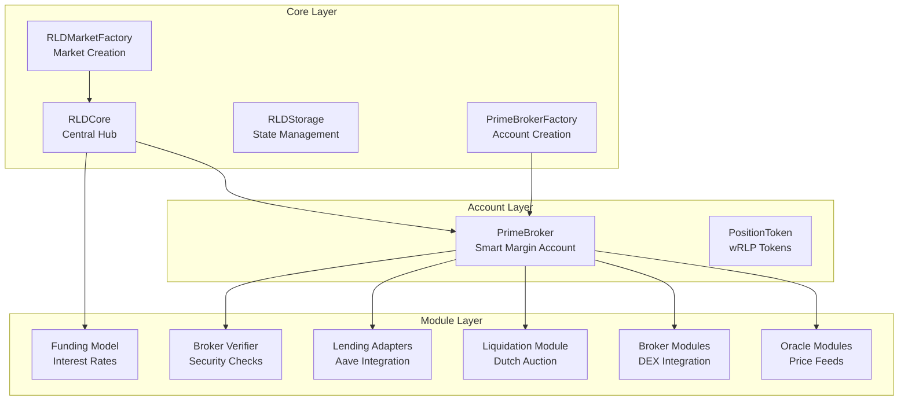

# RLD Protocol - Contracts Index

> **Last Updated**: 2026-01-30  
> **Location**: `/home/ubuntu/RLD/contracts`

## 📋 Overview

The RLD Protocol is a sophisticated DeFi lending protocol built on Foundry. This index catalogs all smart contracts, their purposes, and organizational structure.

---

## 🏗️ Architecture Overview



---

## 📁 Directory Structure

```
contracts/
├── src/                    # Source contracts
│   ├── rld/               # RLD Protocol core
│   │   ├── core/          # Core protocol logic
│   │   ├── broker/        # Prime Broker accounts
│   │   ├── modules/       # Pluggable modules
│   │   └── tokens/        # Token implementations
│   ├── shared/            # Shared utilities
│   │   ├── interfaces/    # Protocol interfaces
│   │   └── libraries/     # Helper libraries
│   ├── twamm/             # TWAMM implementation
│   └── utils/             # Testing utilities
├── test/                  # Test suite
│   ├── core/              # Core protocol tests
│   ├── modules/           # Module tests
│   ├── differential/      # Differential fuzzing
│   ├── integration/       # Integration tests
│   ├── oracle/            # Oracle tests
│   └── unit/              # Unit tests
├── script/                # Deployment scripts
└── lib/                   # External dependencies
```

---

## 🎯 Core Contracts

### [RLDCore.sol](file:///home/ubuntu/RLD/contracts/src/rld/core/RLDCore.sol)

**Location**: `src/rld/core/RLDCore.sol`  
**Lines**: 580 | **Bytes**: 27,365

**Purpose**: Central hub of the RLD Protocol

**Key Responsibilities**:

- Market registry and configuration
- Flash accounting (Uniswap V4-style lock pattern)
- Position management and debt tracking
- Solvency enforcement

**Key Functions**:

- `createMarket()` - Creates new lending markets
- `lock()` - Acquires lock for atomic operations
- `modifyPosition()` - Updates user debt positions
- `liquidate()` - Handles position liquidations

**Architecture Highlights**:

- Uses EIP-1153 transient storage for gas efficiency
- Implements flash accounting pattern
- Enforces solvency checks post-callback
- Lazy funding updates via normalization factor

---

### [PrimeBroker.sol](file:///home/ubuntu/RLD/contracts/src/rld/broker/PrimeBroker.sol)

**Location**: `src/rld/broker/PrimeBroker.sol`  
**Lines**: 802 | **Bytes**: 43,767

**Purpose**: Smart margin account for users

**Key Responsibilities**:

- Collateral management across DeFi protocols
- Position tracking (V4 LP, TWAMM orders)
- Account value calculation
- Operator delegation system

**Key Functions**:

- `initialize()` - Sets up broker for specific market
- `getNetAccountValue()` - Calculates total account value
- `execute()` - Arbitrary DeFi calls with solvency checks
- `seize()` - Liquidation asset extraction
- `setOperator()` - Delegate account access

**V1 Limitations**:

- Only ONE V4 LP position tracked at a time
- Only ONE TWAMM order tracked at a time

**Security Invariants**:

1. Every state change ends with solvency check
2. Only Core can call `seize()` (liquidation)
3. Only owner can modify operators
4. Operators and owner share permissions (except operator management)

---

### [RLDStorage.sol](file:///home/ubuntu/RLD/contracts/src/rld/core/RLDStorage.sol)

**Location**: `src/rld/core/RLDStorage.sol`

**Purpose**: Centralized state management for RLDCore

**Storage Layout**:

- Market configurations and addresses
- Position states and debt tracking
- Transient storage keys for flash accounting
- Market existence mappings

---

### [RLDMarketFactory.sol](file:///home/ubuntu/RLD/contracts/src/rld/core/RLDMarketFactory.sol)

**Location**: `src/rld/core/RLDMarketFactory.sol`

**Purpose**: Factory for creating new lending markets

**Responsibilities**:

- Market deployment and registration
- Parameter validation
- Market ID generation

---

### [PrimeBrokerFactory.sol](file:///home/ubuntu/RLD/contracts/src/rld/core/PrimeBrokerFactory.sol)

**Location**: `src/rld/core/PrimeBrokerFactory.sol`

**Purpose**: Factory for creating Prime Broker accounts

**Responsibilities**:

- Clone-based broker deployment (gas-efficient)
- NFT-based ownership tracking
- Broker initialization

---

## 🔌 Module Contracts

### Oracle Modules

#### [ChainlinkSpotOracle.sol](file:///home/ubuntu/RLD/contracts/src/rld/modules/oracles/ChainlinkSpotOracle.sol)

**Location**: `src/rld/modules/oracles/ChainlinkSpotOracle.sol`

**Purpose**: Chainlink-based spot price oracle

**Features**:

- Chainlink price feed integration
- Staleness checks
- Price validation

---

#### [RLDAaveOracle.sol](file:///home/ubuntu/RLD/contracts/src/rld/modules/oracles/RLDAaveOracle.sol)

**Location**: `src/rld/modules/oracles/RLDAaveOracle.sol`

**Purpose**: Aave protocol oracle integration

**Features**:

- Aave price feed integration
- Collateral valuation for Aave positions

---

#### [UniswapV4SingletonOracle.sol](file:///home/ubuntu/RLD/contracts/src/rld/modules/oracles/UniswapV4SingletonOracle.sol)

**Location**: `src/rld/modules/oracles/UniswapV4SingletonOracle.sol`

**Purpose**: Uniswap V4 TWAP oracle

**Features**:

- Time-weighted average price calculation
- V4 pool integration
- LP position valuation

---

### Broker Modules

#### [UniswapV4BrokerModule.sol](file:///home/ubuntu/RLD/contracts/src/rld/modules/broker/UniswapV4BrokerModule.sol)

**Location**: `src/rld/modules/broker/UniswapV4BrokerModule.sol`

**Purpose**: Uniswap V4 integration for Prime Broker

**Features**:

- LP position management
- Position value calculation
- Liquidity operations

---

#### [TwammBrokerModule.sol](file:///home/ubuntu/RLD/contracts/src/rld/modules/broker/TwammBrokerModule.sol)

**Location**: `src/rld/modules/broker/TwammBrokerModule.sol`

**Purpose**: TWAMM (Time-Weighted Average Market Maker) integration

**Features**:

- Long-term order management
- Order value calculation
- TWAMM position tracking

---

### Liquidation Module

#### [DutchLiquidationModule.sol](file:///home/ubuntu/RLD/contracts/src/rld/modules/liquidation/DutchLiquidationModule.sol)

**Location**: `src/rld/modules/liquidation/DutchLiquidationModule.sol`

**Purpose**: Dutch auction liquidation mechanism

**Features**:

- Declining price auction
- Partial liquidation support
- Liquidator incentives

---

### Funding Module

#### [StandardFundingModel.sol](file:///home/ubuntu/RLD/contracts/src/rld/modules/funding/StandardFundingModel.sol)

**Location**: `src/rld/modules/funding/StandardFundingModel.sol`

**Purpose**: Interest rate calculation model

**Features**:

- Dynamic interest rates
- Utilization-based pricing
- Funding rate accrual

---

### Adapter Modules

#### [AaveAdapter.sol](file:///home/ubuntu/RLD/contracts/src/rld/modules/adapters/AaveAdapter.sol)

**Location**: `src/rld/modules/adapters/AaveAdapter.sol`

**Purpose**: Aave protocol integration adapter

**Features**:

- Aave deposit/withdrawal
- aToken balance tracking
- Collateral value calculation

---

### Verifier Module

#### [BrokerVerifier.sol](file:///home/ubuntu/RLD/contracts/src/rld/modules/verifier/BrokerVerifier.sol)

**Location**: `src/rld/modules/verifier/BrokerVerifier.sol`

**Purpose**: Security verification for broker operations

**Features**:

- Call validation
- Whitelist enforcement
- Security checks for execute() calls

---

## 🪙 Token Contracts

### [PositionToken.sol](file:///home/ubuntu/RLD/contracts/src/rld/tokens/PositionToken.sol)

**Location**: `src/rld/tokens/PositionToken.sol`

**Purpose**: wRLP (Wrapped Rate LP) token implementation

**Features**:

- ERC20 debt tokenization
- Transferable debt positions
- Can be used as collateral

---

## 🔧 TWAMM Implementation

### [TWAMM.sol](file:///home/ubuntu/RLD/contracts/src/twamm/TWAMM.sol)

**Location**: `src/twamm/TWAMM.sol`

**Purpose**: Time-Weighted Average Market Maker implementation

**Features**:

- Long-term order execution
- Virtual order pool
- Time-based price averaging

---

### TWAMM Libraries

#### [OrderPool.sol](file:///home/ubuntu/RLD/contracts/src/twamm/libraries/OrderPool.sol)

**Location**: `src/twamm/libraries/OrderPool.sol`

**Purpose**: Order pool management for TWAMM

---

#### [TwapOracle.sol](file:///home/ubuntu/RLD/contracts/src/twamm/libraries/TwapOracle.sol)

**Location**: `src/twamm/libraries/TwapOracle.sol`

**Purpose**: Time-weighted average price calculations

---

#### [PoolGetters.sol](file:///home/ubuntu/RLD/contracts/src/twamm/libraries/PoolGetters.sol)

**Location**: `src/twamm/libraries/PoolGetters.sol`

**Purpose**: Helper functions for pool data retrieval

---

#### [TransferHelper.sol](file:///home/ubuntu/RLD/contracts/src/twamm/libraries/TransferHelper.sol)

**Location**: `src/twamm/libraries/TransferHelper.sol`

**Purpose**: Safe token transfer utilities

---

## 📚 Shared Libraries

### [FixedPointMath.sol](file:///home/ubuntu/RLD/contracts/src/shared/libraries/FixedPointMath.sol)

**Location**: `src/shared/libraries/FixedPointMath.sol`

**Purpose**: Fixed-point arithmetic operations

**Features**:

- Precision math for financial calculations
- Overflow protection
- Rounding modes

---

### [UniswapIntegration.sol](file:///home/ubuntu/RLD/contracts/src/shared/libraries/UniswapIntegration.sol)

**Location**: `src/shared/libraries/UniswapIntegration.sol`

**Purpose**: Uniswap protocol integration utilities

---

### [LiquidityAmounts.sol](file:///home/ubuntu/RLD/contracts/src/shared/libraries/LiquidityAmounts.sol)

**Location**: `src/shared/libraries/LiquidityAmounts.sol`

**Purpose**: Liquidity position calculations

---

### [TransientStorage.sol](file:///home/ubuntu/RLD/contracts/src/shared/libraries/TransientStorage.sol)

**Location**: `src/shared/libraries/TransientStorage.sol`

**Purpose**: EIP-1153 transient storage wrapper

**Features**:

- Gas-efficient temporary storage
- Flash accounting support
- Auto-cleared after transaction

---

## 🔌 Interfaces

### Core Interfaces

| Interface                                                                                              | Purpose                     |
| ------------------------------------------------------------------------------------------------------ | --------------------------- |
| [IRLDCore.sol](file:///home/ubuntu/RLD/contracts/src/shared/interfaces/IRLDCore.sol)                   | Core protocol interface     |
| [IPrimeBroker.sol](file:///home/ubuntu/RLD/contracts/src/shared/interfaces/IPrimeBroker.sol)           | Prime Broker interface      |
| [IRLDMarketFactory.sol](file:///home/ubuntu/RLD/contracts/src/shared/interfaces/IRLDMarketFactory.sol) | Market factory interface    |
| [IRLDOracle.sol](file:///home/ubuntu/RLD/contracts/src/shared/interfaces/IRLDOracle.sol)               | Oracle interface            |
| [ISpotOracle.sol](file:///home/ubuntu/RLD/contracts/src/shared/interfaces/ISpotOracle.sol)             | Spot price oracle interface |

### Module Interfaces

| Interface                                                                                                | Purpose                            |
| -------------------------------------------------------------------------------------------------------- | ---------------------------------- |
| [IFundingModel.sol](file:///home/ubuntu/RLD/contracts/src/shared/interfaces/IFundingModel.sol)           | Interest rate model interface      |
| [ILiquidationModule.sol](file:///home/ubuntu/RLD/contracts/src/shared/interfaces/ILiquidationModule.sol) | Liquidation module interface       |
| [ILendingAdapter.sol](file:///home/ubuntu/RLD/contracts/src/shared/interfaces/ILendingAdapter.sol)       | Lending protocol adapter interface |
| [IBrokerVerifier.sol](file:///home/ubuntu/RLD/contracts/src/shared/interfaces/IBrokerVerifier.sol)       | Broker verifier interface          |
| [IValuationModule.sol](file:///home/ubuntu/RLD/contracts/src/shared/interfaces/IValuationModule.sol)     | Asset valuation interface          |

### Standard Interfaces

| Interface                                                                                        | Purpose                  |
| ------------------------------------------------------------------------------------------------ | ------------------------ |
| [IERC20.sol](file:///home/ubuntu/RLD/contracts/src/shared/interfaces/IERC20.sol)                 | ERC20 token standard     |
| [IERC20Metadata.sol](file:///home/ubuntu/RLD/contracts/src/shared/interfaces/IERC20Metadata.sol) | ERC20 metadata extension |

---

## 🧪 Test Suite

### Test Organization

```
test/
├── core/                   # Core protocol tests (6 files)
├── modules/                # Module-specific tests (11 files)
├── differential/           # Differential fuzzing (21 files)
├── integration/            # Integration tests (1 file)
├── oracle/                 # Oracle tests (1 file)
├── unit/                   # Unit tests (1 file)
└── utils/                  # Test utilities (1 file)
```

### Comprehensive Test Coverage

We have implemented rigorous testing for critical protocol components. Below is a detailed summary of the verified logic.

#### 1. [PoolInitializationTest](file:///home/ubuntu/RLD/contracts/test/factory/unit/PoolInitialization.t.sol)

**Purpose**: Validation of Uniswap V4 Pool integration and initialization logic.

- **Currency Ordering**:
  - Verified `wRLP` and `collateral` tokens are correctly sorted (`currency0 < currency1`) as required by Uniswap V4.
  - Confirmed `PoolKey` construction respects this ordering regardless of token address values.

- **Price Inversion & Calculation**:
  - Validated that `sqrtPriceX96` is calculated correctly for both ordering scenarios:
    - **Normal**: `wRLP` is `token0` -> `Price = Collateral/wRLP`.
    - **Inverted**: `wRLP` is `token1` -> `Price = 1 / (Collateral/wRLP)`.
  - Confirmed the Factory correctly inverts the Oracle index price when necessary.

- **V4 State Integration**:
  - Queried `StateLibrary.getSlot0` directly from `PoolManager` to verify:
    - `sqrtPriceX96` is initialized to non-zero value.
    - `tick` is initialized within valid range.
    - `IHooks` address matches the deployed `TWAMM` hook.

- **Oracle Registration**:
  - Verified `UniswapV4SingletonOracle` registers the pool using `wRLP` (Position Token) as the key, ensuring downstream components (Funding Model) can query it seamlessly.

#### 2. [RLDMarketFactoryTest](file:///home/ubuntu/RLD/contracts/test/factory/unit/RLDMarketFactoryTest.t.sol)

**Purpose**: Validation of market creation, parameter security, and deployment flow.

- **Parameter Validation (Fail-Fast Checks)**:
  - **Oracle Prices**: Confirmed reverts for prices outside allowed range `[0.0001, 100]`.
    - Tested `IndexPrice < Min` (1e13 reverts).
    - Tested `IndexPrice > Max` (101e18 reverts).
    - Tested `IndexPrice = 0` (reverts).
  - **Risk Parameters**: Confirmed reverts if `minColRatio <= maintenanceMargin`.

- **Deployment Flow**:
  - Validated successful deployment of:
    - `PositionToken` (wRLP) via Clones.
    - `PrimeBrokerFactory` and `BrokerVerifier`.
    - Uniswap V4 Pool (via `PoolManager`).
  - Confirmed `MarketDeployed` event emission with correct arguments.

#### 3. [FundingRateCalculationTest](file:///home/ubuntu/RLD/contracts/test/modules/funding/FundingRateCalculation.t.sol)

**Purpose**: Verification of the Standard Funding Model's mathematical core and rate application.

- **Funding Logic**:
  - Validated the formula: `Funding Rate = (Mark Price - Index Price) / Index Price`.
  - Confirmed proper behavior for:
    - **Mark > Index**: Positive rate (Shorts earn, Longs pay).
    - **Mark < Index**: Negative rate (Longs earn, Shorts pay).
    - **Zero Diff**: Zero rate.

- **Scenarios**:
  - **Normal Ordering**: `Mark` derived from `wRLP` as `token0`.
  - **Inverted Ordering**: `Mark` derived from `wRLP` as `token1` (Automatic oracle inversion confirmed).
  - **Time Periods**: Verified rate accumulation over `1 hour`, `12 hours`, and `24 hours`.

- **Extensive Fuzzing**:
  - Implemented `testFuzz_FundingRate_PricesExtensive` with **257 runs**:
    - **Price Range**: Fully randomized Mark and Index prices within `[0.0001, 100]`.
    - **Validation**: Compares model output against a precise `int256` reference calculation using the **actual V4 Oracle spot price** to eliminate precision noise.
    - **Robustness**: Confirmed no overflows/underflows for valid inputs.

---

## 🚀 Development

### Build & Test

```bash
# Build contracts
forge build

# Run tests
forge test

# Run specific test
forge test --match-test testFunctionName

# Gas snapshot
forge snapshot

# Coverage
forge coverage
```

### Configuration

- **Foundry Config**: [foundry.toml](file:///home/ubuntu/RLD/contracts/foundry.toml)
- **Remappings**: [remappings.txt](file:///home/ubuntu/RLD/contracts/remappings.txt)
- **Dependencies**: [foundry.lock](file:///home/ubuntu/RLD/contracts/foundry.lock)

---

## 📊 Contract Statistics

| Category                 | Count    |
| ------------------------ | -------- |
| **Core Contracts**       | 5        |
| **Module Contracts**     | 9        |
| **Token Contracts**      | 1        |
| **TWAMM Contracts**      | 5        |
| **Libraries**            | 4        |
| **Interfaces**           | 12       |
| **Test Files**           | 17       |
| **Total Solidity Files** | 37 (src) |
| **Total Lines of Code**  | 5,926    |

---

## � Complete File Listing

### Source Contracts (by size)

#### Core Layer (5 files, 1,755 lines)

- [TWAMM.sol](file:///home/ubuntu/RLD/contracts/src/twamm/TWAMM.sol) - 1,146 lines
- [PrimeBroker.sol](file:///home/ubuntu/RLD/contracts/src/rld/broker/PrimeBroker.sol) - 802 lines
- [RLDMarketFactory.sol](file:///home/ubuntu/RLD/contracts/src/rld/core/RLDMarketFactory.sol) - 631 lines
- [RLDCore.sol](file:///home/ubuntu/RLD/contracts/src/rld/core/RLDCore.sol) - 580 lines
- [PrimeBrokerFactory.sol](file:///home/ubuntu/RLD/contracts/src/rld/core/PrimeBrokerFactory.sol) - 195 lines
- [RLDStorage.sol](file:///home/ubuntu/RLD/contracts/src/rld/core/RLDStorage.sol) - 149 lines

#### Module Contracts (9 files, 884 lines)

- [TwammBrokerModule.sol](file:///home/ubuntu/RLD/contracts/src/rld/modules/broker/TwammBrokerModule.sol) - 181 lines
- [StandardFundingModel.sol](file:///home/ubuntu/RLD/contracts/src/rld/modules/funding/StandardFundingModel.sol) - 151 lines
- [UniswapV4SingletonOracle.sol](file:///home/ubuntu/RLD/contracts/src/rld/modules/oracles/UniswapV4SingletonOracle.sol) - 122 lines
- [UniswapV4BrokerModule.sol](file:///home/ubuntu/RLD/contracts/src/rld/modules/broker/UniswapV4BrokerModule.sol) - 98 lines
- [AaveAdapter.sol](file:///home/ubuntu/RLD/contracts/src/rld/modules/adapters/AaveAdapter.sol) - 97 lines
- [BrokerVerifier.sol](file:///home/ubuntu/RLD/contracts/src/rld/modules/verifier/BrokerVerifier.sol) - 88 lines
- [RLDAaveOracle.sol](file:///home/ubuntu/RLD/contracts/src/rld/modules/oracles/RLDAaveOracle.sol) - 80 lines
- [ChainlinkSpotOracle.sol](file:///home/ubuntu/RLD/contracts/src/rld/modules/oracles/ChainlinkSpotOracle.sol) - 80 lines
- [DutchLiquidationModule.sol](file:///home/ubuntu/RLD/contracts/src/rld/modules/liquidation/DutchLiquidationModule.sol) - 69 lines

#### TWAMM Libraries (4 files, 372 lines)

- [TwapOracle.sol](file:///home/ubuntu/RLD/contracts/src/twamm/libraries/TwapOracle.sol) - 212 lines
- [PoolGetters.sol](file:///home/ubuntu/RLD/contracts/src/twamm/libraries/PoolGetters.sol) - 65 lines
- [TransferHelper.sol](file:///home/ubuntu/RLD/contracts/src/twamm/libraries/TransferHelper.sol) - 54 lines
- [OrderPool.sol](file:///home/ubuntu/RLD/contracts/src/twamm/libraries/OrderPool.sol) - 41 lines

#### Shared Libraries (4 files, 335 lines)

- [FixedPointMath.sol](file:///home/ubuntu/RLD/contracts/src/shared/libraries/FixedPointMath.sol) - 195 lines
- [UniswapIntegration.sol](file:///home/ubuntu/RLD/contracts/src/shared/libraries/UniswapIntegration.sol) - 60 lines
- [LiquidityAmounts.sol](file:///home/ubuntu/RLD/contracts/src/shared/libraries/LiquidityAmounts.sol) - 52 lines
- [TransientStorage.sol](file:///home/ubuntu/RLD/contracts/src/shared/libraries/TransientStorage.sol) - 28 lines

#### Interfaces (12 files, 387 lines)

- [IRLDCore.sol](file:///home/ubuntu/RLD/contracts/src/shared/interfaces/IRLDCore.sol) - 135 lines
- [IPrimeBroker.sol](file:///home/ubuntu/RLD/contracts/src/shared/interfaces/IPrimeBroker.sol) - 61 lines
- [IRLDMarketFactory.sol](file:///home/ubuntu/RLD/contracts/src/shared/interfaces/IRLDMarketFactory.sol) - 49 lines
- [ILendingAdapter.sol](file:///home/ubuntu/RLD/contracts/src/shared/interfaces/ILendingAdapter.sol) - 35 lines
- [ILiquidationModule.sol](file:///home/ubuntu/RLD/contracts/src/shared/interfaces/ILiquidationModule.sol) - 30 lines
- [IValuationModule.sol](file:///home/ubuntu/RLD/contracts/src/shared/interfaces/IValuationModule.sol) - 24 lines
- [IFundingModel.sol](file:///home/ubuntu/RLD/contracts/src/shared/interfaces/IFundingModel.sol) - 18 lines
- [ISpotOracle.sol](file:///home/ubuntu/RLD/contracts/src/shared/interfaces/ISpotOracle.sol) - 13 lines
- [IERC20.sol](file:///home/ubuntu/RLD/contracts/src/shared/interfaces/IERC20.sol) - 11 lines
- [IBrokerVerifier.sol](file:///home/ubuntu/RLD/contracts/src/shared/interfaces/IBrokerVerifier.sol) - 10 lines
- [IERC20Metadata.sol](file:///home/ubuntu/RLD/contracts/src/shared/interfaces/IERC20Metadata.sol) - 10 lines
- [IRLDOracle.sol](file:///home/ubuntu/RLD/contracts/src/shared/interfaces/IRLDOracle.sol) - 10 lines

#### Tokens (1 file, 47 lines)

- [PositionToken.sol](file:///home/ubuntu/RLD/contracts/src/rld/tokens/PositionToken.sol) - 47 lines

#### TWAMM Interface (1 file, 297 lines)

- [ITWAMM.sol](file:///home/ubuntu/RLD/contracts/src/twamm/ITWAMM.sol) - 297 lines

### Test Files (by size)

#### Factory Tests (2 files, 1,264 lines)

- [RLDMarketFactoryTest.t.sol](file:///home/ubuntu/RLD/contracts/test/factory/unit/RLDMarketFactoryTest.t.sol) - 840 lines
- [PoolInitialization.t.sol](file:///home/ubuntu/RLD/contracts/test/factory/unit/PoolInitialization.t.sol) - 424 lines

#### Module Tests (12 files, 2,799 lines)

- [FundingRateCalculation.t.sol](file:///home/ubuntu/RLD/contracts/test/modules/funding/FundingRateCalculation.t.sol) - 610 lines
- [FundingVerification.t.sol](file:///home/ubuntu/RLD/contracts/test/modules/funding/FundingVerification.t.sol) - 534 lines
- [TwammIntegration.t.sol](file:///home/ubuntu/RLD/contracts/test/modules/ordering/TwammIntegration.t.sol) - 361 lines
- [V4ModuleVerification.t.sol](file:///home/ubuntu/RLD/contracts/test/modules/broker/V4ModuleVerification.t.sol) - 159 lines
- [LiquidationModules.t.sol](file:///home/ubuntu/RLD/contracts/test/modules/liquidation/LiquidationModules.t.sol) - 134 lines
- [LiquidationVerification.t.sol](file:///home/ubuntu/RLD/contracts/test/modules/liquidation/LiquidationVerification.t.sol) - 125 lines
- [CoreVerification.t.sol](file:///home/ubuntu/RLD/contracts/test/modules/core/CoreVerification.t.sol) - 119 lines
- [TwammVerification.t.sol](file:///home/ubuntu/RLD/contracts/test/modules/twamm/TwammVerification.t.sol) - 118 lines
- [DutchLiquidationVerification.t.sol](file:///home/ubuntu/RLD/contracts/test/modules/liquidation/DutchLiquidationVerification.t.sol) - 108 lines
- [AdapterVerification.t.sol](file:///home/ubuntu/RLD/contracts/test/modules/adapters/AdapterVerification.t.sol) - 106 lines
- [VerifierVerification.t.sol](file:///home/ubuntu/RLD/contracts/test/modules/verifier/VerifierVerification.t.sol) - 105 lines
- [BrokerModuleVerification.t.sol](file:///home/ubuntu/RLD/contracts/test/modules/broker/BrokerModuleVerification.t.sol) - 99 lines

#### Oracle Tests (1 file, 289 lines)

- [RLDAaveOracle.t.sol](file:///home/ubuntu/RLD/contracts/test/oracle/RLDAaveOracle.t.sol) - 289 lines

#### Unit Tests (1 file, 125 lines)

- [DutchAuctionMath.t.sol](file:///home/ubuntu/RLD/contracts/test/unit/DutchAuctionMath.t.sol) - 125 lines

#### Test Utilities (1 file, 93 lines)

- [GlobalTestConfig.sol](file:///home/ubuntu/RLD/contracts/test/utils/GlobalTestConfig.sol) - 93 lines

**Total Test Lines**: 4,349

---

## �🔑 Key Concepts

### Flash Accounting

- Inspired by Uniswap V4
- Uses EIP-1153 transient storage
- Atomic operations with post-callback solvency checks
- Gas-efficient state management

### Prime Broker Pattern

- User-owned smart margin accounts
- Collateral stays in user's broker
- Arbitrary DeFi integrations via `execute()`
- NFT-based ownership

### Modular Architecture

- Pluggable oracle modules
- Swappable liquidation mechanisms
- Flexible funding models
- Extensible adapter system

### Security Model

- Solvency checks on every state change
- Operator delegation for automation
- Whitelist-based call verification
- Liquidation protection via maintenance margin

---

## 📖 Related Documentation

- [Project README](file:///home/ubuntu/RLD/contracts/README.md)
- [Differential Fuzzing Guide](file:///home/ubuntu/RLD/contracts/test/DIFFERENTIAL_FUZZING.md)
- [Deployment Scripts](file:///home/ubuntu/RLD/contracts/script/)

---

## 🏷️ Tags

`#RLD` `#DeFi` `#Lending` `#Foundry` `#Solidity` `#SmartContracts` `#UniswapV4` `#TWAMM` `#Aave`
