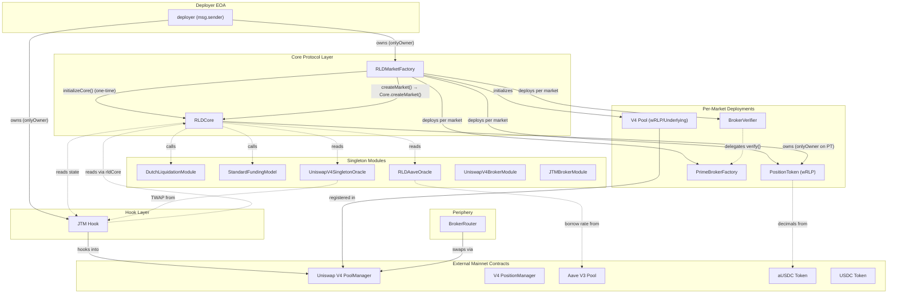

# RLD Protocol Deployment: Architecture & Procedures

This document provides an exhaustive, line-by-line breakdown of the RLD Protocol deployment procedure, detailing the sequence of operations, architectural decisions, invariants, and security checks implemented to ensure a robust deployment.

## Table of Contents

1. [Architecture & Dependency Graph](#architecture--dependency-graph)
2. [Deployment Sequence & Phases](#deployment-sequence--phases)
3. [Market Creation Initialization](#market-creation-initialization)
4. [V4 Pool Price Derivation Pipeline](#v4-pool-price-derivation-pipeline)
5. [Security & Access Control Audit](#security--access-control-audit)
6. [Test Coverage & Parameters](#test-coverage--parameters)
7. [Architectural Decisions Summary](#architectural-decisions-summary)

---

## Architecture & Dependency Graph

The full RLD protocol requires deploying core singletons, hook logic, and per-market infrastructure.

### Diagram: Contract Interactions & Access Control

---

## Deployment Sequence & Phases

The execution script (`DeployRLDProtocol.s.sol`) operates in a rigid, phased sequence due to cyclic dependencies. Below is the step-by-step documentation of the sequential phases:

### Phase 0: Helper Contracts & Valuation Modules

The deployer EOA deploys foundational dependencies that do not rely on Core logic:

1. **`MinimalMetadataRenderer`**: Satisfies the Factory's non-zero interface check.
2. **`UniswapV4BrokerModule`** & **`JTMBrokerModule`**: Stateless modules mapping position valuation configurations.

### Phase 0.5: Hook Mining

The Uniswap V4 JTM hook requires specific leading bytes in its address (flags).

1. The script establishes desired flags: `BEFORE_INITIALIZE`, `BEFORE_ADD_LIQUIDITY`, `BEFORE_REMOVE_LIQUIDITY`, `BEFORE_SWAP`, `AFTER_SWAP`.
2. It uses `HookMiner.find()` against a deterministic `CREATE2` deployer.
3. Crucially, the deployer EOA is passed into the `constructorArgs` as `initialOwner`. This breaks `CREATE2` determinism for outside observers, neutralizing any address "spoofing" vectors. The salt guarantees the address belongs to the deployer.

### Phase 1: Singleton Modules

Stateless math and calculation configurations are deployed next:

- **`DutchLiquidationModule`**: Base liquidation curve logic.
- **`StandardFundingModel`**: Continuous funding rate calculation.
- **`UniswapV4SingletonOracle`**: Aggregation oracle for all V4 pools.
- **`RLDAaveOracle`**: Rate fetcher connecting to Aave V3.

### Phase 2: Implementation Templates & Router

Template contracts cloned by the Factory:

1. **`PositionToken` (Impl)**: Dummy template (not directly cloned, acts as interface placeholder).
2. **`PrimeBroker` (Impl)**: Initialized strictly with `CORE = address(1)` to lock the un-cloned implementation.
3. **`BrokerRouter`**: Central router with `permit2` pre-approvals.

### Phase 3: The Factory

**`RLDMarketFactory`** is deployed. It ingests all templates, modules, and the mainnet `PoolManager` address. At this stage, its internal `CORE` address is `address(0)`.

### Phase 4: Core Logic

**`RLDCore`** is deployed. Its constructor accepts the deployed `Factory` address, ensuring that `Core` inherently trusts the `Factory` immutably.

### Phase 5: Cross-Linking (The Initialization Two-Step)

Because `Factory` creates markets on `Core`, and `Core` delegates market configuration to `Factory`, they cyclicly depend on each other.

1. Deployer calls `Factory.initializeCore(coreAddress)`.
2. Deployer calls `JTM.setRldCore(coreAddress)`.

_(See the "Security & Access Control Audit" section below on how this two-step initialization is cryptographically secured against front-running.)_

---

## Market Creation Initialization

The actual instantiation of a specific market (e.g., specific to `aUSDC / USDC`) occurs via `RLDMarketFactory.createMarket()`.

1. **Parameter Validation**: Twelve sequential `require` statements fail fast if variables (like risk parameters or TWAP bounds) are configured incorrectly.
2. **Deterministic MarketId**: Created by hashing the `underlyingPool`, `underlyingToken`, and `collateralToken`. A duplicate check reverts if the `MarketId` already exists.
3. **Cloning & Deploying**: The Factory clones `PositionToken`, deploys a `PrimeBrokerFactory`, and deploys a `BrokerVerifier`.
4. **V4 Pool Registration**: The external Uniswap V4 pool is initialized with proper tick spacings and fees via the PoolManager.
5. **Core Synchronisation**: `RLDCore.createMarket(addrs, config)` executes atomic state insertion, passing ultimate ownership of the `PositionToken` to the `RLDCore` singleton.

---

## V4 Pool Price Derivation Pipeline

At market genesis, the newly allocated V4 Pool must begin tracking prices natively via the oracle without a "cold start" delay. The RLD protocol performs exact derivation from Aave's logic to perfectly synchronize tick states.

### Derivation Steps:

1. **Query Aave V3**: Call `getReserveData()` to acquire the raw borrow rate (`RAY` representation).
2. **Cap and Floor**: Clamp the rate to a maximum of 100% and floor it above 0.
3. **WAD Conversion**: Calculate `Index Price = rate × K / 1e9`.
4. **Bound Enforcement**: Assert that `MIN_PRICE (1e14) <= Index Price <= MAX_PRICE (100e18)`.
5. **Inversion**: If the new PositionToken (`wRLP`) represents `token1` in the V4 pair, mathematically invert the price.
6. **SqrtPrice Extraction**: Execute `sqrt(Price) × 2^96 / 1e9` to arrive at exactly the `sqrtPriceX96` expected by the V4 `PoolManager`.
7. **Initialization**: Invoke `PM.initialize(key, derivedSqrtPrice)`.
8. **JTM Bootstrapping**: Set the immutable boundary guards on the JTM by deriving `minSqrt` and `maxSqrt`. Invoke `increaseCardinality` targeting `type(uint16).max` to completely maximize TWAP capacity immediately from block 0.
9. **Singleton Registration**: Attach the new pair configuration to the `UniswapV4SingletonOracle`.

---

## Security & Access Control Audit

A line-by-line CTF-style assessment of protocol vulnerabilities proves the robustness of the execution flow.

### Access Control Matrix

| Contract               | Function            | Guard                     | Who Can Call            | Tested?                                            |
| ---------------------- | ------------------- | ------------------------- | ----------------------- | -------------------------------------------------- |
| **RLDMarketFactory**   | `createMarket()`    | `onlyOwner`               | Deployer EOA            | ✅ `test_revert_createMarket_notOwner`             |
|                        | `initializeCore()`  | `msg.sender == DEPLOYER`  | Deployer only, one-time | ✅ `test_revert_initializeCore_notDeployer`        |
|                        | `initializeCore()`  | `!coreInitialized`        | One-time guard          | ✅ `test_revert_initializeCore_alreadyInitialized` |
|                        | `initializeCore()`  | `_core != address(0)`     | Non-zero check          | ✅ `test_revert_initializeCore_zeroAddress`        |
| **RLDCore**            | `createMarket()`    | `onlyFactory`             | Factory only            | ✅ (tested via Factory chain)                      |
| **PositionToken**      | `mint()` / `burn()` | `onlyOwner`               | RLDCore                 | ✅ `test_positionToken_cannotMintAsNonOwner`       |
|                        | `setMarketId()`     | `onlyOwner` + one-time    | RLDCore, once           | ✅ `test_positionToken_marketIdCannotBeSetTwice`   |
| **JTM**              | `setRldCore()`      | `onlyOwner` + one-time    | Deployer, once          | ✅ (setUp chain)                                   |
|                        | `setPriceBounds()`  | `bounds.max == 0`         | One-time per pool       | ✅ `test_v4Pool_twammBoundsCannotBeOverwritten`    |
| **PrimeBrokerFactory** | `createBroker()`    | **None (permissionless)** | Anyone                  | ⬜ Future: broker tests                            |
| **BrokerVerifier**     | `verify()`          | Delegates to `FACTORY`    | Immutable reference     | ✅ `test_brokerVerifier_linkedToFactory`           |

### Red-Team Mitigations

#### 1. Front-Running the Two-Step Initialization

**Context:** `Factory` and `JTM` need linking to `Core` after `Core` is deployed.
**Security:**

- `RLDMarketFactory.initializeCore(core)` enforces `require(msg.sender == DEPLOYER)`. `DEPLOYER` is saved as the EOA running the script during Phase 3. Even if transactions are orphaned across blocks, no MEV blocker can hijack the `Factory`.
- `JTM.setRldCore(core)` is restricted by `onlyOwner` (the deployer).
- Both checks include `!= address(0)` and "Already Initialized" boolean flags, effectively making them one-way ratchets.

### 2. JTM Hook Address Spoofing

**Context:** Attackers pre-computing the `HookMiner` salt to steal hook deployment strings.
**Security:** The constructor arguments encoded in the CREATE2 footprint include the `deployer` EOA address as the `initialOwner`. The deterministic hash relies on this exact address string, guaranteeing uniqueness to the real deployer and breaking the address spoofing attack completely.

### 3. Griefing First Market Creation

**Context:** Sniping the first `createMarket()` call with junk liquidity or parameters.
**Security:** V1 implementations are fully permissioned. The `createMarket` function utilizes an `onlyDeployer` modifier. Unsanctioned pairs cannot be generated permissionlessly.

### 4. Zero-Day Arithmetic Mean Manipulation

**Context:** If an oracle isn't primed with historical data, the first massive swap can wildly throw off TWAP logic.
**Security:**
At genesis, `PM.initialize` sets the current tick to precisely match the external Aave oracle based on the complex Price Derivation Pipeline discussed above.
Furthermore, `increaseCardinality(max)` immediately allocates observation array scope. Because the V4 `StateLibrary` observation logic organically projects current tick backward chronologically when historical arrays run dry, the manufactured history matches the exact actual Genesis tick (the index price), preventing zero-day arbitrage gaps.

### 5. Implementation Proxy Hijacking

**Context:** Generic templates (`PrimeBroker`) allowing un-authorized `initialize()` calls directly on the minimal proxy implementations.
**Security:** The `PrimeBroker` template specifies `CORE = address(1)` in its native `constructor()`. Subsequent proxy instantiations route through `initialize(core)`, but any attacker attempting to run `initialize()` directly on the implementation will revert due to `CORE != address(0)`.

---

## Test Coverage & Parameters

The deployment logic is comprehensively validated against a live Ethereum mainnet fork.

### Test Matrix (`RLDMarketFactory.t.sol`)

| Group              | Tests | Coverage Summary                                            |
| ------------------ | ----- | ----------------------------------------------------------- |
| **Constructor**    | 10    | All fundamental zero-checks + funding period bounds         |
| **Happy Path**     | 3     | Full successful `createMarket` chain and emitted events     |
| **Validation**     | 12    | Exercises every `require` in `_validateParams()`            |
| **Access Control** | 5     | Validates Owner, Deployer, and front-running initialization |
| **Duplicates**     | 2     | Double-creation blocks; asserts deterministic Market IDs    |
| **Invariants**     | 6     | PositionToken ownership, decimals mapping, Verifier link    |
| **Edge Cases**     | 2     | Reentrancy blocks and immutable property verification       |
| **V4 Pool Init**   | 7     | **Price derivation, custom bounds, and oracle syncing**     |

### Default Operational Parameters (`RLDDeployConfig.sol`)

Deploy scripts and test suites pull from identical centralized static sources of truth to prevent configuration drift.

| Parameter                | Standard Value    | Purpose                                             |
| ------------------------ | ----------------- | --------------------------------------------------- |
| `underlyingPool`         | Aave V3 Core      | Primary money market rate oracle and pool.          |
| `minColRatio`            | 120% (1.2e18)     | Minimum capital density for opening new positions.  |
| `maintenanceMargin`      | 109% (1.09e18)    | Threshold where positions become strictly insolvent |
| `liquidationCloseFactor` | 50% (0.50e18)     | Maximum portion of debt liquidated per atomic call. |
| `oraclePeriod`           | 3600 seconds      | TWAP lookback observation window size.              |
| `poolFee`                | 0.30% (3000 bips) | Uniswap V4 Pool Swap Fees                           |
| `tickSpacing`            | 60 ticks          | Uniswap V4 positional granularity                   |

---

## Architectural Decisions Summary

1. **Centralized Configuration (`RLDDeployConfig.sol`)**: Rather than scattering addresses and risk parameters across test scripts and deploy files, standard mainnet configurations (like the `POOL_MANAGER`, Aave pools, default tick spacings, and liquidation parameters) are hardcoded into an imported pure library. This asserts a unified state across the `forge` runtime.
2. **Permissionless Factory (PrimeBroker)**: While Market Creation is deployer-gated, instantiating new `PrimeBrokers` for clients is permissionless. To ensure operational integrity, the central `RLDCore` depends entirely on `BrokerVerifier` mapping, discarding unauthenticated brokers at runtime seamlessly.
3. **EIP-1153 Transient Lock**: Internal accounting logic is built to execute `lock()` mechanics heavily inspired by V4 hook architectures, validating solvency via a callback flow rather than enforcing mid-transaction invariant checks.
