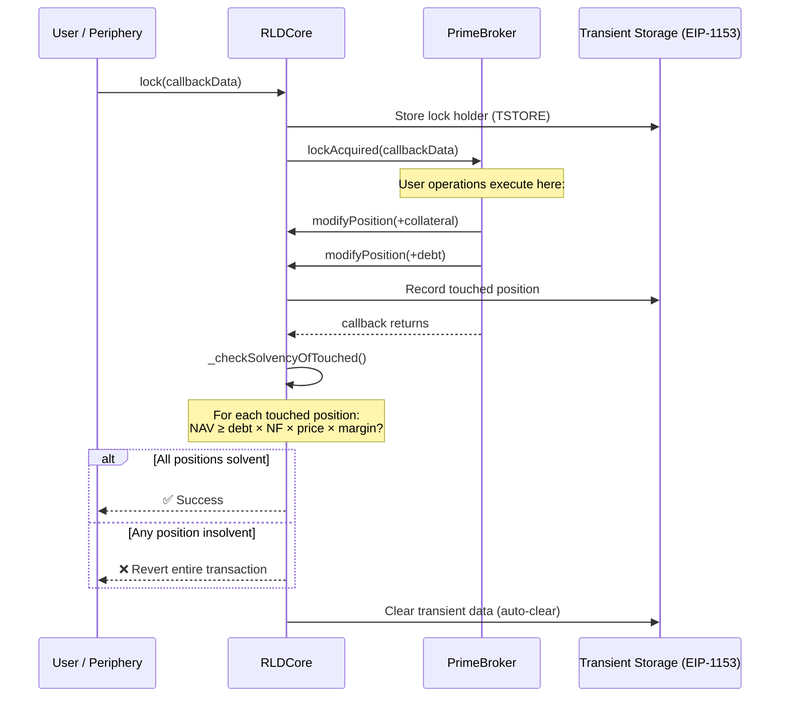

# Flash Accounting

RLD uses a **flash accounting lock pattern** inspired by Uniswap V4. All position modifications go through a single `lock()` entry point that ensures atomic safety — positions are checked for solvency only after all operations complete, preventing partial-state exploits.

## How It Works



## Why Flash Accounting?

### The Problem with Traditional Approaches

In a traditional DeFi protocol, each function call independently validates state:

```
deposit(100 USDC)     → check solvency ✅
mintDebt(900 wRLP)    → check solvency ❌ (no collateral deposited yet!)
```

This forces rigid function ordering or bloated "deposit-and-mint-at-once" functions. It also prevents composable multi-step operations.

### The Flash Accounting Solution

With flash accounting, solvency is checked **once at the end** of all operations:

```
lock() {
    deposit(100 USDC)      → no solvency check yet
    mintDebt(900 wRLP)     → no solvency check yet
    submitTWAMMOrder(...)  → no solvency check yet
}
// NOW check solvency: NAV includes collateral + TWAMM order ✅
```

This enables arbitrary operation ordering within a lock — as long as the final state is solvent, the transaction succeeds.

## EIP-1153 Transient Storage

RLD uses [EIP-1153](https://eips.ethereum.org/EIPS/eip-1153) transient storage (`TSTORE` / `TLOAD`) for lock-scoped data:

| Key               | Purpose                                                     |
| ----------------- | ----------------------------------------------------------- |
| `LOCK_HOLDER`     | Address holding the current lock                            |
| `TOUCHED_COUNT`   | Number of positions modified in this lock                   |
| `TOUCHED_LIST[i]` | Array of (marketId, broker) pairs that need solvency checks |
| `ACTION_SALT`     | Reentrancy guard for callback actions                       |

Transient storage automatically clears at the end of each transaction — no manual cleanup needed, no stale state risks.

## Comparison to Uniswap V4

RLD's flash accounting is directly inspired by V4's `PoolManager.unlock()`:

| Aspect          | Uniswap V4                       | RLD                                          |
| --------------- | -------------------------------- | -------------------------------------------- |
| Entry point     | `unlock(data)`                   | `lock(data)`                                 |
| Callback        | `unlockCallback(data)`           | `lockAcquired(data)`                         |
| Invariant check | Currency deltas must net to zero | All touched positions must be solvent        |
| Storage         | EIP-1153 for currency deltas     | EIP-1153 for lock holder + touched positions |
| Reentrancy      | Single active unlocker           | Single active lock holder                    |

## Security Properties

1. **Atomic all-or-nothing**: If any touched position is insolvent after all operations, the entire transaction reverts. There's no way to leave the system in a partially-valid state.

2. **Reentrancy protection**: Only one address can hold the lock at a time. Nested `lock()` calls revert with `AlreadyLocked`.

3. **No stale state**: EIP-1153 transient storage auto-clears at transaction end. Even if the transaction reverts, there's no leftover lock state to worry about.

4. **Composability**: Any contract can acquire the lock and perform arbitrary operations — this is what enables BrokerExecutor's atomic multicall and BondFactory's one-click bond minting.
