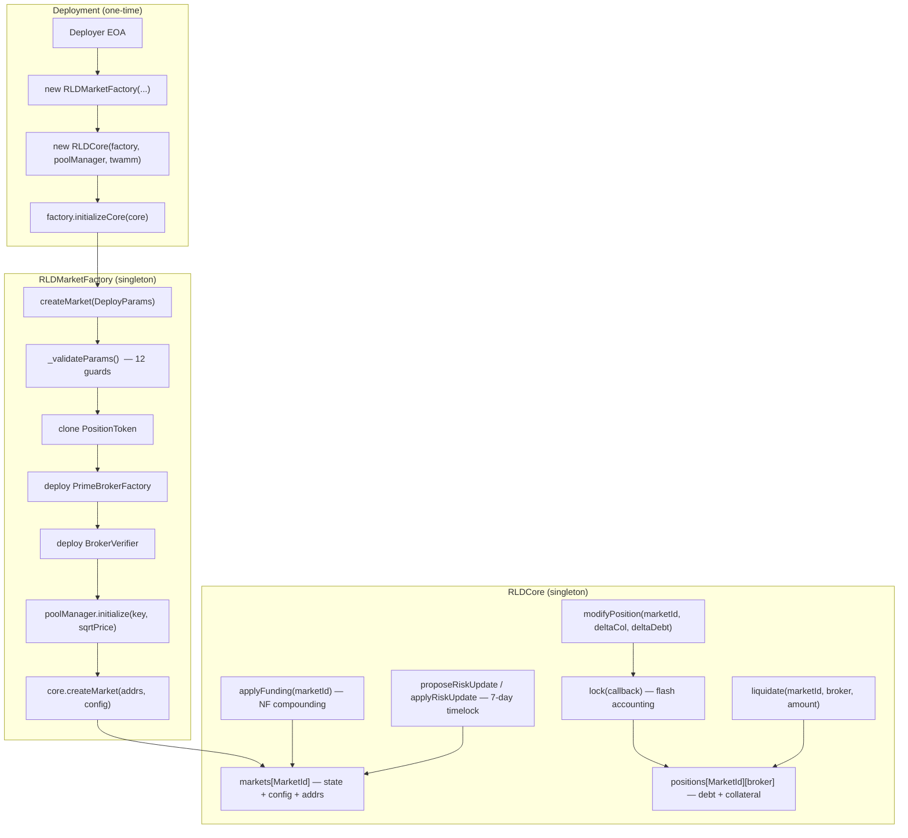

# Core Contracts

> **For external users**: RLDCore is the immutable accounting engine that manages all positions, enforces solvency, and applies funding rates. RLDMarketFactory orchestrates the deployment of new markets. You don't interact with these contracts directly — the [BrokerRouter](./overview) and [BondFactory](./overview) handle all user-facing operations. This page contains detailed internal documentation for developers reviewing the protocol's implementation.

---

## Internal Reference: Functionality & Test Coverage

This document covers `RLDCore` and `RLDMarketFactory` — the two central contracts of the RLD protocol — detailing their state machines, key functions, invariants, and the unit test suite that validates them.

See [DEPLOYMENT.md](DEPLOYMENT.md) for the full deployment sequence and [TWAMM_INITIALIZATION.md](TWAMM_INITIALIZATION.md) for the V4 pool price pipeline.

## Table of Contents

1. [Contract Overview](#contract-overview)
2. [RLDMarketFactory](#rldmarketfactory)
3. [RLDCore](#rldcore)
4. [Shared State Invariants](#shared-state-invariants)
5. [Unit Test Coverage](#unit-test-coverage)

---

## Contract Overview



---

## RLDMarketFactory

### Responsibility

The Factory is the single entry point for permissioned market creation. It wires all singleton modules (oracles, funding model, liquidation module) into per-market structs and delegates final state insertion to `RLDCore`.

### Constructor Parameters

| Parameter           | Type           | Validation                 |
| ------------------- | -------------- | -------------------------- |
| `poolManager`       | `IPoolManager` | `!= address(0)`            |
| `positionTokenImpl` | `address`      | `!= address(0)`            |
| `primeBrokerImpl`   | `address`      | `!= address(0)`            |
| `v4Oracle`          | `address`      | `!= address(0)`            |
| `fundingModel`      | `address`      | `!= address(0)`            |
| `twammAddress`      | `address`      | (zero allowed for testing) |
| `metadataRenderer`  | `address`      | `!= address(0)`            |
| `fundingPeriod`     | `uint32`       | stored (default: 30 days)  |
| `brokerRouter`      | `address`      | stored                     |

### `createMarket(DeployParams)` flow

```
1. onlyOwner guard
2. "Core not initialized" guard (coreInitialized == true)
3. _validateParams() — 12 sequential require() checks:
   ├─ underlyingPool != address(0)
   ├─ underlyingToken != address(0)
   ├─ collateralToken != address(0)
   ├─ liquidationModule != address(0)
   ├─ rateOracle != address(0)
   ├─ minColRatio > 1e18 (> 100%)
   ├─ maintenanceMargin >= 1e18 (>= 100%)
   ├─ minColRatio >= maintenanceMargin (risk config sanity)
   ├─ liquidationCloseFactor in (0, 1e18]
   ├─ tickSpacing > 0
   └─ oraclePeriod > 0
4. Compute deterministic MarketId = keccak256(collateral, underlying, pool)
5. Revert if MarketId already exists
6. Clone PositionToken (decimals match collateral)
7. Deploy PrimeBrokerFactory
8. Deploy BrokerVerifier(primeBrokerFactory)
9. Initialize V4 pool at oracle-derived sqrtPriceX96 (see TWAMM_INITIALIZATION.md)
10. core.createMarket(MarketAddresses, MarketConfig)
    └─ transfers PositionToken ownership to core
11. emit MarketDeployed(...)
```

### `initializeCore(address _core)`

One-time cross-linking call. Guards:

- `msg.sender == DEPLOYER` (saved at construction time)
- `!coreInitialized`
- `_core != address(0)`

---

## RLDCore

### Responsibility

`RLDCore` is the protocol's accounting singleton. It owns all per-position debt/collateral state, enforces solvency, applies funding rates, and coordinates liquidations and risk parameter changes.

### Key State

| Mapping     | Key                  | Value                                          |
| ----------- | -------------------- | ---------------------------------------------- |
| `markets`   | `MarketId`           | `MarketAddresses + MarketConfig + MarketState` |
| `positions` | `(MarketId, broker)` | `debtPrincipal + collateral + lastNF`          |

### Flash Accounting: `lock(callback)`

All state-mutating position modifications go through a V4-style lock callback:

```
caller → lock(callback) → Core stores lockCaller
                       → callback(data) runs (msg.sender = broker/primeBroker)
                       → Core verifies no unclaimed debt
```

Calls to `modifyPosition()` outside a lock revert with `NotLocked`.

### `modifyPosition(marketId, deltaCollateral, deltaDebt)`

```
1. NotLocked guard  (must be called from inside lock callback)
2. applyFunding(marketId) — lazy NF compounding
3. If deltaDebt > 0: mint wRLP, increase debtPrincipal
4. If deltaDebt < 0: burn wRLP, decrease debtPrincipal (underflow reverts)
5. Update totalDebt in MarketState
6. DebtCapExceeded revert if totalDebt > config.debtCap (sentinel 0 = unlimited)
7. Update collateral: deltaCollateral applied
8. isSolvent() check — reverts if position becomes undercollateralized
```

### `applyFunding(marketId)`

Reads the current Aave borrow rate via `rateOracle.getIndexPrice()`, computes the compound normalization factor increase over elapsed time using `StandardFundingModel`, and updates `MarketState.normalizationFactor` and `lastUpdateTimestamp`. Called lazily on every `modifyPosition` and can be called externally by anyone.

### `liquidate(marketId, broker, repayAmount)`

```
1. InvalidBroker guard — broker must be a valid PrimeBroker (BrokerVerifier check)
2. !isSolvent(marketId, broker) → revert UserSolvent if healthy
3. repayAmount > config.minLiquidation guard
4. repayAmount <= debtPrincipal × closeFactor guard (partial liquidation cap)
5. Seize proportional collateral: collateralSeized = repayAmount × colRatio
6. Burn wRLP, reduce debt
7. Transfer seized collateral to liquidator
```

### `proposeRiskUpdate` / `applyRiskUpdate` — Curator Timelock

Curators (set at market creation) can propose new risk parameters (minColRatio, maintenanceMargin, closeFactor, debtCap, etc.). A **7-day timelock** must elapse before `applyRiskUpdate()` executes the change. Only the curator can propose; anyone can apply after the delay.

---

## Shared State Invariants

The following invariants must hold at all times:

| #   | Invariant                                                                                    | Where enforced                             |
| --- | -------------------------------------------------------------------------------------------- | ------------------------------------------ |
| 1   | `totalDebt = Σ debtPrincipal` across all positions                                           | `modifyPosition()` delta accounting        |
| 2   | `wRLP.totalSupply() == totalDebt`                                                            | `mint`/`burn` 1:1 with deltaDebt           |
| 3   | `collateral / (trueDebt × markPrice) ≥ maintenanceMargin` for all non-liquidatable positions | `isSolvent()` guard in `modifyPosition()`  |
| 4   | `MarketId` is unique per `(collateral, underlying, pool)` triple                             | `createMarket()` duplicate check           |
| 5   | `PositionToken.owner() == address(core)` after market creation                               | Transferred by factory in `createMarket()` |

---

## Unit Test Coverage

### Test files

| File                                       | Fork             | Groups | Tests |
| ------------------------------------------ | ---------------- | ------ | ----- |
| `test/unit/factory/RLDMarketFactory.t.sol` | Ethereum mainnet | 6      | ~40   |
| `test/unit/core/RLDCore.t.sol`             | Ethereum mainnet | 9      | ~45   |

Both use a **full protocol stack** in `setUp()`, mirroring `DeployRLDProtocol.s.sol` exactly, with real Aave V3 state and real Uniswap V4 PoolManager.

---

### `RLDMarketFactory.t.sol` — Test Matrix

#### Group 1: Happy Path (3 tests)

| Test                                  | Coverage                                                                                                                                                                    |
| ------------------------------------- | --------------------------------------------------------------------------------------------------------------------------------------------------------------------------- |
| `test_createMarket_success`           | Full `createMarket` end-to-end: `MarketId` is deterministic, Core recognizes the market, all addresses and configs stored correctly, NF = 1e18, debt = 0, wRLP owner = Core |
| `test_createMarket_emitsEvent`        | `MarketDeployed` event emitted with correct indexed params                                                                                                                  |
| `test_createMarket_v4PoolInitialized` | V4 pool exists and has non-zero `sqrtPriceX96` after creation                                                                                                               |

#### Group 2: Validation Failures — `_validateParams()` (12 tests)

Each test zeroes out or corrupts one parameter and asserts the exact revert message:

| Test                                            | Reverts with             |
| ----------------------------------------------- | ------------------------ |
| `test_revert_zeroUnderlyingPool`                | `"Invalid Pool"`         |
| `test_revert_zeroUnderlyingToken`               | `"Invalid Underlying"`   |
| `test_revert_zeroCollateralToken`               | `"Invalid Collateral"`   |
| `test_revert_zeroLiquidationModule`             | `"Invalid LiqModule"`    |
| `test_revert_zeroRateOracle`                    | `"Invalid RateOracle"`   |
| `test_revert_minColRatio_exactly100Percent`     | `"MinCol < 100%"`        |
| `test_revert_maintenanceMargin_below100Percent` | `"Maintenance < 100%"`   |
| `test_revert_minColRatio_lessThanMaintenance`   | `"Risk Config Error"`    |
| `test_revert_zeroLiquidationCloseFactor`        | `"Invalid CloseFactor"`  |
| `test_revert_overflowLiquidationCloseFactor`    | `"Invalid CloseFactor"`  |
| `test_revert_zeroTickSpacing`                   | `"Invalid TickSpacing"`  |
| `test_revert_zeroOraclePeriod`                  | `"Invalid OraclePeriod"` |

#### Group 3: Access Control (5 tests)

| Test                                            | Coverage                                         |
| ----------------------------------------------- | ------------------------------------------------ |
| `test_revert_createMarket_notOwner`             | Non-owner reverts with `"Not owner"`             |
| `test_revert_initializeCore_notDeployer`        | Non-deployer reverts with `"Not deployer"`       |
| `test_revert_initializeCore_alreadyInitialized` | Second call reverts with `"Already initialized"` |
| `test_revert_initializeCore_zeroAddress`        | `address(0)` reverts with `"Invalid core"`       |
| `test_revert_createMarket_coreNotInitialized`   | Creating on uninitialized factory reverts        |

#### Group 4: Duplicate & ID Matching (2 tests)

| Test                          | Coverage                                                     |
| ----------------------------- | ------------------------------------------------------------ |
| `test_revert_duplicateMarket` | Second creation with identical params: `MarketAlreadyExists` |
| `test_marketId_deterministic` | `MarketId == keccak256(collateral, underlying, pool)`        |

#### Group 5: Post-Deployment Invariants (6 tests)

| Test                                          | Invariant                                                |
| --------------------------------------------- | -------------------------------------------------------- |
| `test_positionToken_ownerIsCore`              | `wRLP.owner() == address(core)`                          |
| `test_positionToken_cannotMintAsNonOwner`     | `wRLP.mint()` reverts for non-owner                      |
| `test_positionToken_marketIdCannotBeSetTwice` | `wRLP.setMarketId()` is one-time                         |
| `test_positionToken_decimalsMatchCollateral`  | `wRLP.decimals() == aUSDC.decimals()`                    |
| `test_brokerVerifier_linkedToFactory`         | `BrokerVerifier.FACTORY` is a non-zero deployed contract |
| `test_marketState_initializedCorrectly`       | NF = 1e18, debt = 0, timestamp = block.timestamp         |

#### Group 6: Constructor Validation (10 tests)

Every constructor parameter validated against zero-address / invalid value:

`poolManager`, `positionTokenImpl`, `primeBrokerImpl`, `v4Oracle`, `fundingModel`, `metadataRenderer`, `fundingPeriod` (bounds), `brokerRouter` + `twammAddress`

---

### `RLDCore.t.sol` — Test Matrix

#### Group 1: Constructor (3 tests)

| Test                                        | Coverage                                           |
| ------------------------------------------- | -------------------------------------------------- |
| `test_constructor_revertsOnZeroFactory`     | `"Invalid factory"`                                |
| `test_constructor_revertsOnZeroPoolManager` | `"Invalid poolManager"`                            |
| `test_constructor_allowsZeroJtm`            | Zero JTM allowed (testing flexibility)             |
| `test_constructor_storesImmutables`         | `factory`, `poolManager`, `twamm` stored correctly |

#### Group 2: `createMarket` Access Control (4 tests)

| Test                                         | Coverage                                |
| -------------------------------------------- | --------------------------------------- |
| `test_createMarket_onlyFactory`              | Direct call by attacker: `Unauthorized` |
| `test_createMarket_duplicateReverts`         | Factory-level duplicate guard           |
| `test_createMarket_stateInitialized`         | NF = 1e18, debt = 0, timestamp set      |
| `test_createMarket_addressesStoredCorrectly` | All `MarketAddresses` fields verified   |

#### Group 3: Flash Accounting / `lock()` (3 tests)

| Test                                           | Coverage                         |
| ---------------------------------------------- | -------------------------------- |
| `test_lock_modifyPositionWithoutLockReverts`   | `NotLocked` without lock         |
| `test_lock_modifyPositionFromNonHolderReverts` | `NotLocked` for non-broker       |
| `test_lock_callbackReturnsData`                | Zero-delta lock succeeds cleanly |

#### Group 4: `modifyPosition` / Debt Management (8 tests)

| Test                                             | Coverage                                                      |
| ------------------------------------------------ | ------------------------------------------------------------- |
| `test_modifyPosition_positiveDebtIncreasesState` | `debtPrincipal` and `totalDebt` increase correctly            |
| `test_modifyPosition_positiveDebtMintsWRLP`      | wRLP minted 1:1 with deltaDebt                                |
| `test_modifyPosition_negativeDebtDecreases`      | Partial repayment reduces debt                                |
| `test_modifyPosition_negativeDebtBurnsWRLP`      | wRLP burned 1:1 with repayment                                |
| `test_modifyPosition_underflowReverts`           | Repaying more than owed reverts                               |
| `test_modifyPosition_zeroDeltaIsNoop`            | Zero delta leaves state unchanged                             |
| `test_modifyPosition_debtCapEnforced`            | `DebtCapExceeded` when cap exceeded after curator update      |
| `test_modifyPosition_multipleBrokersIndependent` | Two brokers accumulate debt independently; `totalDebt` is sum |

#### Group 5: Solvency Engine (3 tests)

| Test                                        | Coverage                                             |
| ------------------------------------------- | ---------------------------------------------------- |
| `test_solvency_zeroDebtAlwaysSolvent`       | Zero-debt broker is always solvent                   |
| `test_solvency_wellCollateralizedIsSolvent` | 200:1 collateralization is solvent                   |
| `test_solvency_nonBrokerWithZeroDebt`       | Zero-debt non-broker returns solvent (short-circuit) |

#### Group 6: Funding (4 tests)

| Test                                               | Coverage                                                    |
| -------------------------------------------------- | ----------------------------------------------------------- |
| `test_funding_appliedLazilyOnModifyPosition`       | Timestamp updates on every `modifyPosition` after time warp |
| `test_funding_externalApplyFundingWorks`           | `applyFunding()` is publicly callable                       |
| `test_funding_applyFundingRevertsForInvalidMarket` | Non-existent market: `"Market does not exist"`              |
| `test_funding_normFactorCompoundsOverTime`         | NF is non-negative after 30-day warp (live Aave rates)      |

#### Group 7: Liquidation (4 tests)

| Test                                                 | Coverage                                             |
| ---------------------------------------------------- | ---------------------------------------------------- |
| `test_liquidation_solventPositionRevertsUserSolvent` | Healthy broker: `UserSolvent(broker)`                |
| `test_liquidation_invalidBrokerReverts`              | Non-broker address: `InvalidBroker(attacker)`        |
| `test_liquidation_tooSmallAmountReverts`             | Solvency check fires before amount check             |
| `test_liquidation_permissionless`                    | Any address can attempt liquidation (permissionless) |

#### Group 8: Curator & Timelock (tests)

| Test                                      | Coverage                                      |
| ----------------------------------------- | --------------------------------------------- |
| `test_curator_nonCuratorCannotPropose`    | `Unauthorized` for non-curator                |
| `test_curator_nonCuratorCannotCancel`     | Cancel also requires curator role             |
| `test_curator_proposeAndApplyAfterDelay`  | Full happy path: propose → warp 7d+1s → apply |
| `test_curator_applyBeforeDelayReverts`    | Apply before 7 days: `TimelockNotElapsed`     |
| `test_curator_proposalType_UpdateDebtCap` | Debt cap updated correctly                    |
| `test_curator_cancelProposal`             | Curator can cancel their own proposal         |

#### Group 9: Market Info Queries (tests)

| Test                                        | Coverage                               |
| ------------------------------------------- | -------------------------------------- |
| `test_getMarketConfig_returnsCorrectValues` | All config fields round-trip correctly |
| `test_getPosition_returnsZeroForNewBroker`  | Fresh broker has zero debt/collateral  |
| `test_marketExists_returnsFalseForUnknown`  | Unknown `MarketId` → `false`           |

### Complete Coverage Summary

| Contract           | Total Tests | Groups | Fork    |
| ------------------ | ----------- | ------ | ------- |
| `RLDMarketFactory` | ~40         | 6      | Mainnet |
| `RLDCore`          | ~45         | 9      | Mainnet |
| **Total**          | **~85**     | **15** |         |
