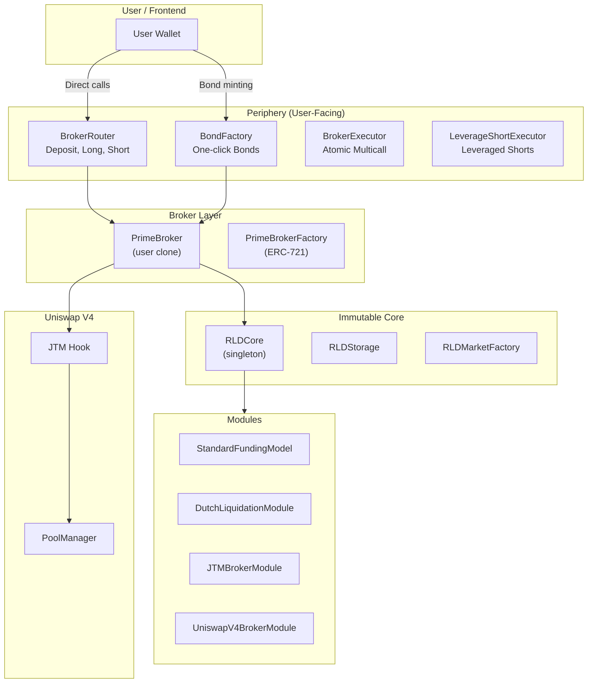

# Contracts Overview

## System Architecture



## Contract Categories

### Contracts You Interact With Directly

| Contract               | What You Do                                                             | When                 |
| ---------------------- | ----------------------------------------------------------------------- | -------------------- |
| **BrokerRouter**       | Deposit, withdraw, go long, go short, close positions                   | Everyday trading     |
| **BondFactory**        | Mint bonds, close bonds                                                 | Fixed-yield products |
| **JTM**                | Submit streaming/limit orders, cancel orders, sync, claim tokens, clear | JTM order management |
| **PrimeBrokerFactory** | Create broker, transfer NFT                                             | Account setup        |

### Contracts That Work Behind the Scenes

| Contract              | What It Does                                          | Called By           |
| --------------------- | ----------------------------------------------------- | ------------------- |
| **RLDCore**           | Manages positions, enforces solvency, applies funding | Broker contracts    |
| **RLDStorage**        | Stores position data and transient lock state         | RLDCore             |
| **PrimeBroker**       | Your wallet — holds assets, computes NAV              | Periphery contracts |
| **BrokerVerifier**    | Validates broker authenticity                         | RLDCore             |
| **Valuation Modules** | Price LP positions and JTM orders                     | PrimeBroker         |
| **Oracle Contracts**  | Provide index, mark, and spot prices                  | RLDCore             |

## Key Interfaces

### For Traders

```solidity
// Deposit collateral and go short
BrokerRouter.depositAndShort(
    broker,         // Your PrimeBroker address
    marketId,       // Market to trade
    collateral,     // Amount of collateral to deposit
    debt,           // Amount of wRLP to mint
    swapParams      // V4 swap parameters for selling wRLP
);

// Mint a synthetic bond
BondFactory.mintBond(
    amount,         // Collateral amount
    duration,       // Bond duration in seconds
    marketId        // Market to bond in
);

// Submit a JTM streaming order
JTM.submitOrder(
    poolKey,        // V4 pool key
    zeroForOne,     // Sell direction
    duration,       // Streaming duration
    amountIn        // Total tokens to sell
);
```

### For Integrators

```solidity
// Read market state
RLDCore.getMarketConfig(marketId)     // Risk parameters, oracle addresses
RLDCore.getNormalizationFactor(marketId) // Current NF
RLDCore.getPosition(marketId, broker)  // Debt principal, collateral

// Check solvency
broker.getNetAccountValue(marketId)    // Total NAV
RLDCore.isSolvent(marketId, broker)    // Boolean check

// Read oracle prices
indexOracle.getIndexPrice(marketId)    // Rate-derived price
markOracle.getMarkPrice(poolId)        // TWAP price
```

## Verified Source Code

All contracts are verified on the block explorer. See [Deployed Addresses](../reference/deployed-addresses) for links.
