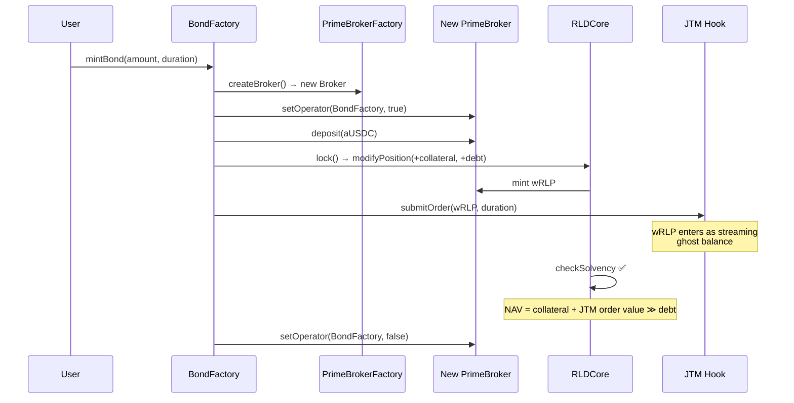

# Synthetic Bonds

Synthetic bonds are RLD's **flagship product** — a one-click way to earn **fixed yield** on stablecoins with **no liquidation risk**.

## What is a Synthetic Bond?

A bond **locks in the current interest rate** as your fixed yield:

1. **Open a short position** — deposit collateral, mint wRLP at the current entry rate (e.g., 5.5% → index price \$5.50)
2. **Submit a JTM streaming sell order** — gradually sells the minted wRLP back to collateral over the bond duration
3. **At maturity** — the short position has fully unwound. Debt is perfectly cancelled by the held asset (the wRLP bought back from TWAMM proceeds matches the outstanding debt). Your yield = the **pro-rated entry rate**.

The key insight: the JTM streaming order is itself [valued as collateral](../architecture/prime-broker#the-bond-problem) via the PrimeBroker, so the position is **naturally overcollateralized** throughout its life.

## Minting a Bond

### One-Click via BondFactory

`BondFactory.mintBond()` performs everything atomically:



### Bond Parameters

| Parameter | Typical Value         | Purpose               |
| --------- | --------------------- | --------------------- |
| Amount    | \$1,000 - \$1,000,000 | Collateral to deposit |
| Duration  | 30 - 90 days          | Bond maturity period  |
| Market    | USDC/aUSDC on Aave V3 | Which rate to lock in |

## Why No Liquidation Risk?

This is the critical design property that makes bonds work.

### At Minting (Day 0) — Entry Rate 5.5%

| Asset                                                  | Value                    |
| ------------------------------------------------------ | ------------------------ |
| aUSDC collateral                                       | \$10,000                 |
| JTM order (wRLP being sold, valued by JTMBrokerModule) | ~\$550                   |
| **Total NAV**                                          | **\$10,550**             |
| Debt (principal × NF × index)                          | ~\$550                   |
| **LTV**                                                | **~5.2%**                |
| **Health Ratio**                                       | **~19:1**                |
| **Locked yield**                                       | **5.5% APY (pro-rated)** |

### At 50% Maturity (Day 180)

The JTM order has sold half the wRLP. The sold USDC proceeds accumulate, while the remaining wRLP in the order gradually decreases:

| Asset                                        | Value                |
| -------------------------------------------- | -------------------- |
| aUSDC collateral (original + TWAMM proceeds) | ~\$10,275            |
| JTM order (remaining half of wRLP)           | ~\$275               |
| **Total NAV**                                | **~\$10,550**        |
| Debt                                         | ~\$550 (NF-adjusted) |
| **Health Ratio**                             | **~19:1**            |

### At Maturity (Day 365)

The streaming order has fully executed. The short position is unwound — the accumulated USDC proceeds are used to buy back wRLP, which **perfectly cancels** the outstanding debt:

| Asset                                     | Value             |
| ----------------------------------------- | ----------------- |
| aUSDC collateral (original)               | \$10,000          |
| TWAMM proceeds (accumulated over 90 days) | ~\$550            |
| wRLP held (bought back from proceeds)     | cancels debt      |
| **Debt remaining**                        | **\$0**           |
| **Yield (5.5% × 365/365)**                | **~\$550 (5.5%)** |
| **Annualized**                            | **5.5% APY**      |

The yield equals the **entry rate** locked at bond creation. The debt-to-collateral ratio **never** approaches liquidation territory throughout the bond's life.

### What Would It Take to Liquidate a Bond?

Starting at ~5.2% LTV with 109% maintenance margin, the rate would need to:

- **Increase to 95** (e.g., from 5.5% to 95%) to push LTV near 100%
- AND this increase would need to be **sustained** (not just a spike, because TWAP oracles smooth out volatility)

Monte Carlo simulations across extreme scenarios show bonds don't exceed 50% LTV as our position linearly unwinds decreasing LTV linearly over time.

## Expected Yields

The bond yield is primarily determined by the **entry rate** locked at creation. Secondary factors (funding, execution quality) can add or subtract slightly:

| Scenario                    | Yield vs Entry Rate   | Notes                                                         |
| --------------------------- | --------------------- | ------------------------------------------------------------- |
| Stable rates (mark ≈ index) | ≈ Entry rate          | Clean execution, minimal funding impact                       |
| Rates rise (mark > index)   | Entry rate + bonus    | Funding payments (NF decreases) reduce debt → extra yield     |
| Rates fall (mark < index)   | Entry rate - drag     | Adverse funding (NF increases) grows debt → reduced yield     |
| Extreme volatility          | Entry rate ± variance | Higher variance, but bounded by natural overcollateralization |

**Example**: A bond opened at 5.5% entry rate for 365 days delivers ~5.5% absolute return (5.5% × 365/365). Funding adjustments typically even out to add 0.5-1.5% annualized.

## Bond Maturity & Closing

### At Maturity

1. JTM streaming order has fully executed — all wRLP has been buy backed effectively neutralising the short position.
2. USDC proceeds have accumulated in the broker
3. Call `closeBond()`:
   - Sync and claim JTM earnings
   - The accumulated wRLP (bought back from TWAMM proceeds) cancels the outstanding debt
   - Any remaining debt is repaid from proceeds
   - Withdraw collateral + yield to your wallet

### Early Exit

If you need to exit before maturity:

1. Cancel the JTM streaming order (receive refund of unsold wRLP + earned proceeds)
2. Buy back wRLP on the V4 pool if needed
3. Repay debt, withdraw collateral

> **Penalty**: Early exit means you may need to buy wRLP at market price, which may differ from your original mint price. You keep proportional yield for the time held but lose the fixed-yield guarantee.

## Bond Lifecycle Timeline

```
  SYNTHETIC BOND LIFECYCLE (365-Day, 5.5% APY)

                     Day 0                    Day 180                   Day 365
                       │                         │                         │
                       ▼                         ▼                         ▼
                       ├─────────────────────────┼─────────────────────────┤
                       │        JTM Streaming Sell (wRLP → waUSDC)         │
                       ├─────────────────────────┼─────────────────────────┤

   Collateral:     $10,000 ────────────────── $10,275 ───────────────── $10,550
   JTM Order:      $550 ────────────────────── $275 ────────────────────── $0
   Effective Debt: $550 ────────────────────── $550 ────────────────────── $0
   LTV:            5.2% ────────────────────── ~5% ─────────────────────── 0%
   Health:         19:1 ────────────────────── 19:1 ───────────────── debt repaid ✓

   Cash Flow:
   ├── wRLP sold daily via TWAMM ───────────────────────────────────────────┤
   │                                     Repay debt ───────────────────────►│
   │                                  Withdraw $550 ───────────────────────►│
```
