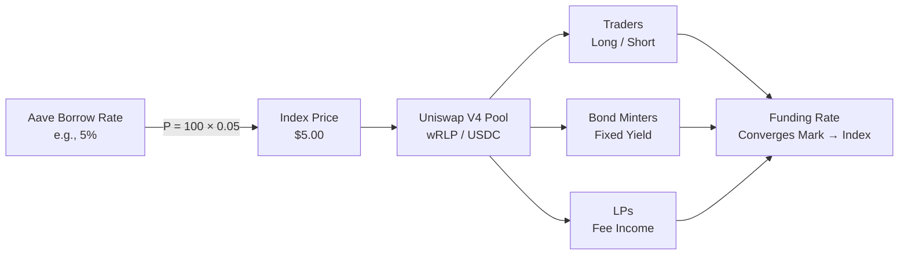

# What is RLD?

**RLD (Rate-Level Derivatives)** is a DeFi protocol that transforms lending pool interest rates into tradeable assets. Think of it as a stock market for interest rates — instead of trading tokens, you trade the borrow rate of lending protocols like Aave.

## The Problem

Decentralized lending markets handle billions of dollars, but their interest rates are wildly volatile. A lender earning 8% today might earn 2% tomorrow. A borrower paying 3% could face 15% overnight.

This creates real problems:

- **Lenders** can't predict their yield
- **Borrowers** can't budget their costs
- **DAOs** can't plan treasury strategies
- **Protocols** can't offer fixed-rate products

Traditional finance solved this decades ago with interest rate derivatives. DeFi hasn't — until now.

## The Solution

RLD creates a **perpetual contract** that tracks a lending pool's interest rate. The price of this contract is simply:

$$P = K \times r$$

Where `K = 100` and `r` is the borrow rate. So if Aave's USDC borrow rate is 5%, the RLD price is **\$5.00**.

### What You Can Do

| Action                | What it Means                         | You Profit When               |
| --------------------- | ------------------------------------- | ----------------------------- |
| **Go Long**           | Buy the rate derivative (wRLP token)  | Rates go up                   |
| **Go Short**          | Mint wRLP against collateral, sell it | Rates go down                 |
| **Mint a Bond**       | Short + TWAMM unwind = fixed yield    | You hold to maturity          |
| **Provide Liquidity** | LP on the V4 wRLP/USDC pool           | Trading volume generates fees |

## Key Innovations

### One Pool, Many Products

Unlike fixed-term protocols (Pendle, Notional) that fragment liquidity across expiry dates, RLD uses a **single perpetual pool**. Bonds, hedges, and speculation all trade in the same pool — concentrating liquidity and tightening spreads.

### No Liquidation Risk for Bonds

Synthetic bonds are designed to be **naturally over-collateralized**. The TWAMM sell order that unwinds the bond counts as collateral via the [Prime Broker](../architecture/prime-broker) system. Initial loan-to-value starts at ~9%, meaning bonds would need extreme rate movements to approach liquidation.

### JTM Engine

The protocol's matching engine — [JTM (JIT-TWAMM)](../jtm/design-evolution) — is a Uniswap V4 hook that supports streaming, limit, and market orders. Its 3-layer execution eliminates AMM fees for makers and flips MEV from a problem into a service.

### Immutable Core

No admin keys on the core contracts. Risk parameters can only be changed via curators with a mandatory **7-day timelock**. The protocol is designed as a [hyperstructure](https://jacob.energy/hyperstructures.html) — once deployed, it runs forever without centralized intervention.

## How It Fits Together

Ready to dive deeper? Start with [Key Concepts](./key-concepts) to understand the building blocks, or jump straight to [Use Cases](./use-cases) for practical examples.
