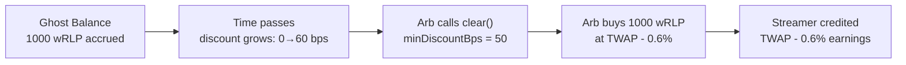

# Design Evolution

## From Paradigm TWAMM to JTM

The JTM (JIT-TWAMM) engine is a **complete redesign** of the time-weighted average market maker concept. This page explains the design evolution — what the original Paradigm TWAMM did, what problems it had, and how JTM solves them.

## The Original: Paradigm TWAMM (2021)

[Paradigm's TWAMM paper](https://www.paradigm.xyz/2021/07/twamm) introduced a revolutionary concept: embed long-running orders directly into an AMM that execute continuously as infinitesimally small sub-trades.

### How It Worked

1. User submits a streaming order: "Sell 10,000 USDC → ETH over 24 hours"
2. The TWAMM simulates continuous tiny swaps through the AMM curve
3. On each pool interaction, the virtual AMM catches up — executing accumulated sub-swaps against the pool

### The Problems

While conceptually elegant, the original design had three fundamental issues:

**Problem 1: Gas Cost**

Catching up across multiple epochs required iterating through every intermediate state. Each epoch boundary required a virtual swap simulation, with gas costs scaling linearly with the number of epochs crossed.

**Problem 2: MEV Vulnerability**

TWAMM orders are **public and predictable**. If a 10,000 USDC sell order is streaming, MEV bots know exactly when and how much will be dumped:

```
Block N:     Bot buys ETH cheaply
Block N+1:   TWAMM dumps → ETH price drops
Block N+2:   Bot sells ETH at profit
```

The streaming nature of TWAMM creates a **predictable market dump** that sandwich bots exploit systematically. Value flows from makers to MEV extractors.

**Problem 3: Execution Quality**

All orders execute through the AMM curve. Every streaming trade pays:

- LP fees (e.g., 30 bps)
- Price impact (curve movement)
- MEV extraction (sandwich losses)

For two opposing streams that cancel each other out, both still pay full AMM costs — even though they could have been matched directly.

## The Key Insight: Ghost Balances

JTM's innovation starts with a simple observation: **don't swap through the AMM at all**.

Instead of executing virtual swaps, JTM **accrues tokens as ghost balances** — they accumulate inside the hook contract, invisible to the pool, waiting to be matched:

```
  PARADIGM TWAMM                          JTM (JIT-TWAMM)

  Streaming Order                         Streaming Order
       │                                       │
       │ virtual swap                           │ accrue
       ▼                                       ▼
  ┌──────────┐                           ┌──────────────┐
  │ AMM Pool │                           │ Ghost Balance │
  └────┬─────┘                           │ (invisible   │
       │                                 │  to pool)    │
       │ price impact + fees             └──┬───┬───┬───┘
       ▼                                    │   │   │
   Executed                      Layer 1 ───┘   │   └─── Layer 3
   (with slippage)               Free netting   │        Auction
                                 at TWAP        │        (arb clears)
                                                │
                                     Layer 2 ───┘
                                     JIT fill vs taker
                                     (zero AMM impact)
```

## Three Layers — Better for Everyone

### Layer 1: Internal Netting (Free)

When two opposing streams exist (e.g., Alice selling wRLP → USDC and Bob selling USDC → wRLP), their ghost balances are **netted against each other at TWAP price**:

- Alice's accrued wRLP and Bob's accrued USDC are matched
- Both parties receive their desired tokens at fair price
- **Zero AMM fees, zero price impact, zero MEV**

Uniswap-V4 powered enhancements.

### Layer 2: JIT Fill (Free for Makers, Better for Takers)

When an external swap arrives, JTM intercepts it in `beforeSwap`:

1. A taker wants to buy wRLP
2. JTM has accrued wRLP ghost balance from streaming sellers
3. JTM fills the taker directly from ghost at TWAP price
4. Returns `BeforeSwapDelta` to V4 — "I handled this internally"

**For makers (TWAMM orders)**: free execution — their ghost balance was filled without any AMM interaction, so they **pay zero trading fees**.

**For takers (swappers)**: better execution — the fill bypasses the AMM curve, avoiding slippage against concentrated liquidity gaps.

**For LPs**: trading fees from the AMM portion of the swap still flow to liquidity providers — they earn on the volume that JTM doesn't fill internally.

This aligns incentives across all three sides: TWAMM users get free fills, takers get better prices, and LPs earn fees on residual flow — everyone benefits from the same system.

### Layer 3: Dutch Auction Clearing (Flips MEV)

This is where JTM transforms a fundamental problem into a feature.

**In Paradigm TWAMM**: predictable dumps → MEV bots front-run → value extracted from makers

**In JTM**: leftover ghost balances that weren't netted or JIT-filled are cleared via a **permissionless Dutch auction**:

1. A time-decaying discount starts at **0 bps** after the last clear
2. Discount grows linearly: `discount = min(elapsed × rate, maxDiscount)`
3. Any arb can call `clear()` to purchase ghost balances at `TWAP × (1 - discount)`
4. The arb specifies `minDiscountBps` — if the current discount is less, the tx reverts

**Economic equivalence**: Layers 1 and 3 alone produce economics **identical to the original Paradigm TWAMM** — the auction discount that arbs capture is equivalent to the MEV that sandwich bots would have extracted anyway. The value leakage is the same; JTM just makes it explicit and competitive.

**The main innovation is Layer 2** — JIT fills are genuinely _new_ value. They give makers free execution and takers better prices, which no version of the original TWAMM design can achieve due to 2021 infrastructure limitations. But right now with Uniswap V4, we are able to significantly improve the experience for makers and takers.

**Layer 3 also solves a bootstrapping problem**: in low-liquidity markets where organic swap flow is sparse (meaning Layer 2 fills are rare), the growing auction discount actively incentivizes arbs to clear ghost balances. The longer balances sit uncleared, the more profitable it becomes to clear them — ensuring that even thin markets eventually settle.



### Why This Flips MEV

|                    | Paradigm TWAMM                      | JTM                                                  |
| ------------------ | ----------------------------------- | ---------------------------------------------------- |
| **Who profits**    | MEV bots extract via sandwiching    | Arbs earn a bounded discount for providing a service |
| **Maker cost**     | Unbounded (depends on MEV activity) | Bounded (`maxDiscountBps`, typically 5%)             |
| **Predictability** | Dumps are exploitable               | Clearing is competitive — arbs bid down the discount |
| **Protection**     | None                                | `minDiscountBps` prevents front-running the arb      |

The key shift: arbs aren't extracting value from predictable dumps — they're **providing a clearing service** (converting ghost balances to real balances) and earning only a small, transparent fee.

## Unified Order Engine

The Ghost Balance architecture naturally extends beyond streaming orders:

| Order Type           | How Tokens Enter Ghost Balance        | Execution                                             |
| -------------------- | ------------------------------------- | ----------------------------------------------------- |
| **Streaming (TWAP)** | Accrue at `sellRate` per second       | Same 3-layer engine                                   |
| **Limit**            | Deposited at a specific trigger price | Filled when TWAP crosses trigger (same JIT mechanism) |
| **Market**           | Deposited for immediate matching      | JIT-filled on next swap                               |

All three order types use:

- The same ghost balance storage
- The same `beforeSwap` JIT interception
- The same TWAP pricing
- The same clearing auction for residuals

This unification means RLD has **one** hook contract that serves as a complete order book — streaming, limit, and market orders — all within a standard Uniswap V4 pool.
