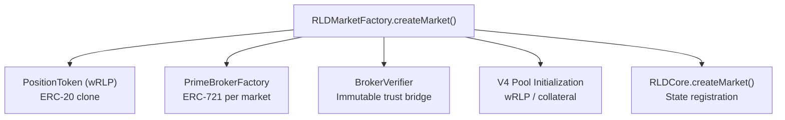

# Market Structure

## What is a Market?

An RLD **market** tracks the borrow rate of a specific asset on a specific lending pool. Each market is uniquely defined by three components:

| Component            | Example | Purpose                                    |
| -------------------- | ------- | ------------------------------------------ |
| **Underlying Pool**  | Aave V3 | The lending protocol whose rate is tracked |
| **Underlying Token** | USDC    | The asset whose borrow rate is the index   |
| **Collateral Token** | aUSDC   | What shorts deposit as collateral          |

### MarketId

Each market gets a deterministic identifier:

```
MarketId = keccak256(collateralToken, underlyingToken, underlyingPool)
```

This guarantees uniqueness — you can't create two markets for the same (pool, token, collateral) triple.

## Per-Market Components

When a market is created via `RLDMarketFactory.createMarket()`, the following are deployed atomically:



| Component                | Purpose                                                                                                          |
| ------------------------ | ---------------------------------------------------------------------------------------------------------------- |
| **PositionToken (wRLP)** | ERC-20 token representing debt. Decimals match the collateral token. Owned by RLDCore (only Core can mint/burn). |
| **PrimeBrokerFactory**   | ERC-721 that manages broker creation and ownership for this market                                               |
| **BrokerVerifier**       | Immutable adapter that validates broker authenticity by delegating to the factory                                |
| **V4 Pool**              | Uniswap V4 pool initialized at the oracle-derived price with JTM as the hook                                     |

## Market Lifecycle

### Creation

Markets are **permissioned** — only the protocol deployer can create them via the factory. This prevents spam markets and ensures proper oracle configuration.

### Operation

Once created, markets operate autonomously:

- Anyone can create a PrimeBroker (permissionless)
- Anyone can trade, LP, or submit JTM orders
- Funding applies lazily on every interaction
- Liquidation is permissionless

### Risk Parameter Updates

Each market has a **curator** — an address authorized to propose changes to risk parameters:

| Parameter                | What It Controls                                  |
| ------------------------ | ------------------------------------------------- |
| Minimum Collateral Ratio | How much collateral is needed to open a position  |
| Maintenance Margin       | Threshold for liquidation                         |
| Close Factor             | Maximum % liquidatable per transaction            |
| Debt Cap                 | Maximum total debt for the market (0 = unlimited) |

All changes require a **7-day timelock**:

```
Day 0: Curator calls proposeRiskUpdate(newParams)
Day 1-6: Users can see the pending change and adjust positions
Day 7+: Anyone calls applyRiskUpdate() to execute
```

The curator can cancel a pending proposal at any time before it's applied.
