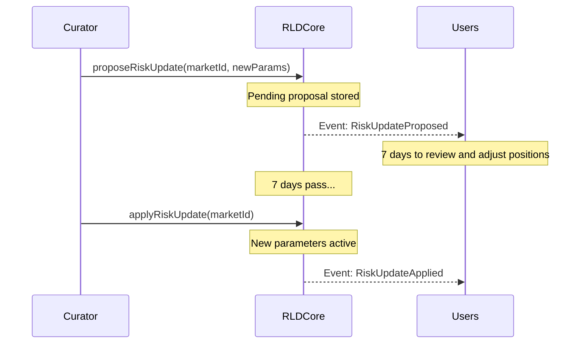

# Risk Parameters

## Per-Market Parameters

Each RLD market has configurable risk parameters that determine leverage limits, liquidation thresholds, and debt caps.

### Current Parameters

| Parameter                     | Description                                     | Typical Value                   |
| ----------------------------- | ----------------------------------------------- | ------------------------------- |
| **Minimum Collateral Ratio**  | Required to open a new position                 | 120% (1.2e18 WAD)               |
| **Maintenance Margin**        | Threshold for liquidation                       | 109% (1.09e18 WAD)              |
| **Close Factor**              | Max % of debt liquidatable per call             | 50% (0.5e18 WAD)                |
| **Debt Cap**                  | Maximum total debt across all positions         | `type(uint128).max` (unlimited) |
| **Liquidation Base Discount** | Starting bonus for liquidators                  | 5%                              |
| **Liquidation Max Discount**  | Maximum bonus for severely underwater positions | 15%                             |

### Maximum Leverage

The minimum collateral ratio determines maximum leverage:

```
Max Leverage = 1 / (1 - 1/minColRatio)
```

| Min Collateral Ratio | Max Leverage |
| -------------------- | ------------ |
| 120%                 | 6×           |
| 150%                 | 3×           |
| 200%                 | 2×           |

### Effective Margin

The gap between minimum collateral ratio and maintenance margin is your **safety buffer**:

```
Buffer = minColRatio - maintenanceMargin = 120% - 109% = 11%
```

This means a new position at maximum leverage can absorb an 11% adverse move before becoming liquidatable.

## Parameter Governance

### Curator System

Each market has a designated **curator** — an address authorized to propose risk parameter changes:

- The curator is set at market creation
- Curator can be a multisig, DAO governance contract, or protocol admin
- Only the curator can propose changes for their market

### 7-Day Timelock

All risk parameter changes require a **mandatory 7-day delay**:



During the 7-day window:

- Users can see the proposed changes on-chain
- Users can adjust positions (add collateral, reduce debt)
- Curator can **cancel** the proposal at any time
- No one can bypass the timelock

### What Can Change

| Parameter            | Changeable      | Impact                                  |
| -------------------- | --------------- | --------------------------------------- |
| Min Collateral Ratio | ✅ via timelock | Affects new position opening            |
| Maintenance Margin   | ✅ via timelock | Affects existing liquidation thresholds |
| Close Factor         | ✅ via timelock | Affects liquidation mechanics           |
| Debt Cap             | ✅ via timelock | Limits market growth                    |
| Oracle addresses     | ❌ immutable    | Set at market creation                  |
| Core contract logic  | ❌ immutable    | No upgrade mechanism                    |

## JTM Parameters

The JTM hook has its own governance-tunable parameters:

| Parameter           | Default      | Changeable By | Purpose                         |
| ------------------- | ------------ | ------------- | ------------------------------- |
| Discount Rate       | 5 bps/s      | Owner         | Layer 3 auction speed           |
| Max Discount        | 500 bps (5%) | Owner         | Layer 3 discount cap            |
| TWAP Window         | 30s          | Owner         | Oracle lookback period          |
| Trading Fee         | 0 bps        | Owner         | Fee on JTM earnings             |
| Protocol Fee        | 0 bps        | Owner         | Protocol's share of trading fee |
| Price Bounds        | Per-pool     | Immutable     | Manipulation resistance         |
| Expiration Interval | 3600s        | Immutable     | Epoch alignment                 |
