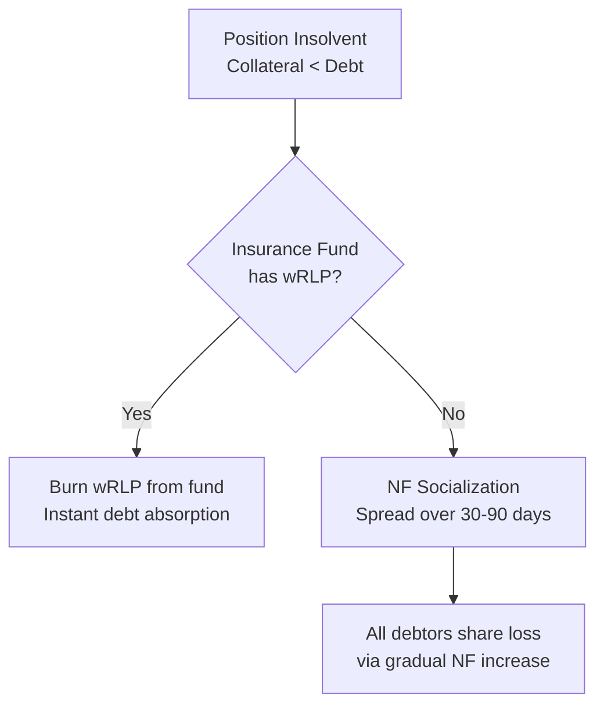

# Security Model

## Design Principles

RLD is designed as a **hyperstructure** — a protocol that runs autonomously without centralized intervention. The security model prioritizes immutability, bounded risk, and transparent operation.

## Immutability Guarantees

### Core Contracts — No Admin Keys

The following contracts have **no owner, no upgrade mechanism, and no admin functions** after deployment:

| Contract           | Immutable Properties                                  |
| ------------------ | ----------------------------------------------------- |
| **RLDCore**        | Position accounting, solvency logic, flash accounting |
| **RLDStorage**     | State storage patterns, transient storage layout      |
| **PositionToken**  | Mint/burn restricted to RLDCore only                  |
| **BrokerVerifier** | Trust bridge between core and factory                 |

### What CAN Change

| What                   | How              | Timelock                |
| ---------------------- | ---------------- | ----------------------- |
| Risk parameters        | Curator proposal | **7 days**              |
| JTM tunable parameters | Hook owner       | Immediate (but bounded) |
| New market creation    | Factory owner    | Immediate               |

## Flash Accounting — Atomic Safety

All position modifications go through the [flash accounting](../architecture/flash-accounting) `lock()` pattern:

- **Atomicity**: All operations within a lock succeed or fail together — no partial states
- **Deferred validation**: Solvency is checked once at the end, not after each operation
- **Reentrancy protection**: Only one lock holder at a time (EIP-1153 transient storage)
- **No stale state**: Transient storage auto-clears at transaction end

## Oracle Manipulation Resistance

### TWAP vs Spot

The mark price oracle uses a **Time-Weighted Average Price** rather than instantaneous spot:

| Attack                   | Spot Price             | TWAP                                         |
| ------------------------ | ---------------------- | -------------------------------------------- |
| Flash loan (single tx)   | ❌ Vulnerable          | ✅ Immune — doesn't affect time average      |
| Multi-block manipulation | ❌ Vulnerable          | ⚠️ Resistant — requires sustained capital    |
| Cost to manipulate       | Low (borrowed capital) | High (must hold capital for window duration) |

### Price Bounds

The JTM hook enforces **immutable price bounds** on every swap:

- Set once at market creation, derived from rate oracle limits
- No swap can push the price outside `[minSqrtPrice, maxSqrtPrice]`
- Protects against oracle manipulation via extreme price swings
- Cannot be removed or widened after deployment

### Three-Oracle Separation

Using three separate oracles prevents circular dependency:

- **Index** (Aave rate) — external, not manipulable via RLD pool
- **Mark** (V4 TWAP) — internal, but TWAP + bounds protected
- **Spot** (Chainlink) — external, decentralized oracle network

## Bad Debt Waterfall

When a position's collateral doesn't cover its debt:

- **Layer 1** is instant — no impact on other users
- **Layer 2** is gradual — prevents sudden NAV shocks, gives time for the market to stabilize

## PrimeBroker Security

### NFT Transfer Safety

When a broker NFT is transferred:

- All operators are **automatically revoked**
- New owner starts with clean access
- Prevents lingering access from previous owner

### Ephemeral Operator Isolation

Multi-step operations (bonds, leveraged shorts) use ephemeral operators:

- Set + revoke within a single atomic transaction
- EIP-191 signature authentication
- If any step fails, the entire transaction reverts (operator was never set)

### Broker Verification

RLDCore validates every broker via `BrokerVerifier` before any financial operation — prevents arbitrary contracts from posing as brokers.

## Known Limitations

| Limitation                     | Impact                             | Mitigation                           |
| ------------------------------ | ---------------------------------- | ------------------------------------ |
| Curator risk parameter changes | Potential margin tightening        | 7-day timelock + on-chain visibility |
| JTM owner parameters           | Discount rate, TWAP window changes | Parameters have practical bounds     |
