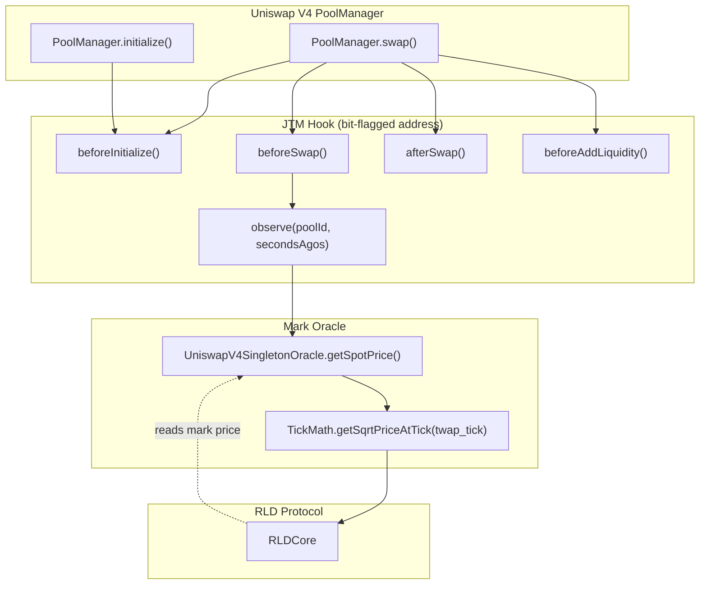

# JTM Hook: Initialization & Price Pipeline

This document covers the full lifecycle of the JTM hook from deployment through V4 pool initialization, explaining how the oracle index price is converted to a valid sqrtPriceX96 and how the mark oracle reads it back, with references to the integration test suite.

## Table of Contents

1. [JTM Hook Architecture](#twamm-hook-architecture)
2. [Deployment: HookMiner & CREATE2](#deployment-hookminer--create2)
3. [Cross-Linking: setRldCore](#cross-linking-setrldcore)
4. [V4 Pool Initialization Pipeline](#v4-pool-initialization-pipeline)
5. [Oracle Price → sqrtPriceX96 Math](#oracle-price--sqrtpricex96-math)
6. [Currency Ordering Invariants](#currency-ordering-invariants)
7. [Mark Price Readback: UniswapV4SingletonOracle](#mark-price-readback-uniswapv4singletonoracle)
8. [Integration Test Coverage](#integration-test-coverage)

---

## JTM Hook Architecture

The JTM hook is a Uniswap V4 hook contract that:

- Intercepts every swap and liquidity operation on the RLD pool
- Executes outstanding long-term swap orders (TWAP orders) as part of each interaction
- Exposes `observe()` returning tick cumulative data — consumed by `UniswapV4SingletonOracle` for TWAP-based mark pricing
- Enforces price bounds (`minSqrtPrice`, `maxSqrtPrice`) set at market genesis to prevent oracle manipulation



---

## Deployment: HookMiner & CREATE2

V4 hooks must reside at addresses whose leading bytes encode the set of callbacks they implement. The required flags for the RLD JTM hook are:

| Flag                           | Bit    | Purpose                                        |
| ------------------------------ | ------ | ---------------------------------------------- |
| `BEFORE_INITIALIZE_FLAG`       | 0x2000 | Set price bounds on pool creation              |
| `BEFORE_ADD_LIQUIDITY_FLAG`    | 0x0800 | Execute pending JTM orders before LP change  |
| `BEFORE_REMOVE_LIQUIDITY_FLAG` | 0x0400 | Execute pending JTM orders before LP removal |
| `BEFORE_SWAP_FLAG`             | 0x0200 | Execute pending JTM orders before each swap  |
| `AFTER_SWAP_FLAG`              | 0x0100 | Record swap for JTM accounting               |

**`HookMiner.find()`** iterates salts until `CREATE2(salt, creationCode, constructorArgs)` produces the flagged address. The `deployer` EOA address is baked into `constructorArgs` as `initialOwner`, guaranteeing uniqueness per deployer and preventing address-spoofing attacks.

```solidity
// Matches both DeployRLDProtocol.s.sol and setUp() in integration tests
(address hookAddress, bytes32 salt) = HookMiner.find(
    address(this),  // deployer — breaks CREATE2 determinism for attackers
    flags,
    type(JTM).creationCode,
    abi.encode(poolManager, JTM_EXPIRATION_INTERVAL, deployer, address(0))
);
jtmHook = new JTM{salt: salt}(poolManager, JTM_EXPIRATION_INTERVAL, deployer, address(0));
require(address(jtmHook) == hookAddress, "Hook address mismatch");
```

> [!IMPORTANT]
> The JTM hook is deployed with `rldCore = address(0)`. The core address is wired in a separate step (Phase 5 of the deploy script) via `jtmHook.setRldCore(address(core))`. The hook must not attempt to call core before this step.

---

## Cross-Linking: setRldCore

Because `RLDCore` depends on `RLDMarketFactory` (which wraps the JTM hook address) and the JTM hook needs to call back into `RLDCore`, there is a deliberate two-step initialization:

```
Phase 3: factory = new RLDMarketFactory(..., address(jtmHook), ...)
Phase 4: core   = new RLDCore(address(factory), poolManager, address(jtmHook))
Phase 5: factory.initializeCore(address(core))   ← one-time, deployer-only
          jtmHook.setRldCore(address(core))     ← one-time, owner-only
```

Both calls include guard conditions: `onlyOwner` / `msg.sender == DEPLOYER`, `!= address(0)`, and "already initialized" boolean flags, making them one-time ratchets that cannot be re-executed or front-run.

---

## V4 Pool Initialization Pipeline

At market genesis, the factory initializes the V4 pool at a price derived from the current Aave borrow rate. This eliminates the TWAP "cold start" gap — from block 0, the tick cumulative history reflects the correctly priced genesis tick.

### Step-by-step

1. **Query Aave V3**: Call `getReserveData(underlyingToken)` → raw borrow rate in RAY (27-decimal fixed point)
2. **WAD conversion**: `indexPrice_WAD = borrowRateRAY × K / 1e9` (K = 100, from `RLDAaveOracle.K_SCALAR`)
3. **Bound enforcement**: Assert `MIN_PRICE (1e14) ≤ indexPrice_WAD ≤ MAX_PRICE (100e18)`
4. **Decimal adjustment**: Map oracle WAD price to pool raw price (token1 per token0 atoms):
   - If PT (18-dec) is token0, CT (6-dec) is token1: `rawPrice = indexPrice × 10^12`
   - If CT (6-dec) is token0, PT (18-dec) is token1: `rawPrice = indexPrice / 10^12`
5. **sqrtPriceX96**: `sqrtPriceX96 = √(rawPrice × 2^192 / 1e18)` — computed via Babylonian sqrt
6. **Pool initialization**: `poolManager.initialize(poolKey, sqrtPriceX96)`
7. **JTM bootstrapping**: Set `minSqrtPrice` / `maxSqrtPrice` bounds; call `increaseCardinality(type(uint16).max)` to maximize TWAP observation capacity immediately
8. **Oracle registration**: `v4Oracle.registerPool(positionToken, poolKey, twammAddr, oraclePeriod)`

---

## Oracle Price → sqrtPriceX96 Math

### Formula

```
indexPrice_WAD = borrowRateRAY × 100 / 1e9

# For PT(18-dec) as token0, CT(6-dec) as token1:
rawPriceWAD = indexPrice_WAD × 10^(18 - 6) = indexPrice_WAD × 1e12

sqrtPriceX96 = sqrt(rawPriceWAD × 2^192 / 1e18)
```

### Concrete example: 5% Aave rate

| Step                  | Value                                               |
| --------------------- | --------------------------------------------------- |
| `borrowRateRAY`       | `0.05e27` (5%)                                      |
| `indexPrice_WAD`      | `0.05e27 × 100 / 1e9` = `5e18` (5.0 WAD)            |
| `rawPriceWAD` (PT=t0) | `5e18 × 1e12` = `5e30`                              |
| `sqrtPriceX96`        | `≈ 177_159_557_114_295_710_296_101_716_160_726_006` |
| Round-trip error      | `< 1 basis point`                                   |

### Round-trip recovery

```
rawBack  = sqrtPriceX96² × 1e18 / 2^192
indexBack = rawBack / 1e12              # for PT(18-dec) as token0
|indexBack - indexPrice_WAD| / indexPrice_WAD < 1e-4  ✓
```

> [!NOTE]
> The decimal adjustment direction depends on which token sorts to currency0 (lower address). Both orderings encode the same economic price — verified by `test_Phase1c_DecimalAdjust_IsSymmetric()` and `test_Phase1f_CurrencyOrder_BothOrderings_SameEconomicPrice()`.

---

## Currency Ordering Invariants

Uniswap V4 enforces `currency0.address < currency1.address`. The RLD factory applies `_sortCurrencies` before pool initialization.

| Scenario                     | currency0   | currency1   | rawPrice direction          |
| ---------------------------- | ----------- | ----------- | --------------------------- |
| PT deployed at lower address | PT (18-dec) | CT (6-dec)  | `index × 1e12` (ascending)  |
| CT deployed at lower address | CT (6-dec)  | PT (18-dec) | `index / 1e12` (descending) |

**Key invariant**: sqrtPriceX96 is **monotone increasing** with oracle index price in **both** orderings (because `1e12` and `1/1e12` are positive constants). The economic CT/PT price recovered from either pool ordering converges within 1 basis point.

---

## Mark Price Readback: UniswapV4SingletonOracle

The `UniswapV4SingletonOracle` implements `ISpotOracle.getSpotPrice(collateralToken, underlyingToken)`.

### TWAP computation

```solidity
// secondsAgos = [period, 0]
int56[] memory tickCumulatives = twamm.observe(poolId, secondsAgos);
int56 delta = tickCumulatives[1] - tickCumulatives[0];
int24 twapTick = int24(delta / int56(uint56(period)));
// floor rounding for negative delta
if (delta < 0 && delta % int56(uint56(period)) != 0) twapTick--;
```

### Price derivation from tick

```solidity
uint160 sqrtRatioX96 = TickMath.getSqrtPriceAtTick(twapTick);
uint128 baseAmount   = 10 ** baseDecimals;  // 1 whole token
// For baseToken == token0:
quoteAmount = mulDiv(sqrtRatioX96², baseAmount, 1 << 192);
// Normalize to WAD:
price = quoteAmount × 1e18 / (10 ** quoteDecimals);
```

The oracle correctly handles both token orderings by checking `baseToken == token0` and inverting the ratio when `baseToken == token1`.

---

## Integration Test Coverage

### Test file: `test/integration/TwammInitialization.t.sol`

The integration tests use a production-like base (`RLDIntegrationBase.t.sol`) that deploys the full real protocol stack with:

- Real `JTM` hook (HookMiner + CREATE2)
- Real `UniswapV4SingletonOracle`
- `ConfigurableOracle` for settable index prices
- Mock PT/CT tokens (PT = 18-dec, CT = 6-dec)

#### Phase 0a — Pool Initialization (5 tests)

| Test                                                      | What is verified                                                           |
| --------------------------------------------------------- | -------------------------------------------------------------------------- |
| `test_Phase0a_PoolInitialized_AtSqrtPrice_1_1`            | Pool starts at `SQRT_PRICE_1_1`; tick = 0                                  |
| `test_Phase0a_TokenOrdering_Currency0_LessThan_Currency1` | V4 invariant: `currency0.address < currency1.address`                      |
| `test_Phase0a_PoolKey_HasJTMHook`                       | Pool key references the bit-flagged JTM hook; correct fee/tickSpacing    |
| `test_Phase0a_UnInitializedPool_HasZeroSqrtPrice`         | Fresh pool with same tokens but different fee has `sqrtPrice = 0`          |
| `test_Phase0a_RLDMarket_Created_WithCorrectPool`          | `MarketId` is non-zero; `positionToken` and `collateralToken` are deployed |

#### Phase 0b — Token Order Documentation (2 tests)

| Test                                                             | What is verified                                                                               |
| ---------------------------------------------------------------- | ---------------------------------------------------------------------------------------------- |
| `test_Phase0b_TokenOrder_PT_CT`                                  | Address ordering holds regardless of deployment order                                          |
| `test_Phase0b_Price_InitializedAt_SqrtX96_ForAsymmetricDecimals` | Documents the 1:1 sqrtPrice semantic gap: 1:1 raw price ≠ 1:1 economic price for 18/6-dec pair |

#### Phase 0c — Oracle-Derived Price Verification (3 tests)

| Test                                                          | What is verified                                                                             |
| ------------------------------------------------------------- | -------------------------------------------------------------------------------------------- |
| `test_Phase0c_AaveOracleFormula_5pct_Rate`                    | Formula: `5% RAY × 100 / 1e9 = 5.0 WAD` exactly                                              |
| `test_Phase0c_SqrtPriceX96_Derivation_With_DecimalAdjustment` | Full forward pass; round-trip < 1 bip at 5% rate                                             |
| `test_Phase0c_PoolPrice_Matches_OraclePrice_Within1Pct`       | `ConfigurableOracle.setIndexPrice(5e18)` → compute sqrt → recover mark → within 1% of oracle |

#### Phase 1a — Multi-Rate Formula Correctness (1 test)

Verifies `P = K × r` exactly at 7 Aave rates: 0.5%, 1%, 2%, 5%, 10%, 20%, 50%

#### Phase 1b — Round-Trip Precision at All Rates (1 test)

For each rate in `{0.5%, 1%, 2%, 5%, 10%, 20%, 50%}`:

```
indexPrice → decimalAdjust(dec0, dec1) → sqrtPriceX96 → rawBack → undecimalAdjust → indexBack
|indexBack - indexPrice| / indexPrice < 1e-4 (1 bip) ✓
```

Uses **actual pool currency ordering** (not hardcoded).

#### Phase 1c — Decimal Adjustment Symmetry (1 test)

Proves the adjustment is a true bijection for a concrete `indexPrice = 5e18`:

- PT as token0: `rawA = 5e30`; recovered economic price = `5e18` ± 1 bip ✓
- CT as token0: `rawB = 5e6`; recovered economic price = `5e18` ± 1 bip ✓

#### Phase 1d — Tick Consistency (1 test)

For 5 rates, verifies `sqrtPriceX96` lies in `[sqrtAtTick, sqrtAtNextTick)` — confirming the tick math round-trips correctly and pool initialization places the price at the right tick.

#### Phase 1e — Live Pool Seeding (3 tests)

Creates a fresh no-hook V4 pool at the oracle-derived `sqrtPriceX96` and reads it back via `getSlot0()`:

- Stored `sqrtPrice` equals seed exactly
- Stored `tick` equals `getTickAtSqrtPrice(sqrtSeed)` exactly
- Round-trip index price recovery < 1 bip

Rates tested: 1%, 5%, 20%

#### Phase 1f — Currency-Order-Explicit Seeding (1 test)

Computes both PT-as-currency0 and CT-as-currency0 price encodings at `5e18` WAD, verifies both:

- Recover to `5e18 ± 1 bip` individually
- Agree with each other within `1 bip`

#### Phase 1g — Edge Cases & Monotonicity (3 tests)

| Test                                                   | What is verified                                                                 |
| ------------------------------------------------------ | -------------------------------------------------------------------------------- |
| `test_Phase1g_EdgeCase_VeryLowRate_0_1pct`             | `0.1% → 0.1 WAD` stays in `[MIN_SQRT_PRICE, MAX_SQRT_PRICE]`                     |
| `test_Phase1g_EdgeCase_HighRate_50pct`                 | `50% → 50 WAD` stays in valid price range                                        |
| `test_Phase1g_Monotonicity_HigherRate_HigherSqrtPrice` | sqrtPriceX96 is **strictly increasing** with index price in both token orderings |

### Summary Table

| Phase     | Tests  | Key Guarantee                                          |
| --------- | ------ | ------------------------------------------------------ |
| 0a        | 5      | Pool is live with correct hook, fee, tick              |
| 0b        | 2      | Token ordering and decimal-semantic gap documented     |
| 0c        | 3      | Oracle formula exact; round-trip within 1% at 5% rate  |
| 1a        | 1      | Formula exact at 7 representative rates                |
| 1b        | 1      | Round-trip < 1 bip at all 7 rates with real ordering   |
| 1c        | 1      | Decimal adjustment is a true bijection                 |
| 1d        | 1      | Tick math round-trips correctly at 5 rates             |
| 1e        | 3      | Live pool stores the seeded price exactly              |
| 1f        | 1      | Both currency orderings encode the same economic price |
| 1g        | 3      | Edge cases in-range; price is monotone in oracle rate  |
| **Total** | **22** |                                                        |
