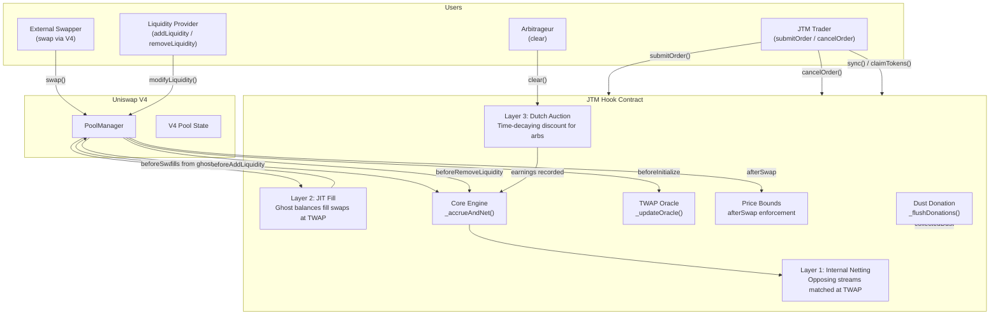
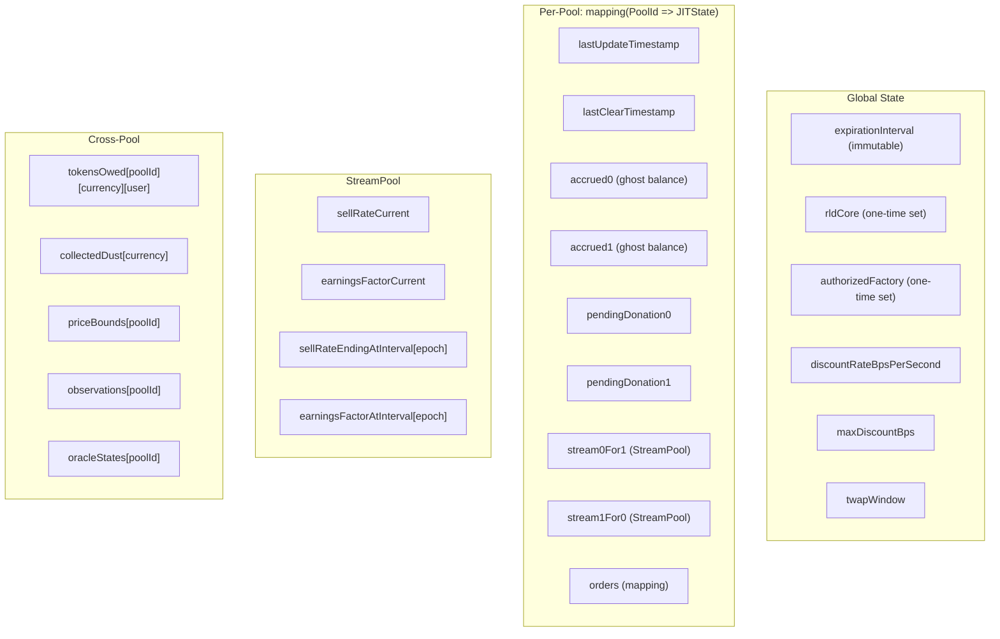
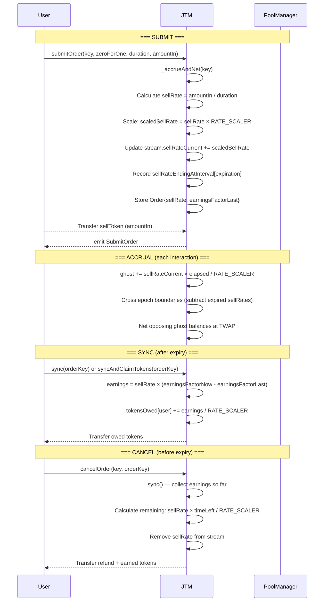
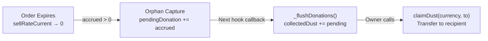

# JTM Hook: Implementation Reference

This document provides an exhaustive reference for the JTM (JIT Time-Weighted Average Market Maker) hook implementation — the core execution engine for streaming TWAP orders in the RLD Protocol. It covers architecture, the 3-layer matching engine, state management, order lifecycle, dust donation, access control, test coverage, and known limitations.

> [!NOTE]
> For deployment procedures and price pipeline initialization, see [DEPLOYMENT.md](./DEPLOYMENT.md) and [JTM_INITIALIZATION.md](./JTM_INITIALIZATION.md).

## Table of Contents

1. [Architecture Overview](#architecture-overview)
2. [Three-Layer Matching Engine](#three-layer-matching-engine)
3. [State Management & Data Model](#state-management--data-model)
4. [Order Lifecycle](#order-lifecycle)
5. [Core Engine: Accrual, Netting & Epoch Crossing](#core-engine-accrual-netting--epoch-crossing)
6. [Dust Donation Mechanism](#dust-donation-mechanism)
7. [TWAP Oracle Integration](#twap-oracle-integration)
8. [Price Bounds Enforcement](#price-bounds-enforcement)
9. [Hook Callback Matrix](#hook-callback-matrix)
10. [Access Control & Security](#access-control--security)
11. [Error Catalog](#error-catalog)
12. [Event Catalog](#event-catalog)
13. [Test Coverage](#test-coverage)
14. [Known Limitations & Design Tensions](#known-limitations--design-tensions)
15. [Configuration Parameters](#configuration-parameters)

---

## Architecture Overview

JTM is a **complete redesign** of the Paradigm JTM model. Instead of simulating a virtual AMM curve and executing via `PoolManager.swap()`, this hook operates as a **JIT Limit Order Maker** with a 3-layer matching engine that eliminates swap costs entirely for streamed orders.



### Inheritance Chain

```
JTM
├── BaseHook (v4-periphery)     — V4 hook callback routing
├── Owned (solmate)              — Single-owner access control
├── ReentrancyGuard (OpenZeppelin) — Reentrancy protection
└── IJTM                    — Public interface
```

### Contract Files

| File                                                                                             | Lines | Purpose                                               |
| ------------------------------------------------------------------------------------------------ | ----- | ----------------------------------------------------- |
| [`JTM.sol`](file:///home/ubuntu/RLD/contracts/src/twamm/JTM.sol)                       | 1,205 | Core implementation                                   |
| [`IJTM.sol`](file:///home/ubuntu/RLD/contracts/src/twamm/IJTM.sol)                     | 221   | Public interface (errors, structs, events, functions) |
| [`TransferHelper.sol`](file:///home/ubuntu/RLD/contracts/src/twamm/libraries/TransferHelper.sol) | —     | Safe ERC20 transfer wrappers                          |
| [`TwapOracle.sol`](file:///home/ubuntu/RLD/contracts/src/twamm/libraries/TwapOracle.sol)         | —     | TWAP observation ring buffer                          |

---

## Three-Layer Matching Engine

The core innovation: three independent layers that execute sequentially on every pool interaction, each offering progressively worse pricing to ensure ghost balances are always cleared.

### Layer 1: Internal Netting (Free)

**When**: Every `_accrueAndNet()` call (triggered by any hook callback).

**What**: Opposing ghost balances (`accrued0` selling token0, `accrued1` selling token1) are netted against each other at the oracle TWAP price. Both streams earn the matched amount without any swap fees or price impact.

```
// If accrued0 = 10,000 USDC and accrued1 = 8,000 wRLP (at TWAP = 1:1):
// → Match 8,000 from each side
// → 0→1 stream earns 8,000 wRLP
// → 1→0 stream earns 8,000 USDC
// → Remaining: accrued0 = 2,000, accrued1 = 0
```

**Cost to JTM traders**: Zero. No swap fees, no price impact.

### Layer 2: JIT Fill (Free, earns spread)

**When**: `_beforeSwap()` hook callback — intercepts every external swap.

**What**: If a taker wants to buy token X and the hook has accrued token X (ghost balance), the hook fills the swap directly at TWAP price. The hook:

1. Gives accrued tokens to the PoolManager (output for the taker)
2. Takes input tokens from the PoolManager (earnings for JTM streamers)

**Cost to JTM traders**: Zero. Effectively a free limit order fill at TWAP.

**Cost to takers**: Same as a regular swap — they pay the pool's fee tier. The difference is execution happens at TWAP rather than the AMM curve.

### Layer 3: Dynamic Dutch Auction (Gas-only cost)

**When**: Arbitrageurs call `clear()` permissionlessly.

**What**: A time-decaying discount incentivizes arbs to clear ghost balances. The discount starts at 0 bps and grows linearly with time since the last clear, capped at `maxDiscountBps`.

```
discountBps = min(
    (block.timestamp - lastClearTimestamp) × discountRateBpsPerSecond,
    maxDiscountBps
)
```

**Cost to JTM traders**: The discount amount. On mainnet with 12s blocks and typical settings, this is ~5 bps per second × 12s = ~60 bps (0.6%) per block gap.

---

## State Management & Data Model

### Storage Layout



### Key Data Structures

#### `JITState` — Per-pool core state

| Field                 | Type                        | Description                                               |
| --------------------- | --------------------------- | --------------------------------------------------------- |
| `lastUpdateTimestamp` | `uint256`                   | Last time `_accrueAndNet()` ran                           |
| `lastClearTimestamp`  | `uint256`                   | Last time `clear()` was called (for discount calculation) |
| `accrued0`            | `uint256`                   | Ghost balance of token0 awaiting sale                     |
| `accrued1`            | `uint256`                   | Ghost balance of token1 awaiting sale                     |
| `pendingDonation0`    | `uint256`                   | Orphaned token0 awaiting flush to `collectedDust`         |
| `pendingDonation1`    | `uint256`                   | Orphaned token1 awaiting flush to `collectedDust`         |
| `stream0For1`         | `StreamPool`                | Aggregate state for all orders selling token0 → token1    |
| `stream1For0`         | `StreamPool`                | Aggregate state for all orders selling token1 → token0    |
| `orders`              | `mapping(bytes32 => Order)` | Individual order state keyed by `keccak256(OrderKey)`     |

#### `StreamPool` — Aggregate stream state per direction

| Field                             | Type      | Description                                                           |
| --------------------------------- | --------- | --------------------------------------------------------------------- |
| `sellRateCurrent`                 | `uint256` | Sum of all active orders' sell rates (scaled by `RATE_SCALER = 1e18`) |
| `earningsFactorCurrent`           | `uint256` | Cumulative earnings per unit sellRate (Q96 fixed point)               |
| `sellRateEndingAtInterval[epoch]` | `mapping` | Aggregate sellRate expiring at each epoch boundary                    |
| `earningsFactorAtInterval[epoch]` | `mapping` | Snapshot of earningsFactor at each epoch boundary                     |

#### `Order` — Per-user order state

| Field                | Type      | Description                                                        |
| -------------------- | --------- | ------------------------------------------------------------------ |
| `sellRate`           | `uint256` | Tokens sold per second (scaled by `RATE_SCALER`)                   |
| `earningsFactorLast` | `uint256` | Snapshot of `earningsFactorCurrent` at order creation or last sync |

---

## Order Lifecycle



### Key Formulas

**Sell Rate Scaling**:

```
sellRate = amountIn / duration           // tokens per second (raw)
scaledSellRate = sellRate × 1e18         // prevent precision loss
actualDeposit = sellRate × duration      // may truncate dust
```

**Ghost Balance Accrual**:

```
accrued0 += stream0For1.sellRateCurrent × elapsed / 1e18
accrued1 += stream1For0.sellRateCurrent × elapsed / 1e18
```

**Earnings Calculation** (for a user with order at a specific `earningsFactorLast`):

```
earningsPerUnit = stream.earningsFactorCurrent - order.earningsFactorLast
earnings = order.sellRate × earningsPerUnit / (2^96 × 1e18)
```

**Cancel Refund**:

```
timeRemaining = expiration - block.timestamp
refund = order.sellRate × timeRemaining / 1e18
```

---

## Core Engine: Accrual, Netting & Epoch Crossing

The `_accrueAndNet()` function is called on **every hook callback** and executes 4 steps atomically:

### Step 1: Accrue ghost balances

```solidity
uint256 elapsed = currentTime - state.lastUpdateTimestamp;
state.accrued0 += state.stream0For1.sellRateCurrent * elapsed / RATE_SCALER;
state.accrued1 += state.stream1For0.sellRateCurrent * elapsed / RATE_SCALER;
```

### Step 2: Internal Net (Layer 1)

Convert `accrued1` to token0 terms at TWAP, find the matchable amount (minimum of both sides), and record earnings for both streams proportionally.

### Step 3: Cross Epoch Boundaries

Walk through every epoch boundary between `lastUpdateTimestamp` and `now`. For each boundary:

- Snapshot `earningsFactorAtInterval[epoch]`
- Subtract expired `sellRateEndingAtInterval[epoch]` from `sellRateCurrent`

### Step 4: Orphan Capture (Dust Donation)

If a stream's `sellRateCurrent` drops to 0 (all orders expired) and there are still accrued tokens:

```solidity
if (stream0For1.sellRateCurrent == 0 && accrued0 > 0) {
    state.pendingDonation0 += accrued0;
    state.accrued0 = 0;
}
```

These tokens cannot be claimed by any trader (the stream has no active orders), so they are captured for later donation.

---

## Dust Donation Mechanism

### The Problem: Stranded Dust

When a JTM stream expires, `_accrueAndNet()` crosses the epoch boundary and sets `sellRateCurrent = 0`. If there are still accrued tokens (from the final block of accrual), `clear()` reverts with `NoActiveStream` because `_recordEarnings` would divide by zero. These tokens would be permanently stranded.

### The Solution



**On mainnet** (12s blocks), each expired order orphans at most `sellRate × 12` tokens — one block's worth of accrual.

### Why Not V4 `donate()`?

V4's `donate()` function calls `beforeDonate/afterDonate` hooks on the pool's hook address. Enabling `BEFORE_DONATE_FLAG` would require **re-mining the hook address** (changing the CREATE2 salt), which is not feasible post-deployment. Instead, dust accumulates in `collectedDust` and the owner redistributes manually.

### `collectedDust` Mapping

```solidity
mapping(Currency => uint256) public collectedDust;
```

Flushed on every `_beforeSwap`, `_beforeAddLiquidity`, and `_beforeRemoveLiquidity` callback via `_flushDonations()`.

---

## TWAP Oracle Integration

JTM maintains its own TWAP oracle (independent of V4's built-in oracle) using the `TwapOracle` library:

- **Observation ring buffer**: Written on every `_updateOracle(key)` call
- **Cardinality**: Grows dynamically via `increaseCardinality()`, initialized to 10 at pool creation, expanded to `type(uint16).max` at market genesis
- **TWAP window**: Configurable via `setTwapWindow()`, default 30 seconds
- **Fallback**: If cardinality < 2, falls back to V4's `getSqrtPriceX96()` (spot price)
- **Used by**:
  - Layer 1 netting (price conversion)
  - Layer 2 JIT fill (price conversion)
  - Layer 3 clearing (discount calculation base)
  - `UniswapV4SingletonOracle` (mark price for RLDCore)

---

## Price Bounds Enforcement

Price bounds are enforced in `_afterSwap()` to prevent oracle manipulation:

```solidity
(uint160 sqrtPriceAfter, , , ) = poolManager.getSlot0(key.toId());
if (sqrtPriceAfter < bounds.min || sqrtPriceAfter > bounds.max) {
    revert("Price out of bounds");
}
```

- Set once per pool via `setPriceBounds(key, min, max)`
- Only callable by `authorizedFactory` or `rldCore`
- Cannot be overwritten (`bounds.max != 0` check)
- Derived from Aave borrow rates at market genesis

---

## Hook Callback Matrix

| Callback                | Triggered By                    | Actions Performed                                                               |
| ----------------------- | ------------------------------- | ------------------------------------------------------------------------------- |
| `beforeInitialize`      | `PoolManager.initialize()`      | Initialize TWAP oracle, grow cardinality                                        |
| `beforeAddLiquidity`    | `PoolManager.modifyLiquidity()` | `_updateOracle()`, `_accrueAndNet()`, `_flushDonations()`                       |
| `beforeRemoveLiquidity` | `PoolManager.modifyLiquidity()` | `_updateOracle()`, `_accrueAndNet()`, `_flushDonations()`                       |
| `beforeSwap`            | `PoolManager.swap()`            | `_updateOracle()`, `_accrueAndNet()`, `_flushDonations()`, **Layer 2 JIT fill** |
| `afterSwap`             | `PoolManager.swap()`            | **Price bounds enforcement**                                                    |

### V4 Hook Permission Flags

```
beforeInitialize:     true
afterInitialize:      false
beforeAddLiquidity:   true
beforeRemoveLiquidity: true
beforeSwap:           true
afterSwap:            true
beforeDonate:         false  ← Intentionally disabled (see Dust Donation)
afterDonate:          false
```

---

## Access Control & Security

### Access Control Matrix

| Contract     | Function                  | Guard                                  | Who Can Call                    | Notes                                               |
| ------------ | ------------------------- | -------------------------------------- | ------------------------------- | --------------------------------------------------- |
| **JTM** | `setRldCore()`            | `onlyOwner` + one-time                 | Deployer EOA                    | `rldCore` must be `address(0)`                      |
|              | `setAuthorizedFactory()`  | `onlyOwner` + one-time                 | Deployer EOA                    | `authorizedFactory` must be `address(0)`            |
|              | `setDiscountRate()`       | `onlyOwner`                            | Deployer EOA                    | Governance tunable                                  |
|              | `setMaxDiscount()`        | `onlyOwner`                            | Deployer EOA                    | Governance tunable                                  |
|              | `setTwapWindow()`         | `onlyOwner`                            | Deployer EOA                    | Governance tunable                                  |
|              | `setTradingFee()`         | `onlyOwner`                            | Deployer EOA                    | Governance tunable                                  |
|              | `setProtocolFee()`        | `onlyOwner`                            | Deployer EOA                    | Capped at 50% of trading fee                        |
|              | `setPriceBounds()`        | `authorizedFactory` or `rldCore`       | Factory/Core, one-time per pool | Cannot overwrite existing bounds                    |
|              | `claimDust()`             | `onlyOwner`                            | Deployer EOA                    | Withdraws accumulated orphaned tokens               |
|              | `submitOrder()`           | `nonReentrant`                         | Anyone                          | Permissionless                                      |
|              | `cancelOrder()`           | `nonReentrant` + `msg.sender == owner` | Order owner only                |                                                     |
|              | `sync()`                  | None                                   | Anyone                          | Permissionless (updates earnings)                   |
|              | `claimTokens()`           | `msg.sender` scoped                    | Token owner                     | Only claims own `tokensOwed`                        |
|              | `clear()`                 | `nonReentrant`                         | Anyone                          | Permissionless (MEV-protected via `minDiscountBps`) |
|              | `executeJTMOrders()` | None                                   | Anyone                          | Permissionless accrual trigger                      |
|              | `syncAndClaimTokens()`    | None                                   | Anyone                          | Convenience function                                |

### Security Mitigations

1. **Reentrancy**: All state-mutating user-facing functions (`submitOrder`, `cancelOrder`, `clear`) use OpenZeppelin's `nonReentrant` modifier.

2. **One-Time Initialization**: `setRldCore()` and `setAuthorizedFactory()` include `address(0)` checks — they can only be called once, preventing hijacking.

3. **Price Manipulation Protection**: `afterSwap` enforces immutable price bounds derived from Aave rates at genesis. No swap can move the price outside these bounds.

4. **MEV Protection on Clears**: Arbs specify `minDiscountBps` when calling `clear()`, ensuring they receive at least their minimum acceptable discount. Front-runners cannot steal the discount by executing the clear with a lower discount first.

5. **Dust Orphan Capture**: Orphaned tokens are captured and accumulated in `collectedDust` rather than being stranded permanently. Owner redistributes.

6. **Order Identity**: Orders are identified by `keccak256(owner, expiration, zeroForOne)`, meaning one user can have at most one active order per direction per expiration epoch.

---

## Error Catalog

| Error                         | Thrown By             | Condition                                          |
| ----------------------------- | --------------------- | -------------------------------------------------- |
| `PoolWithNativeNotSupported`  | `beforeInitialize`    | Pool uses native ETH (not wrapped)                 |
| `InvalidExpirationInterval`   | Constructor           | `expirationInterval == 0`                          |
| `ExpirationNotOnInterval`     | `submitOrder`         | `duration` doesn't align with `expirationInterval` |
| `ExpirationLessThanBlockTime` | `submitOrder`         | Order would expire in the past                     |
| `NotInitialized`              | Various               | Pool's `lastUpdateTimestamp == 0`                  |
| `OrderAlreadyExists`          | `submitOrder`         | Duplicate `(owner, expiration, zeroForOne)`        |
| `OrderDoesNotExist`           | `cancelOrder`, `sync` | Order key has no stored state                      |
| `OrderAlreadyExpired`         | `cancelOrder`         | Cannot cancel after expiration                     |
| `SellRateCannotBeZero`        | `submitOrder`         | `amountIn / duration == 0` (dust truncation)       |
| `Unauthorized`                | `cancelOrder`         | `msg.sender != orderKey.owner`                     |
| `NothingToClear`              | `clear`               | Accrued balance for direction is 0                 |
| `NoActiveStream`              | `clear`               | `sellRateCurrent == 0` for the direction           |
| `InsufficientPayment`         | `clear`               | Arb's token transfer failed                        |
| `OracleNotReady`              | `_getTwapPrice`       | Oracle cardinality < 2 and no fallback             |
| `InsufficientDiscount`        | `clear`               | Current discount < `minDiscountBps`                |

---

## Event Catalog

| Event              | Emitted By          | Data                                                                                                   |
| ------------------ | ------------------- | ------------------------------------------------------------------------------------------------------ |
| `SubmitOrder`      | `submitOrder()`     | `poolId`, `orderId`, `owner`, `amountIn`, `expiration`, `zeroForOne`, `sellRate`, `earningsFactorLast` |
| `CancelOrder`      | `cancelOrder()`     | `poolId`, `orderId`, `owner`, `sellTokensRefund`                                                       |
| `InternalMatch`    | `_internalNet()`    | `poolId`, `matched0`, `matched1`                                                                       |
| `JITFill`          | `_beforeSwap()`     | `poolId`, `filledAmount`, `zeroForOne`                                                                 |
| `AuctionClear`     | `clear()`           | `poolId`, `clearer`, `amount`, `discount`                                                              |
| `DustDonatedToLPs` | `_flushDonations()` | `poolId`, `amount0`, `amount1`                                                                         |

---

## Test Coverage

The JTM test suite contains **116 tests across 16 groups** in [`JTMParanoid.t.sol`](file:///home/ubuntu/RLD/contracts/test/integration/JTMParanoid.t.sol), running against a full V4 integration environment.

### Test Group Summary

| Group                       | Tests | Focus Area                                                                               |
| --------------------------- | ----- | ---------------------------------------------------------------------------------------- |
| **1. Init**                 | 5     | Hook deployment, pool initialization, default tunables, timestamp                        |
| **2. Submit**               | 10    | Order creation, sell rate scaling, balance deductions, reverts                           |
| **3. Cancel**               | 7     | Full/partial refunds, earnings on cancel, sellRate removal, reverts                      |
| **4. Engine**               | 6     | Ghost accrual math, epoch crossing, multi-epoch, no-op conditions                        |
| **5. Sync**                 | 5     | Earnings credits, idempotent double-sync, factor updates, reverts                        |
| **6. Claim**                | 2     | Token transfer, zero-balance claim                                                       |
| **7. Layer 1**              | 9     | Internal netting, balanced/asymmetric orders, price stability, earnings direction        |
| **8. Layer 2**              | 9     | JIT fill on swap, ghost drainage, cap enforcement, opposing direction, multi-swap        |
| **9. Layer 3**              | 9     | Dutch auction clearing, discount growth, partial/full clear, both directions, sequential |
| **10. Bounds**              | 6     | Price bounds storage, enforcement, LP range, swap compliance                             |
| **11. Views**               | 5     | Read-only consistency: `getOrder`, `getStreamState`, `getCancelOrderState`               |
| **12. Overlap**             | 5     | Multiple overlapping orders, staggered expirations, cancel during overlap                |
| **13. Stress**              | 6     | 10 actors, 10 epochs, rolling orders, mixed durations, staggered entry                   |
| **14. Full Cycle**          | 1     | End-to-end: submit → accrue → clear → expire → claim with **7 invariants**               |
| **15. LP Wei-Precise**      | 1     | Exact wei-level accounting: LP deposit → streams → clear → LP withdraw                   |
| **16. Asymmetric Opposing** | 1     | 10:1 ratio opposing streams: netting-backing gap measurement + conservation              |

**Additionally:**

| Suite               | Tests | Focus                                                                  |
| ------------------- | ----- | ---------------------------------------------------------------------- |
| **Admin**           | 8     | All setter functions, owner checks, revert conditions                  |
| **Adversarial**     | 5     | Cancel+resubmit, empty execution, late joiner, very large/small orders |
| **Ported**          | 5     | Regression tests from the original Paradigm JTM                      |
| **Gap Convergence** | 1     | Imbalanced flow clearance via auction                                  |
| **SyncAndClaim**    | 2     | Combined sync+claim, double-subtract regression                        |

### Key Invariants (Full Cycle Test)

The `test_FullCycle_NoFundsLost_AllParticipantsWhole` test enforces these invariants:

| ID        | Invariant                                        | Assertion                                    |
| --------- | ------------------------------------------------ | -------------------------------------------- |
| **INV-1** | Both JTM traders earn their expected buy token | `earnings > 0` for each                      |
| **INV-2** | Both traders sold their full order amount        | `loss == orderAmount`                        |
| **INV-3** | LP recovers ≥ 99.5% of deposit                   | `lpRecovery >= deposit × 99.5%`              |
| **INV-4** | Hook residual fully accounted by `collectedDust` | `unaccounted < 10 wei`                       |
| **INV-5** | V4 pool remains solvent                          | `balanceOf(poolManager) > 0` for both tokens |
| **INV-6** | Global token conservation via `totalSupply`      | `delta == exactMintedAmount`                 |
| **INV-7** | No residual `tokensOwed` for any participant     | `tokensOwed == 0`                            |

### Tightened Tolerances

All assertion tolerances have been hardened from the initial implementation:

| Check                   | Before       | After         | Rationale                             |
| ----------------------- | ------------ | ------------- | ------------------------------------- |
| LP recovery (INV-3)     | 95%          | **99.5%**     | Prevents masking impermanent loss     |
| Cancel refund           | 2% tolerance | **0.5%**      | Tighter refund precision              |
| Accrual accuracy        | 1% tolerance | **0.1%**      | Catches rounding errors               |
| View vs actual refund   | 5% tolerance | **1%**        | Consistency between view and mutation |
| LP wei-precise recovery | 98%          | **99.5%**     | Ensures fee income offsets IL         |
| Price drift (balanced)  | ≤ 1%         | **Exactly 0** | Balanced flow must not move price     |
| Hook residual (INV-4)   | —            | **< 10 wei**  | With `collectedDust` accounting       |

---

## Known Limitations & Design Tensions

### 1. Netting-Backing Gap (Asymmetric Opposing Streams)

**Severity**: Low (measurable, bounded)

When two opposing JTM streams have different sizes (e.g., 10:1 ratio), L1 netting credits earnings at TWAP price, but L3 clearing provides backing at a discounted price. The result: the hook holds slightly fewer tokens than the total recorded earnings.

**Measured gap**: ~999,999 tokens on a 36,000e6 order (0.003%).

**Formula**: `gap ≈ discount% × cleared_amount ≈ sellRate × block_time`

**Mitigation**: Owner can fill from `collectedDust` or protocol fees.

### 2. Dust per Expired Order

**Severity**: Negligible

Each expired order orphans at most `sellRate × blockTime` tokens (one block of accrual). On mainnet (12s blocks), this is typically < 0.1% of the order.

**Mitigation**: Captured via orphan capture (Step 4 of `_accrueAndNet`), flushed to `collectedDust`.

### 3. Hook Permission Constraint

**Severity**: Architectural

JTM cannot call V4's `donate()` because `BEFORE_DONATE_FLAG` is not set in the hook address. Changing this would require re-mining the hook address via CREATE2.

**Mitigation**: `collectedDust` accumulates dust; owner redistributes manually via `claimDust()`.

### 4. Single Order per Direction per Epoch (By Design)

A user can have at most one active order per `(zeroForOne, expiration)` pair. Attempting to submit a duplicate reverts with `OrderAlreadyExists`. This is a deliberate design choice:

- **Deterministic lookups**: Anyone can reconstruct an `orderId` from `keccak256(owner, expiration, zeroForOne)` — no hidden nonces or salts needed
- **No state bloat**: No per-user nonce mappings that accumulate permanently
- **Natural consolidation**: Users batch their intent into one well-sized TWAP order rather than fragmenting across many small ones
- **Simpler UX**: Users only need to track direction + expiration, not arbitrary order IDs

Users who need additional throughput can use different durations to land on different expiration epochs.

### 5. Seed Liquidity Sensitivity

Test environment uses high seed liquidity (100e12) which minimizes price impact. Production environments with lower liquidity will see larger IL for LPs and potentially wider netting-backing gaps.

---

## Configuration Parameters

### Immutable (Set at deployment)

| Parameter            | Value           | Purpose                                       |
| -------------------- | --------------- | --------------------------------------------- |
| `expirationInterval` | 7200s (2 hours) | Epoch boundary for order expiration alignment |
| `RATE_SCALER`        | `1e18`          | Precision multiplier for sell rates           |

### Governance Tunables (Owner-only)

| Parameter                  | Default  | Range          | Purpose                              |
| -------------------------- | -------- | -------------- | ------------------------------------ |
| `discountRateBpsPerSecond` | 5 bps/s  | 0–∞            | Speed of L3 discount growth          |
| `maxDiscountBps`           | 500 (5%) | 0–10000        | Cap on L3 discount                   |
| `twapWindow`               | 30s      | 1–3600         | TWAP observation lookback            |
| `tradingFee`               | 0 bps    | 0–10000        | Fee applied to JTM earnings        |
| `protocolFee`              | 0 bps    | 0–tradingFee/2 | Protocol fee (subset of trading fee) |

### One-Time Initialization

| Parameter             | Set By                   | Purpose                                   |
| --------------------- | ------------------------ | ----------------------------------------- |
| `rldCore`             | `setRldCore()`           | RLDCore contract address for oracle reads |
| `authorizedFactory`   | `setAuthorizedFactory()` | RLDMarketFactory for price bounds         |
| `priceBounds[poolId]` | `setPriceBounds()`       | Immutable min/max sqrtPrice per pool      |
