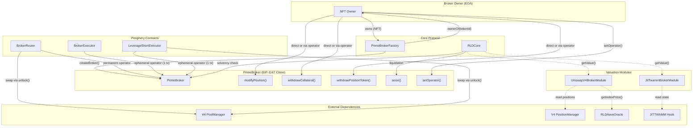

# Broker & Periphery: Architecture, Test Coverage & Penetration Testing

This document provides a comprehensive breakdown of the PrimeBroker ecosystem, periphery execution contracts, valuation modules, and the 8-phase penetration testing campaign that validated them.

## Table of Contents

1. [Architecture & Contract Graph](#architecture--contract-graph)
2. [Contract Overview](#contract-overview)
3. [Security & Access Control](#security--access-control)
4. [Penetration Testing — 8 Phases](#penetration-testing--8-phases)
5. [Production Bugs Found & Fixed](#production-bugs-found--fixed)
6. [Architectural Decisions](#architectural-decisions)
7. [Known Limitations](#known-limitations)

---

## Architecture & Contract Graph

The PrimeBroker ecosystem consists of a core broker contract managed via NFT ownership, three periphery execution contracts, and two valuation modules that feed NAV calculations.

### Diagram: Broker & Periphery Interaction Flow

---

## Contract Overview

### PrimeBroker (`src/rld/broker/PrimeBroker.sol`)

The central account contract for each user. Deployed as an EIP-1167 minimal proxy clone from `PrimeBrokerFactory`. Each broker is an NFT — the factory contract is the ERC-721, and the token ID is `uint256(uint160(brokerAddress))`.

| Aspect         | Detail                                                                |
| -------------- | --------------------------------------------------------------------- |
| **Deployment** | Factory clone via `CREATE2`                                           |
| **Ownership**  | NFT-based (`ownerOf(tokenId)`)                                        |
| **Operators**  | Up to `MAX_OPERATORS` addresses with delegated access                 |
| **State**      | Collateral balance, debt principal, active TWAMM order, LP positions  |
| **Solvency**   | Checked by `RLDCore.lockAndCallback()` on every position modification |
| **Reentrancy** | All mutating functions are `nonReentrant` (shared lock)               |

### BrokerRouter (`src/periphery/BrokerRouter.sol`)

Unified execution layer for deposits, longs, shorts, and their closures.

| Aspect             | Detail                                                                                     |
| ------------------ | ------------------------------------------------------------------------------------------ |
| **Operator Model** | Permanent operator (set during `initialize()`)                                             |
| **Auth**           | `onlyBrokerAuthorized(broker)` — NFT owner or operator                                     |
| **V4 Integration** | Direct `poolManager.unlock()` with `unlockCallback()`                                      |
| **Admin**          | `setDepositRoute()`, `transferOwnership()` via `onlyOwner`                                 |
| **Functions**      | `deposit`, `depositWithApproval`, `executeLong`, `closeLong`, `executeShort`, `closeShort` |

### BrokerExecutor (`src/periphery/BrokerExecutor.sol`)

Generic atomic multicall with ephemeral operator pattern.

| Aspect                | Detail                                             |
| --------------------- | -------------------------------------------------- |
| **Operator Model**    | Ephemeral — set and revoked within one transaction |
| **Auth**              | EIP-191 signature from broker NFT owner            |
| **Replay Protection** | Auto-incrementing nonce per executor per broker    |
| **Targets**           | Arbitrary contract calls (composable)              |

### LeverageShortExecutor (`src/periphery/LeverageShortExecutor.sol`)

Purpose-built atomic leveraged short: deposit → mint → swap → re-deposit → revoke.

| Aspect             | Detail                                                                          |
| ------------------ | ------------------------------------------------------------------------------- |
| **Operator Model** | Ephemeral (same as BrokerExecutor)                                              |
| **Flow**           | 8-step atomic: set op → modify pos → withdraw → swap → sweep → deposit → revoke |
| **V4 Integration** | Direct `poolManager.unlock()` for wRLP → waUSDC swap                            |
| **Math**           | `calculateOptimalDebt(collateral, LTV%, wRLPPrice)`                             |

### JitTwammBrokerModule (`src/rld/modules/broker/JitTwammBrokerModule.sol`)

Stateless valuation module for JITTWAMM orders.

| Aspect                | Detail                                                                           |
| --------------------- | -------------------------------------------------------------------------------- |
| **Formula**           | `sellRefund × sellPrice + buyOwed × buyPrice + ghostShare × sellPrice × (1 − d)` |
| **Ghost Attribution** | Pro-rata: `totalGhost × order.sellRate / stream.sellRateCurrent`                 |
| **Discount**          | Dutch auction: `d = min(timeSinceLastClear × rate, maxDiscount)`                 |
| **Pricing**           | valuationToken = 1:1, positionToken = indexPrice, unknown = 0                    |

### UniswapV4BrokerModule (`src/rld/modules/broker/UniswapV4BrokerModule.sol`)

Stateless valuation module for Uniswap V4 LP positions.

| Aspect            | Detail                                                               |
| ----------------- | -------------------------------------------------------------------- |
| **Decomposition** | `getAmountsForLiquidity(sqrtPrice, tickLower, tickUpper, liquidity)` |
| **Pricing**       | Same as TWAMM module: collateral 1:1, position at index price        |
| **Edge Cases**    | Zero liquidity → 0, out-of-range → single-token value                |

---

## Security & Access Control

### Access Control Matrix

| Contract                  | Function                     | Guard                           | Who Can Call         | Tested     |
| ------------------------- | ---------------------------- | ------------------------------- | -------------------- | ---------- |
| **PrimeBroker**           | `initialize()`               | `!initialized`                  | Factory (once)       | ✅ Phase 8 |
|                           | `modifyPosition()`           | `onlyAuthorized + nonReentrant` | Owner / operator     | ✅ Phase 2 |
|                           | `withdrawCollateral()`       | `onlyAuthorized + solvency`     | Owner / operator     | ✅ Phase 2 |
|                           | `withdrawPositionToken()`    | `onlyAuthorized + solvency`     | Owner / operator     | ✅ Phase 2 |
|                           | `setOperator()`              | `onlyAuthorized`                | Owner / operator     | ✅ Phase 1 |
|                           | `setOperatorWithSignature()` | `signature + nonce`             | Anyone (with sig)    | ✅ Phase 5 |
|                           | `seize()`                    | `onlyCore`                      | RLDCore only         | ✅ Phase 3 |
| **BrokerRouter**          | `deposit()`                  | `onlyBrokerAuthorized`          | NFT owner / operator | ✅ Phase 4 |
|                           | `executeLong()`              | `onlyBrokerAuthorized`          | NFT owner / operator | ✅ Phase 4 |
|                           | `executeShort()`             | `onlyBrokerAuthorized`          | NFT owner / operator | ✅ Phase 4 |
|                           | `closeShort()`               | `onlyBrokerAuthorized`          | NFT owner / operator | ✅ Phase 4 |
|                           | `setDepositRoute()`          | `onlyOwner`                     | Protocol admin       | ✅ Phase 4 |
|                           | `unlockCallback()`           | `msg.sender == PM`              | PoolManager          | ✅ Phase 4 |
| **BrokerExecutor**        | `execute()`                  | `nonReentrant + sig`            | Anyone (with sig)    | ✅ Phase 5 |
| **LeverageShortExecutor** | `executeLeverageShort()`     | `nonReentrant + sig`            | Anyone (with sig)    | ✅ Phase 6 |
|                           | `unlockCallback()`           | `msg.sender == PM`              | PoolManager          | ✅ Phase 6 |
| **JitTwammBrokerModule**  | `getValue()`                 | `view` (stateless)              | Anyone               | ✅ Phase 7 |
| **UniswapV4BrokerModule** | `getValue()`                 | `view` (stateless)              | Anyone               | ✅ Phase 7 |

### Red-Team Security Properties

1. **No Token Leakage** — All periphery contracts sweep residuals to the broker before returning. Verified: `balanceOf(router) == 0` and `balanceOf(executor) == 0` after every operation (Phase 4, 5, 6, 8).
2. **No Lingering Operators** — BrokerExecutor and LeverageShortExecutor always revoke operator status, even on revert (atomic tx guarantees). Verified Phase 5, 6.
3. **TWAP Resistance** — Solvency uses oracle TWAP, not spot price. Single-block flash loan manipulation has no effect on solvency checks. Verified Phase 8.
4. **Re-initialization Protection** — `PrimeBroker.initialize()` uses a `!initialized` flag. No actor (including the factory) can re-initialize an existing broker. Verified Phase 8.
5. **Multi-Broker Isolation** — Two brokers in the same market have completely independent state. Broker A's operations never affect Broker B's debt, collateral, or solvency. Verified Phase 8.
6. **Ghost Never Inflates NAV** — The TWAMM module's discount formula ensures ghost is always valued at or below face value. Verified Phase 7.

---

## Penetration Testing — 8 Phases

### Summary

| Phase     | Focus Area                  | Tests   | Suite                           | Bugs Found |
| --------- | --------------------------- | ------- | ------------------------------- | ---------- |
| 1         | Init & ACL                  | 17      | `BrokerInitACL.t.sol`           | 0          |
| 1         | Bond Lock                   | 17      | `BrokerBondLock.t.sol`          | 0          |
| 2         | Position Management         | 14      | `BrokerPositionMgmt.t.sol`      | 0          |
| 3         | Position Tracking & NAV     | 21      | `BrokerPositionTracking.t.sol`  | 0          |
| 4         | BrokerRouter Trading        | 17      | `BrokerRouterTrading.t.sol`     | **3**      |
| 5         | BrokerExecutor Multicall    | 7       | `BrokerExecutorMulticall.t.sol` | 0          |
| 6         | LeverageShortExecutor       | 8       | `LeverageShortTests.t.sol`      | **2**      |
| 7         | Valuation Modules           | 10      | `ValuationModuleTests.t.sol`    | 0          |
| 8         | Cross-Contract Interactions | 6       | `CrossContractTests.t.sol`      | 0          |
| **Total** |                             | **117** | **9 suites**                    | **5**      |

### Phase 1 — Initialization & Access Control (34 tests)

Two test suites covering PrimeBroker bootstrap and authorization gates:

- **BrokerInitACL**: Factory creates broker, NFT ownership transfer, operator add/remove, `onlyAuthorized` modifier enforcement, max operator limit, frozen state, initialization flags.
- **BrokerBondLock**: Bond deposit mechanics, lock periods, early withdrawal penalties, bond maturity, unlock conditions.

### Phase 2 — Position Management (14 tests)

Covers `modifyPosition()`, `withdrawCollateral()`, and `withdrawPositionToken()`:

- Deposit collateral and mint debt atomically
- Repay debt and withdraw collateral
- Solvency enforcement: withdraw rejects if result would be insolvent
- `onlyAuthorized`: unauthorized callers revert
- Reentrancy blocked: nested `modifyPosition()` in callback reverts
- Zero-delta no-op: `modifyPosition(0, 0)` passes without state change

### Phase 3 — Position Tracking & NAV (21 tests)

End-to-end solvency and net account value:

- Multi-position tracking across deposits, mints, and withdrawals
- NAV calculation with oracle price changes
- Liquidation threshold at maintenance margin
- `seize()`: Core can seize assets from insolvent broker
- Position state consistency after partial liquidation

### Phase 4 — BrokerRouter Trading (17 tests)

Full long/short lifecycle through the router:

- `executeLong()`: deposit collateral → swap to wRLP → verify position
- `closeLong()`: swap wRLP back → verify collateral returned
- `executeShort()`: mint + swap + re-deposit → verify leveraged position
- `closeShort()`: swap collateral → wRLP → burn debt
- Pool key validation: wrong pool reverts `PoolKeyMismatch()`
- No token residuals in router after any operation
- Unauthorized caller reverts

### Phase 5 — BrokerExecutor Multicall (7 tests)

Atomic execution with ephemeral operator:

- Full lifecycle: set operator → calls → revoke (operator count = 0 after)
- Atomic revert: if any call fails, all state rolls back
- Replay protection: same signature cannot be used twice (nonce increments)
- Multi-target: calls can target different contracts in one batch
- Reentrancy guard: nested `execute()` reverts
- Hash functions: `getMessageHash()` produces correct EIP-191 hash

### Phase 6 — LeverageShortExecutor (8 tests)

End-to-end leveraged short with V4 swaps:

- Full leverage short: 10k collateral → 4k debt → swap → 14k effective
- Broker stays solvent after leverage
- Operator always revoked post-execution
- No residual wRLP or waUSDC left in executor
- V4 callback restricted to PoolManager only
- `calculateOptimalDebt()` verified at 0%, 40%, 50%, 80% LTV
- Excessive leverage (5× on 10k collateral) rejected by solvency check

### Phase 7 — Valuation Modules (10 tests)

JitTwammBrokerModule and UniswapV4BrokerModule:

- **TWAMM three-term valuation**: sellRefund + buyOwed + ghost tracked through order lifecycle
- **Ghost pro-rata**: 3× sell rate produces ~3× attributed ghost value
- **Ghost discount**: time since clear grows discount; NAV never exceeds face value
- **Expired order**: returns 0
- **Unknown token**: `_priceToken()` returns 0
- **LP decomposition**: `getAmountsForLiquidity()` correctly splits position
- **LP pricing**: collateral 1:1, position at index price (5× WAD verified)
- **Zero liquidity**: returns 0
- **Out-of-range LP**: valued correctly (single-token composition)

### Phase 8 — Cross-Contract Interactions (6 tests)

Integration attack vectors:

- **Token leakage chain**: executor → broker chain leaves 0 tokens in executor/router
- **Flash loan resistance**: solvency uses TWAP, not spot — manipulation-proof
- **Re-initialization**: existing brokers reject `initialize()` from any caller
- **Operator during liquidation**: `nonReentrant` shared lock blocks concurrent access
- **Multi-broker isolation**: independent positions, debt, solvency across brokers in same market

---

## Production Bugs Found & Fixed

### Critical Severity

| #   | Contract                | Bug                           | Impact                                                         | Fix                                    |
| --- | ----------------------- | ----------------------------- | -------------------------------------------------------------- | -------------------------------------- |
| 1   | `BrokerRouter`          | `closeShort()` debt underflow | Arithmetic revert when repaying more wRLP than `debtPrincipal` | Cap repayment at outstanding debt      |
| 2   | `LeverageShortExecutor` | `amountSpecified` sign        | Positive = exact output in V4; left ~8 wRLP stranded           | Changed to `-int256(targetDebtAmount)` |

### High Severity

| #   | Contract                | Bug                    | Impact                                     | Fix                             |
| --- | ----------------------- | ---------------------- | ------------------------------------------ | ------------------------------- |
| 3   | `BrokerRouter`          | No pool key validation | Users could swap against rogue pools       | Added `_validatePoolKey()`      |
| 4   | `BrokerRouter`          | Implicit swap proceeds | Output amount never explicitly decoded     | Explicit `BalanceDelta` decode  |
| 5   | `LeverageShortExecutor` | No wRLP sweep          | Residual wRLP stranded in executor forever | Added post-swap sweep to broker |

---

## Architectural Decisions

1. **Permanent vs Ephemeral Operators**: BrokerRouter uses permanent operator status (set once during `initialize()`), avoiding signature overhead on every call. BrokerExecutor and LeverageShortExecutor use ephemeral operators (set + revoke per transaction) for maximum security on trusted-call-pattern workflows.

2. **NFT Ownership Model**: Each PrimeBroker is an EIP-1167 clone identified by an NFT. The factory contract IS the ERC-721 token — `ownerOf(uint256(uint160(brokerAddress)))` resolves the owner. This allows seamless transfer of broker ownership.

3. **Stateless Valuation Modules**: Both `JitTwammBrokerModule` and `UniswapV4BrokerModule` are pure read-only contracts with zero storage. They cannot modify order or pool state, eliminating an entire class of manipulation vectors.

4. **Three-Term TWAMM Valuation**: Without ghost attribution (Term 3), uncleared tokens in the TWAMM hook are invisible to solvency checks, causing false liquidation triggers. The pro-rata ghost attribution with Dutch auction discount provides a conservative lower bound.

5. **Pool Key Validation**: Added as a penetration testing fix. Since V4 swap routing is caller-specified (`PoolKey` parameter), malicious callers could theoretically swap against a rogue pool. `_validatePoolKey()` ensures the pool's currencies match the broker's token pair.

---

## Known Limitations

1. **Single Active TWAMM Order**: V1 supports only one JITTWAMM order per broker (`activeTwammOrder`).
2. **Ghost Pro-Rata Approximation**: Exact within an epoch but approximate across epoch boundaries where orders were added/removed.
3. **Swap Slippage**: `calculateOptimalDebt()` does not account for swap fees or slippage, meaning actual leverage may be slightly below target.
4. **Caller-Supplied Tokens in LSE**: `LeverageShortExecutor` accepts `collateralToken` and `positionToken` as parameters rather than reading from the broker (unlike `BrokerRouter`).
5. **Deposit Route Registration**: Each market's deposit wrapping path must be manually registered via `setDepositRoute()` before the `deposit()` function works.
