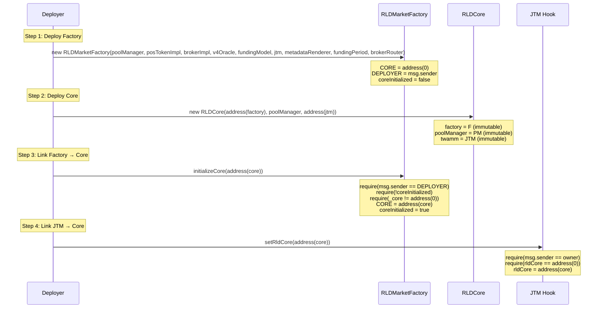
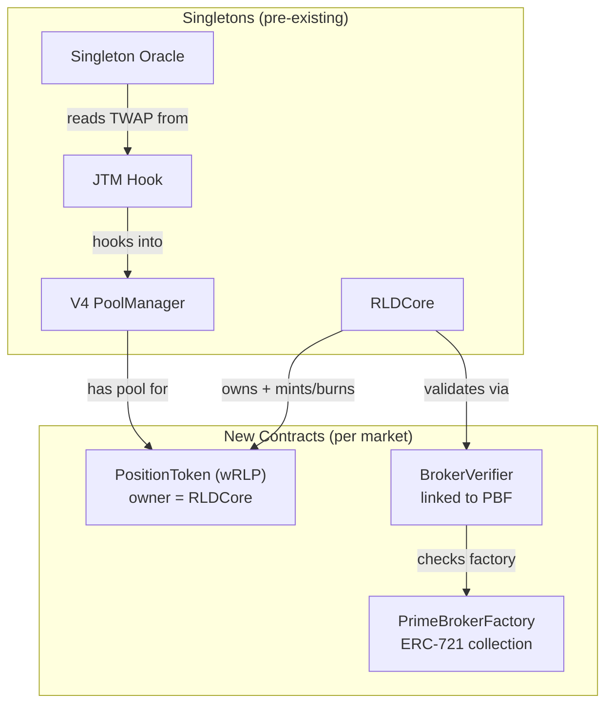

# RLD Market Deployment — Paranoid Reference

Every opcode-level detail of creating a new RLD market, traced directly from source.

> [!IMPORTANT]
> This document covers [RLDMarketFactory.createMarket()](file:///home/ubuntu/RLD/contracts/src/rld/core/RLDMarketFactory.sol#L314-L354) → [RLDCore.createMarket()](file:///home/ubuntu/RLD/contracts/src/rld/core/RLDCore.sol#L124-L180). The entire pipeline is **atomic** — any failure at any point reverts everything.

---

## 0. Prerequisites: Protocol Cross-Linking

Before **any** market can be deployed, the protocol singleton trio must be wired together. This is a one-time setup.



### Cross-Linking Invariants

| Check                              | Enforced By                      | What Happens If Violated                          |
| ---------------------------------- | -------------------------------- | ------------------------------------------------- |
| `Factory.CORE != address(0)`       | `createMarket()` line 321        | Reverts `"Core not initialized"`                  |
| `Core.factory == address(Factory)` | `onlyFactory` modifier           | Core rejects all `createMarket()` calls           |
| `JTM.rldCore == address(Core)`     | `setRldCore()` one-shot          | JTM can't call back into Core for hook operations |
| `initializeCore()` called once     | `coreInitialized` flag           | Reverts `"Already initialized"` on second call    |
| `setRldCore()` called once         | `require(rldCore == address(0))` | JTM reverts on second call                        |

### Factory Constructor Immutables

Stored at deploy time, **never changeable**:

| Immutable             | Source          | Validated                                 |
| --------------------- | --------------- | ----------------------------------------- |
| `POOL_MANAGER`        | Constructor arg | `require != address(0)`                   |
| `POSITION_TOKEN_IMPL` | Constructor arg | `require != address(0)`                   |
| `PRIME_BROKER_IMPL`   | Constructor arg | `require != address(0)`                   |
| `SINGLETON_V4_ORACLE` | Constructor arg | `require != address(0)`                   |
| `STD_FUNDING_MODEL`   | Constructor arg | `require != address(0)`                   |
| `TWAMM`               | Constructor arg | ⚠️ **Can be address(0) for testing**      |
| `METADATA_RENDERER`   | Constructor arg | Not validated (currently unused)          |
| `FUNDING_PERIOD`      | Constructor arg | Not validated (trusted deployer)          |
| `BROKER_ROUTER`       | Constructor arg | Can be `address(0)` (no default operator) |
| `DEPLOYER`            | `msg.sender`    | Implicit                                  |

---

## 1. Input: DeployParams Struct

The caller provides a single [DeployParams](file:///home/ubuntu/RLD/contracts/src/rld/core/RLDMarketFactory.sol#L162-L184) struct:

```solidity
struct DeployParams {
    // --- Assets ---
    address underlyingPool;          // e.g., Aave V3 Pool
    address underlyingToken;         // e.g., USDC
    address collateralToken;         // e.g., waUSDC (yield-bearing wrapper)
    address curator;                 // Risk parameter manager

    // --- Token Metadata ---
    string positionTokenName;        // e.g., "wRLP aUSDC"
    string positionTokenSymbol;      // e.g., "wRLPaUSDC"

    // --- Risk Parameters ---
    uint64 minColRatio;              // e.g., 1.2e18 (120%)
    uint64 maintenanceMargin;        // e.g., 1.1e18 (110%)
    uint64 liquidationCloseFactor;   // e.g., 0.5e18 (50%)
    address liquidationModule;       // DutchLiquidationModule address
    bytes32 liquidationParams;       // Module-specific config (opaque)

    // --- Oracle Configuration ---
    address spotOracle;              // Spot price oracle (can be address(0))
    address rateOracle;              // Interest rate oracle (e.g., RLDAaveOracle)
    uint32 oraclePeriod;             // TWAP window in seconds (e.g., 3600)

    // --- V4 Pool Configuration ---
    uint24 poolFee;                  // Fee tier in hundredths of bips (e.g., 500 = 0.05%)
    int24 tickSpacing;               // Tick spacing (e.g., 5)
}
```

---

## 2. Access Control Gate

```
Line 316:  onlyOwner       → msg.sender must be Factory owner
Line 317:  nonReentrant     → OpenZeppelin reentrancy guard
Line 321:  require(CORE != address(0))  → Cross-linking completed
```

**Who is `owner`?** The OZ `Ownable` owner of `RLDMarketFactory`, set to the deployer at construction. This is the protocol admin.

---

## Phase 1: Validation (`_validateParams`)

[Source: lines 369-387](file:///home/ubuntu/RLD/contracts/src/rld/core/RLDMarketFactory.sol#L369-L387)

Every check is `require()` with a revert string. All are `pure` — no state reads.

| #   | Check                             | Revert String            | Why                                                       |
| --- | --------------------------------- | ------------------------ | --------------------------------------------------------- |
| 1   | `underlyingPool != address(0)`    | `"Invalid Pool"`         | Needed for MarketId computation + oracle queries          |
| 2   | `underlyingToken != address(0)`   | `"Invalid Underlying"`   | Needed for MarketId computation + oracle queries          |
| 3   | `collateralToken != address(0)`   | `"Invalid Collateral"`   | Needed for MarketId computation + token operations        |
| 4   | `liquidationModule != address(0)` | `"Invalid LiqModule"`    | Needed for seize calculations                             |
| 5   | `rateOracle != address(0)`        | `"Invalid RateOracle"`   | Needed for funding rate + index price                     |
| 6   | `minColRatio > 1e18`              | `"MinCol < 100%"`        | Must exceed 100% to maintain overcollateralization        |
| 7   | `maintenanceMargin >= 1e18`       | `"Maintenance < 100%"`   | Cannot liquidate above 100% health                        |
| 8   | `minColRatio > maintenanceMargin` | `"Risk Config Error"`    | Minting ratio must be stricter than liquidation threshold |
| 9   | `closeFactor > 0`                 | `"Invalid CloseFactor"`  | Zero close factor = can't liquidate at all                |
| 10  | `closeFactor <= 1e18`             | `"Invalid CloseFactor"`  | > 100% close factor is nonsensical                        |
| 11  | `tickSpacing > 0`                 | `"Invalid TickSpacing"`  | V4 requires positive tick spacing                         |
| 12  | `oraclePeriod > 0`                | `"Invalid OraclePeriod"` | 0-second TWAP = spot price (manipulable)                  |

> [!WARNING]
> `spotOracle` is **NOT validated** (can be `address(0)`) — currently commented out in both Factory and Core. `curator` is also not validated — allowing `address(0)` means no risk parameter updates possible.

---

## Phase 2: Identification (`_precomputeId`)

[Source: lines 397-400](file:///home/ubuntu/RLD/contracts/src/rld/core/RLDMarketFactory.sol#L397-L400)

```solidity
MarketId = keccak256(abi.encode(collateralToken, underlyingToken, underlyingPool))
```

**Three inputs, deterministic output:**

| Input             | Example             | Purpose                    |
| ----------------- | ------------------- | -------------------------- |
| `collateralToken` | `0x5979...waUSDC`   | Yield-bearing collateral   |
| `underlyingToken` | `0xA0b8...USDC`     | Base asset                 |
| `underlyingPool`  | `0x7d27...AavePool` | Lending pool distinguisher |

**Why all three?** Same tokens can have different lending pools (Aave vs Compound) → different markets.

### Duplicate Check (Fail-Fast)

```solidity
// Line 331-334
bytes32 canonicalKey = MarketId.unwrap(futureId);
if (MarketId.unwrap(canonicalMarkets[canonicalKey]) != bytes32(0)) {
    revert MarketAlreadyExists();
}
```

This check runs **before** deploying any contracts, saving ~600k gas on duplicate attempts. The `canonicalMarkets` mapping is `bytes32 → MarketId`.

---

## Phase 3: Infrastructure (`_deployInfrastructure`)

[Source: lines 413-458](file:///home/ubuntu/RLD/contracts/src/rld/core/RLDMarketFactory.sol#L413-L458)

### 3a. Resolve Token Symbol (Gas-Safe)

```solidity
try ERC20(params.underlyingToken).symbol{gas: 50000}() returns (string memory s) {
    symbol = s;
} catch {
    symbol = "UNKNOWN";
}
```

| Detail    | Value                                                       |
| --------- | ----------------------------------------------------------- |
| Gas limit | 50,000 (prevents gas bomb from malicious token)             |
| Fallback  | `"UNKNOWN"` (non-standard ERC20s without `symbol()`)        |
| Used for  | NFT collection naming: `"RLD: {symbol}"` / `"RLD-{symbol}"` |

### 3b. Build Default Operators

```solidity
if (BROKER_ROUTER != address(0)) {
    operators = [BROKER_ROUTER];    // Pre-approved on every broker
} else {
    operators = [];                 // No default operators
}
```

### 3c. Deploy PrimeBrokerFactory

```solidity
PrimeBrokerFactory pbFactory = new PrimeBrokerFactory(
    PRIME_BROKER_IMPL,     // EIP-1167 clone source
    id,                     // MarketId for the collection
    name,                   // "RLD: USDC"
    nftSymbol,              // "RLD-USDC"
    METADATA_RENDERER,      // Currently unused, reserved
    CORE,                   // Passed to brokers during init
    operators               // [BrokerRouter] if configured
);
```

**What PrimeBrokerFactory does:**

- Deploys EIP-1167 minimal proxy clones of `PRIME_BROKER_IMPL` for each user position
- Acts as ERC-721 NFT collection (each broker = 1 NFT)
- Pre-approves `BrokerRouter` as operator on every new broker

### 3d. Deploy BrokerVerifier

```solidity
verifier = address(new BrokerVerifier(factory));
```

**What BrokerVerifier does:**

- During liquidation, Core calls `verifier.isValidBroker(address)` to confirm the target is a real broker from this factory (not an arbitrary address)

### Phase 3 State Changes

| Contract             | Storage Written  | Value                |
| -------------------- | ---------------- | -------------------- |
| `PrimeBrokerFactory` | `implementation` | `PRIME_BROKER_IMPL`  |
| `PrimeBrokerFactory` | `marketId`       | `futureId`           |
| `PrimeBrokerFactory` | `rldCore`        | `CORE`               |
| `BrokerVerifier`     | `factory`        | `address(pbFactory)` |

---

## Phase 4: Position Token (`_deployPositionToken`)

[Source: lines 469-482](file:///home/ubuntu/RLD/contracts/src/rld/core/RLDMarketFactory.sol#L469-L482)

```solidity
uint8 collateralDecimals = ERC20(params.collateralToken).decimals();

PositionToken token = new PositionToken(
    params.positionTokenName,      // "wRLP aUSDC"
    params.positionTokenSymbol,    // "wRLPaUSDC"
    collateralDecimals,            // 6 (matches aUSDC)
    params.collateralToken         // waUSDC address (backing asset)
);
```

| Detail            | Value                                                              |
| ----------------- | ------------------------------------------------------------------ |
| Decimals          | Matches collateral (6 for USDC-based, 18 for DAI-based)            |
| Owner at creation | `RLDMarketFactory` (temporary — transferred in Phase 6)            |
| Total supply      | 0 (no wRLP minted until first borrow)                              |
| Minting authority | Only `owner` can mint (will be `RLDCore` after ownership transfer) |

> [!NOTE]
> `PositionToken` is a fresh deployment per market, **not** a clone. It's a standard ERC20 with `mint`/`burn` restricted to `owner`.

---

## Phase 5: Pool Initialization (`_initializePool`)

[Source: lines 503-588](file:///home/ubuntu/RLD/contracts/src/rld/core/RLDMarketFactory.sol#L503-L588)

This is the most complex phase — 8 sub-steps.

### 5a. Currency Ordering

```solidity
Currency currency0 = Currency.wrap(positionToken);
Currency currency1 = Currency.wrap(params.collateralToken);
if (currency0 > currency1) {
    (currency0, currency1) = (currency1, currency0);
}
```

**V4 invariant:** `currency0 < currency1` (by address). The ordering determines which token is the "base" in price representation. This swap happens silently and **affects all subsequent price calculations**.

### 5b. Fetch Oracle Price

```solidity
uint256 indexPrice = IRLDOracle(params.rateOracle).getIndexPrice(
    params.underlyingPool,
    params.underlyingToken
);
```

| Detail  | Value                                           |
| ------- | ----------------------------------------------- |
| Units   | WAD (1e18) — collateral tokens per 1 wRLP       |
| Example | `1.05e18` means 1 wRLP = 1.05 collateral tokens |
| Source  | Aave liquidityIndex for rate oracle             |

### 5c. Validate Price Bounds

```solidity
require(indexPrice >= MIN_PRICE && indexPrice <= MAX_PRICE, "Price out of bounds");
```

| Constant    | Value    | Meaning                             |
| ----------- | -------- | ----------------------------------- |
| `MIN_PRICE` | `1e14`   | 0.0001 (1 wRLP = 0.0001 collateral) |
| `MAX_PRICE` | `100e18` | 100.0 (1 wRLP = 100 collateral)     |

### 5d. Price Inversion (Conditional)

```solidity
if (Currency.wrap(positionToken) == currency1) {
    indexPrice = 1e36 / indexPrice;
}
```

**When wRLP is token1:** V4 stores `sqrtPrice = sqrt(token1/token0)`. Since oracle returns `collateral/wRLP`, and we need `wRLP/collateral`, we invert: `1e36 / indexPrice` (WAD division).

### 5e. sqrtPriceX96 Calculation

```solidity
uint160 initSqrtPrice = uint160(
    (FixedPointMathLib.sqrt(indexPrice) * (1 << 96)) / 1e9
);
```

**Math breakdown:**

1. `sqrt(indexPrice)` — square root of WAD price → result is in ≈ `1e9` scale
2. `* (1 << 96)` — shift to Q96 fixed point
3. `/ 1e9` — normalize from `sqrt(WAD)` to dimensionless

**Example:** `indexPrice = 1.05e18` → `sqrt = 1.0247e9` → `initSqrtPrice = 1.0247 × 2^96 ≈ 8.11e28`

> [!CAUTION]
> **Decimal Invariant Required.** This formula assumes both pool tokens have **identical decimals**. V4 stores `sqrtPrice = sqrt(token1_raw / token0_raw) × 2^96` — if decimals differ, the raw-unit ratio ≠ the WAD ratio and the formula silently produces a wrong price. Today this is safe because `PositionToken` always clones the collateral's decimals (Phase 4, line 507: `collateralDecimals = ERC20(collateralToken).decimals()`), so both tokens in the pool are equal-decimal. If this invariant is ever broken (e.g., a refactor that decouples PositionToken decimals), the factory must add a decimal adjustment: `rawPrice = WAD_price × 10^(dec0 − dec1)`. See `_decimalAdjustPrice()` in [`JITRLDIntegrationBase.t.sol`](file:///home/ubuntu/RLD/contracts/test/integration/shared/JITRLDIntegrationBase.t.sol#L417-L425) for the reference implementation.

### 5f. Build PoolKey

```solidity
PoolKey memory key = PoolKey({
    currency0: currency0,          // Lower address
    currency1: currency1,          // Higher address
    fee: params.poolFee,           // e.g., 500
    tickSpacing: params.tickSpacing, // e.g., 5
    hooks: IHooks(TWAMM)           // JTM hook address
});
```

> [!IMPORTANT]
> The `hooks` field is the JTM hook contract. V4 validates that the hook address's leading bytes match the declared hook flags. If the JTM hook address doesn't encode the correct flags, `initialize()` will revert.

### 5g. V4 Pool Initialization

```solidity
IPoolManager(POOL_MANAGER).initialize(key, initSqrtPrice);
```

**What V4 does internally:**

1. Validates `key.hooks` address encodes claimed flags
2. Calls `JTM.beforeInitialize()` → JTM initializes oracle state + rejects native ETH
3. Stores pool state: `Slot0{sqrtPriceX96, tick, protocolFee, lpFee}`
4. Returns the computed tick corresponding to `initSqrtPrice`

### 5h. Set JTM Price Bounds

```solidity
if (TWAMM != address(0)) {
    JTMHook(TWAMM).setPriceBounds(key, minSqrt, maxSqrt);
}
```

**Bounds depend on currency ordering:**

| wRLP Position | `minSqrt`                 | `maxSqrt`                | Price Range            |
| ------------- | ------------------------- | ------------------------ | ---------------------- |
| **token0**    | `Q96 / 100` (0.01 × 2^96) | `Q96 * 10` (10 × 2^96)   | [0.0001, 100] col/wRLP |
| **token1**    | `Q96 / 10` (0.1 × 2^96)   | `Q96 * 100` (100 × 2^96) | [0.01, 10000] wRLP/col |

**JTM enforces these bounds on every swap:** if a swap pushes price outside `[minSqrt, maxSqrt]`, it reverts.

### 5i. Register with Singleton Oracle

```solidity
// Token order validation
require(
    (positionToken == token0 && params.collateralToken == token1)
    || (positionToken == token1 && params.collateralToken == token0),
    "Oracle token mismatch"
);

// Register pool for TWAP queries
UniswapV4SingletonOracle(SINGLETON_V4_ORACLE).registerPool(
    positionToken,       // Lookup key
    key,                 // Full PoolKey
    TWAMM,               // Hook address (for observe() calls)
    params.oraclePeriod  // TWAP window (e.g., 3600s)
);
```

**What the oracle stores:**

- Maps `positionToken → PoolKey + hookAddress + period`
- Later, `getSpotPrice(positionToken, collateralToken)` reads TWAP from JTM's observation array

---

## Phase 6: Registration (`_registerMarket`)

[Source: lines 606-657](file:///home/ubuntu/RLD/contracts/src/rld/core/RLDMarketFactory.sol#L606-L657)

### 6a. Build MarketAddresses Struct

```solidity
MarketAddresses({
    collateralToken:    params.collateralToken,
    underlyingToken:    params.underlyingToken,
    underlyingPool:     params.underlyingPool,
    rateOracle:         params.rateOracle,
    spotOracle:         params.spotOracle,        // Can be address(0)
    markOracle:         SINGLETON_V4_ORACLE,       // Factory immutable
    fundingModel:       STD_FUNDING_MODEL,         // Factory immutable
    curator:            params.curator,
    liquidationModule:  params.liquidationModule,
    positionToken:      positionToken              // Deployed in Phase 4
})
```

### 6b. Build MarketConfig Struct

```solidity
MarketConfig({
    minColRatio:             params.minColRatio,
    maintenanceMargin:       params.maintenanceMargin,
    liquidationCloseFactor:  params.liquidationCloseFactor,
    fundingPeriod:           FUNDING_PERIOD,               // Factory immutable
    debtCap:                 type(uint128).max,             // Unlimited by default
    minLiquidation:          0,                             // Curator must set manually
    liquidationParams:       params.liquidationParams,
    brokerVerifier:          verifier                       // Deployed in Phase 3
})
```

> [!NOTE]
> `debtCap = type(uint128).max` means unlimited debt at deployment. `minLiquidation = 0` means any amount can be liquidated. Both must be configured by the curator post-deployment.

### 6c. Call RLDCore.createMarket()

The Factory calls into Core, which runs its own validation:

```solidity
// Core validates (lines 128-142):
if (addresses.collateralToken == address(0))  revert InvalidParam("Collateral");
if (addresses.underlyingToken == address(0))  revert InvalidParam("Underlying");
if (addresses.rateOracle == address(0))       revert InvalidParam("Rate Oracle");
if (addresses.fundingModel == address(0))     revert InvalidParam("Funding");
if (addresses.positionToken == address(0))    revert InvalidParam("Position Token");
if (addresses.liquidationModule == address(0)) revert InvalidParam("LiqModule");
```

**Double validation:** Factory validates `params.rateOracle`, Core validates `addresses.rateOracle` — the same address checked twice for defense in depth.

### 6d. MarketId Generation (Core)

```solidity
MarketId id = MarketId.wrap(
    keccak256(abi.encode(
        addresses.collateralToken,
        addresses.underlyingToken,
        addresses.underlyingPool
    ))
);
```

**Must match Phase 2 exactly.** Same inputs, same `abi.encode`, same `keccak256`.

### 6e. Duplicate Check (Core)

```solidity
if (marketExists[id]) revert MarketAlreadyExists();
```

Third line of defense — after Factory's `canonicalMarkets` check.

### 6f. State Initialization

```solidity
marketExists[id] = true;
marketAddresses[id] = addresses;   // Full struct stored
marketConfigs[id] = config;        // Full struct stored
marketStates[id] = MarketState({
    normalizationFactor: 1e18,     // Start at 1:1 (no accrued interest)
    totalDebt: 0,                  // No debt initially
    lastUpdateTimestamp: uint48(block.timestamp),
    badDebt: 0                     // No bad debt initially
});
```

| State Field           | Initial Value     | Meaning                                 |
| --------------------- | ----------------- | --------------------------------------- |
| `normalizationFactor` | `1e18`            | 1.0 — debt and wRLP are initially equal |
| `totalDebt`           | `0`               | No positions open                       |
| `lastUpdateTimestamp` | `block.timestamp` | Funding calculation starts from now     |
| `badDebt`             | `0`               | No socialized losses                    |

### 6g. Link Position Token

```solidity
// Factory stores canonical mapping
canonicalMarkets[canonicalKey] = marketId;

// Position token learns its market
PositionToken(positionToken).setMarketId(marketId);

// Ownership transferred to Core (only Core can mint/burn)
PositionToken(positionToken).transferOwnership(CORE);
```

> [!CAUTION]
> After `transferOwnership(CORE)`, **only RLDCore can mint or burn wRLP tokens**. The Factory permanently loses this ability. This is irreversible.

### 6h. Emit Event

```solidity
emit MarketDeployed(
    marketId,                  // indexed
    params.underlyingPool,     // indexed
    params.collateralToken,    // indexed
    positionToken,
    brokerFactory,
    verifier
);
```

---

## Phase 7: Post-Condition Verification

```solidity
if (MarketId.unwrap(marketId) != MarketId.unwrap(futureId)) {
    revert IDMismatch();
}
```

**Why this exists:** The Factory precomputes the ID in Phase 2, then Core independently computes it in Phase 6. If they disagree, something is catastrophically wrong with the hashing logic. This is a **compile-time safety net** — it should never trigger in production.

---

## Post-Deployment State Summary

After a successful `createMarket()`, the following new contracts and state exist:



### Storage Written

| Contract           | Key                       | Value                                                   |
| ------------------ | ------------------------- | ------------------------------------------------------- |
| `RLDCore`          | `marketExists[id]`        | `true`                                                  |
| `RLDCore`          | `marketAddresses[id]`     | Full `MarketAddresses` struct                           |
| `RLDCore`          | `marketConfigs[id]`       | Full `MarketConfig` struct                              |
| `RLDCore`          | `marketStates[id]`        | `{NF: 1e18, totalDebt: 0, lastUpdate: now, badDebt: 0}` |
| `RLDMarketFactory` | `canonicalMarkets[hash]`  | `marketId`                                              |
| `V4 PoolManager`   | Pool slot0                | `{sqrtPriceX96, tick, fees}`                            |
| `JTM`              | `priceBounds[poolId]`     | `{minSqrt, maxSqrt}`                                    |
| `Singleton Oracle` | `poolData[positionToken]` | `{PoolKey, hook, period}`                               |
| `PositionToken`    | `owner`                   | `address(RLDCore)`                                      |
| `PositionToken`    | `marketId`                | `marketId`                                              |

### Gas Cost Estimate

| Phase                    | Approximate Gas | Dominant Cost               |
| ------------------------ | --------------- | --------------------------- |
| Phase 1 (Validation)     | ~5k             | Pure checks                 |
| Phase 2 (ID)             | ~3k             | keccak256 + SLOAD           |
| Phase 3 (Infrastructure) | ~600k           | Two `CREATE` opcodes        |
| Phase 4 (Position Token) | ~300k           | One `CREATE` opcode         |
| Phase 5 (Pool Init)      | ~200k           | V4 pool init + oracle state |
| Phase 6 (Registration)   | ~100k           | Multiple SSTOREs            |
| Phase 7 (Verification)   | ~0.5k           | Two MLOAD + compare         |
| **Total**                | **~1.2M gas**   |                             |
