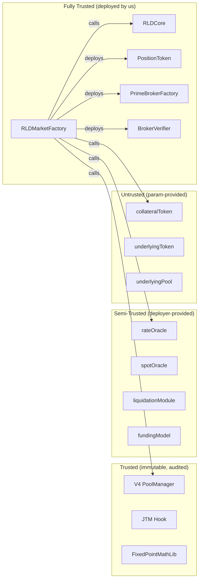

# Market Deployment — Security Audit

**Scope**: [RLDMarketFactory.createMarket()](file:///home/ubuntu/RLD/contracts/src/rld/core/RLDMarketFactory.sol#L314-L354) and all code paths it invokes.

**Methodology**: Paranoid line-by-line trace of every external call, state write, mathematical operation, and trust assumption.

**Contracts Audited**:

| Contract                                                                                                               | Lines | Role                           |
| ---------------------------------------------------------------------------------------------------------------------- | ----- | ------------------------------ |
| [RLDMarketFactory.sol](file:///home/ubuntu/RLD/contracts/src/rld/core/RLDMarketFactory.sol)                            | 659   | Deployment orchestrator        |
| [RLDCore.sol](file:///home/ubuntu/RLD/contracts/src/rld/core/RLDCore.sol)                                              | 1171  | Market state singleton         |
| [PositionToken.sol](file:///home/ubuntu/RLD/contracts/src/rld/tokens/PositionToken.sol)                                | 46    | wRLP ERC20                     |
| [PrimeBrokerFactory.sol](file:///home/ubuntu/RLD/contracts/src/rld/core/PrimeBrokerFactory.sol)                        | 210   | Broker clone factory + ERC-721 |
| [BrokerVerifier.sol](file:///home/ubuntu/RLD/contracts/src/rld/modules/verifier/BrokerVerifier.sol)                    | 89    | Broker authenticity check      |
| [UniswapV4SingletonOracle.sol](file:///home/ubuntu/RLD/contracts/src/rld/modules/oracles/UniswapV4SingletonOracle.sol) | 127   | TWAP mark oracle               |
| [RLDAaveOracle.sol](file:///home/ubuntu/RLD/contracts/src/rld/modules/oracles/RLDAaveOracle.sol)                       | 82    | Index price (funding)          |
| [FixedPointMathLib.sol](file:///home/ubuntu/RLD/contracts/src/shared/utils/FixedPointMathLib.sol)                      | 243   | sqrt / mulWad / divWad         |

---

## 1. Access Control Analysis

### 1.1 Caller Restrictions

| Gate                 | Location                                                                                | Mechanism                          | Bypass Risk                           |
| -------------------- | --------------------------------------------------------------------------------------- | ---------------------------------- | ------------------------------------- |
| `onlyOwner`          | [Factory:316](file:///home/ubuntu/RLD/contracts/src/rld/core/RLDMarketFactory.sol#L316) | OpenZeppelin `Ownable.onlyOwner()` | ✅ Safe — standard OZ                 |
| `nonReentrant`       | [Factory:317](file:///home/ubuntu/RLD/contracts/src/rld/core/RLDMarketFactory.sol#L317) | OpenZeppelin `ReentrancyGuard`     | ✅ Safe — standard OZ                 |
| `CORE != address(0)` | [Factory:321](file:///home/ubuntu/RLD/contracts/src/rld/core/RLDMarketFactory.sol#L321) | `require()`                        | ✅ Safe — prevents unconfigured state |
| `onlyFactory`        | [Core:127](file:///home/ubuntu/RLD/contracts/src/rld/core/RLDCore.sol#L127)             | `msg.sender == factory`            | ✅ Safe — immutable reference         |

**Verdict**: ✅ **PASS**. No privilege escalation vectors. Deployment is gated to Factory owner only.

### 1.2 Cross-Linking Security

| One-Time Gate      | Contract | Guard                                                   |
| ------------------ | -------- | ------------------------------------------------------- |
| `initializeCore()` | Factory  | `require(msg.sender == DEPLOYER && !coreInitialized)`   |
| `setRldCore()`     | JTM      | `require(msg.sender == owner && rldCore == address(0))` |

> [!IMPORTANT]
> **Finding C-01: `initializeCore()` uses deployer check, not `onlyOwner`.**
> The Factory stores `DEPLOYER = msg.sender` at construction. `initializeCore()` checks `msg.sender == DEPLOYER`, **not** `onlyOwner`. If ownership is transferred before `initializeCore()` is called, the new owner **cannot** initialize Core — the original deployer must still do it. This is intentional (prevents misbehavior after ownership transfer) but should be documented.
>
> **Severity**: 🟡 Low (operational risk, not exploit)
> **Recommendation**: Add NatSpec comment: "Must be called by original deployer before ownership transfer"

### 1.3 Ownership Transfer Lifecycle

```
PositionToken ownership flow:
1. PositionToken deployed → owner = RLDMarketFactory (msg.sender)
2. setMarketId() called → by Factory (owner) ✅
3. transferOwnership(CORE) → owner = RLDCore (irreversible)
4. mint/burn only by Core ✅
```

> [!NOTE]
> **Finding C-02: `setMarketId()` has a one-shot guard but no owner check on the MarketId value.**
> `setMarketId()` is `onlyOwner` AND checks `marketId != bytes32(0)` to prevent double-set. However, it doesn't validate that the MarketId matches Core's notion of the market. This is safe because only the Factory (owner at step 2) calls it, and it's paired with `_registerMarket()` which uses the same ID. No exploit path exists.
>
> **Severity**: ✅ Informational
> **Status**: Safe by construction

---

## 2. Input Validation Analysis

### 2.1 Missing Validations

| Parameter                 | Validated?                | Risk     |
| ------------------------- | ------------------------- | -------- |
| `underlyingPool`          | ✅ `!= address(0)`        | —        |
| `underlyingToken`         | ✅ `!= address(0)`        | —        |
| `collateralToken`         | ✅ `!= address(0)`        | —        |
| `liquidationModule`       | ✅ `!= address(0)`        | —        |
| `rateOracle`              | ✅ `!= address(0)`        | —        |
| `minColRatio`             | ✅ `> 1e18`               | —        |
| `maintenanceMargin`       | ✅ `>= 1e18`              | —        |
| `liquidationCloseFactor`  | ✅ `> 0 && <= 1e18`       | —        |
| `tickSpacing`             | ✅ `> 0`                  | —        |
| `oraclePeriod`            | ✅ `> 0`                  | —        |
| **`spotOracle`**          | ❌ Not validated          | See V-01 |
| **`curator`**             | ❌ Not validated          | See V-02 |
| **`positionTokenName`**   | ❌ Not validated          | See V-03 |
| **`positionTokenSymbol`** | ❌ Not validated          | See V-03 |
| **`liquidationParams`**   | ❌ Not validated (opaque) | See V-04 |
| **`poolFee`**             | ❌ Not validated          | See V-05 |

> [!WARNING]
> **Finding V-01: `spotOracle` validation is commented out.**
> Both [Factory:375](file:///home/ubuntu/RLD/contracts/src/rld/core/RLDMarketFactory.sol#L375) and [Core:136](file:///home/ubuntu/RLD/contracts/src/rld/core/RLDCore.sol#L136) have the `spotOracle` check commented out. If `spotOracle = address(0)`, any code that later calls `ISpotOracle(addresses.spotOracle).getSpotPrice()` will revert with an out-of-gas or invalid opcode.
>
> **Severity**: 🟡 Medium (depends on whether spotOracle is actually queried post-deployment)
> **Recommendation**: Either enforce `!= address(0)` or explicitly document that spotOracle is optional

> [!WARNING]
> **Finding V-02: `curator = address(0)` accepted silently.**
> Zero curator means `onlyCurator(id)` will always revert, making the market's risk parameters **permanently frozen** at deployment values. No one can call `proposeRiskUpdate()`, `updatePoolFee()`, or any curator-gated function.
>
> **Severity**: 🟡 Medium (permanent lockout of risk management)
> **Recommendation**: Either validate `!= address(0)` or add a mechanism for owner to set a curator post-deployment

**Finding V-03**: Token name/symbol are unchecked. Empty strings create unnamed tokens. Low severity (cosmetic).

**Finding V-04**: `liquidationParams` is opaque `bytes32` passed through to the liquidation module. The Factory does not validate it. If the module expects specific encoding, invalid params cause silent misbehavior only when liquidation is attempted. Low severity (liquidation module's responsibility).

> [!WARNING]
> **Finding V-05: `poolFee` is not bounded.**
> `uint24 poolFee` passes directly to V4's `PoolKey`. V4 allows fees up to `1_000_000` (100%). A fee of 100% would make swaps economically impossible, effectively bricking the market's trading pair.
>
> **Severity**: 🟡 Medium (owner-only so no external exploit, but operator error risk)
> **Recommendation**: Add `require(poolFee <= 10000, "Fee > 1%")` or a reasonable cap

---

## 3. Mathematical & Precision Analysis

### 3.1 sqrtPriceX96 Calculation

```solidity
// Line 529
uint160 initSqrtPrice = uint160(
    (FixedPointMathLib.sqrt(indexPrice) * (1 << 96)) / 1e9
);
```

**Overflow analysis:**

- `indexPrice` range: `[1e14, 100e18]` (enforced by bounds check)
- `sqrt(100e18) = 10_000_000_000` (≈ 10e9)
- `10e9 * 2^96 = 10e9 * 7.9e28 ≈ 7.9e38` — fits in uint256 ✅
- `sqrt(1e14) = 10_000_000` (≈ 1e7)
- `1e7 * 2^96 / 1e9 ≈ 7.9e25` — fits in uint160 ✅
- Max: `7.9e38 / 1e9 = 7.9e29` — fits in uint160 (max `1.46e48`) ✅

**Precision analysis:**

- `FixedPointMathLib.sqrt()` uses Babylonian method with 7 iterations → accurate to full precision for inputs > 256
- `indexPrice = 1e14` → `sqrt = 10_000_000` → potential rounding error ≤ 1 unit in 1e7 → negligible

**Verdict**: ✅ **PASS**. No overflow or precision issues in the valid price range.

### 3.2 Price Inversion

```solidity
// Line 523
indexPrice = 1e36 / indexPrice;
```

**Edge case analysis:**

- `indexPrice = 1e14` (minimum) → `inverted = 1e36 / 1e14 = 1e22` — fits in uint256 ✅
- `indexPrice = 100e18` (maximum) → `inverted = 1e36 / 1e20 = 1e16` — fits in uint256 ✅
- `indexPrice = 0` → impossible (enforced by bounds check) ✅

**Precision analysis:**

- Integer division truncates. For `indexPrice = 1.05e18`: `1e36 / 1.05e18 = 952380952380952380` → loss ≈ 0.47e-18 → negligible for sqrtPriceX96 computation.

**Verdict**: ✅ **PASS**

### 3.3 Oracle Price Formula (RLDAaveOracle)

```solidity
// Price = (rawRateRay * K_SCALAR) / 1e9
// where rawRateRay ∈ [0, RATE_CAP=1e27], K_SCALAR = 100
uint256 calculatedPrice = (rawRateRay * K_SCALAR) / 1e9;
```

**Overflow analysis:**

- Max: `1e27 * 100 = 1e29` — fits in uint256 ✅
- Result: `1e29 / 1e9 = 1e20 = 100e18` → matches `MAX_PRICE` bound ✅

**Floor analysis:**

- `rawRateRay = 0` → `calculatedPrice = 0 < MIN_PRICE(1e14)` → clamped to `1e14` ✅
- `rawRateRay = 1e18` (0.1% APR) → `price = 1e18 * 100 / 1e9 = 1e11 < 1e14` → clamped ✅

**Verdict**: ✅ **PASS**. Bounds are consistent between oracle and Factory.

### 3.4 JTM Price Bounds

```solidity
// wRLP is token0:
minSqrt = Q96 / 100;    // sqrt(0.0001) = 0.01
maxSqrt = Q96 * 10;     // sqrt(100) = 10

// wRLP is token1:
minSqrt = Q96 / 10;     // sqrt(0.01) = 0.1
maxSqrt = Q96 * 100;    // sqrt(10000) = 100
```

> [!IMPORTANT]
> **Finding M-01: Price bounds are hardcoded and asymmetric between token orderings.**
> The bounds `[0.0001, 100]` for the actual price are consistent across both orderings. However, `Q96 * 100 = 7.9e30` which is within uint160 max (`1.46e48`). No overflow.
>
> But these bounds assume the initial price is **always within [0.0001, 100] collateral per wRLP**. If a future market uses a different pricing regime (e.g., a stablecoin market where wRLP = 0.00001 collateral), it would be rejected at the bounds check even though it's valid.
>
> **Severity**: 🟡 Low (constrains market types, not an exploit)
> **Recommendation**: Consider making bounds configurable per-market

---

## 4. External Call Analysis

### 4.1 Call Graph (Attack Surface)

Every external call made during deployment, ordered by execution:

| #   | Target                | Function                   | Trust Level               | Can Revert?   | Can Consume Gas?       |
| --- | --------------------- | -------------------------- | ------------------------- | ------------- | ---------------------- |
| 1   | `underlyingToken`     | `symbol()`                 | ⚠️ Untrusted              | ✅ (caught)   | ✅ (gas-limited 50k)   |
| 2   | `underlyingToken`     | `symbol()` → via `ERC20()` | ⚠️ Untrusted              | Same as above | Same                   |
| 3   | `PrimeBrokerFactory`  | constructor                | ✅ Self-deployed          | ✅            | ✅ (bounded by CREATE) |
| 4   | `BrokerVerifier`      | constructor                | ✅ Self-deployed          | ✅            | ✅ (bounded)           |
| 5   | `collateralToken`     | `decimals()`               | ⚠️ Untrusted              | ✅ (no catch) | ✅ (no gas limit)      |
| 6   | `PositionToken`       | constructor                | ✅ Self-deployed          | ✅            | ✅ (bounded)           |
| 7   | `rateOracle`          | `getIndexPrice()`          | 🔸 Semi-trusted           | ✅ (no catch) | ✅ (no gas limit)      |
| 8   | `POOL_MANAGER`        | `initialize()`             | ✅ Trusted (immutable)    | ✅            | ✅                     |
| 9   | `TWAMM (JTM)`         | `setPriceBounds()`         | ✅ Trusted (immutable)    | ✅            | ✅                     |
| 10  | `SINGLETON_V4_ORACLE` | `registerPool()`           | ✅ Trusted (immutable)    | ✅            | ✅                     |
| 11  | `CORE`                | `createMarket()`           | ✅ Trusted (cross-linked) | ✅            | ✅                     |
| 12  | `PositionToken`       | `setMarketId()`            | ✅ Self-deployed          | ✅            | ✅                     |
| 13  | `PositionToken`       | `transferOwnership()`      | ✅ Self-deployed          | ✅            | ✅                     |

> [!CAUTION]
> **Finding E-01: `collateralToken.decimals()` is called without gas limit or try/catch.**
> [Line 471](file:///home/ubuntu/RLD/contracts/src/rld/core/RLDMarketFactory.sol#L471): `uint8 collateralDecimals = ERC20(params.collateralToken).decimals();`
>
> Unlike `symbol()` (which has a 50k gas limit + try/catch), `decimals()` is called raw. A malicious or non-standard token could:
>
> 1. **Revert** with arbitrary data → deployment reverts (DOS, but owner-only so low impact)
> 2. **Consume excessive gas** → no gas limit → could consume entire block gas
> 3. **Return non-standard values** → decimals > 18 could cause overflow in downstream math
>
> **Severity**: 🟡 Low (owner-only call, trusted params)
> **Recommendation**: Add `try/catch` with gas limit, similar to `symbol()` call. Add `require(decimals <= 18)`.

> [!CAUTION]
> **Finding E-02: `rateOracle.getIndexPrice()` is called without gas limit.**
> [Line 514](file:///home/ubuntu/RLD/contracts/src/rld/core/RLDMarketFactory.sol#L514): Raw external call to oracle.
>
> A malicious oracle could re-enter (but `nonReentrant` blocks this) or consume unbounded gas.
> Since `rateOracle` is a deployer-supplied address and `nonReentrant` is active, the risk is minimal.
>
> **Severity**: ✅ Informational
> **Recommendation**: Add `{gas: 100000}` limit for defense in depth

### 4.2 Reentrancy Analysis

| Guard                              | Scope                   | Protects Against                                                      |
| ---------------------------------- | ----------------------- | --------------------------------------------------------------------- |
| `nonReentrant` (OZ)                | Entire `createMarket()` | Re-entering Factory via token callbacks                               |
| No external callbacks mid-function | —                       | V4 `initialize()` may callback into JTM, but JTM doesn't call Factory |

**Potential reentrancy paths:**

1. `ERC20(collateralToken).decimals()` → callback? No (view function)
2. `IRLDOracle.getIndexPrice()` → callback? Possible but `nonReentrant` blocks Factory re-entry
3. `IPoolManager.initialize()` → calls `JTM.beforeInitialize()` → JTM doesn't call Factory
4. `JTM.setPriceBounds()` → no callbacks
5. `PositionToken.transferOwnership()` → solmate `Owned`, no callbacks

**Verdict**: ✅ **PASS**. No reentrancy vectors.

---

## 5. State Consistency Analysis

### 5.1 Atomic Deployment Invariants

| Invariant                                   | Enforced How                                                     | Failure Mode                                 |
| ------------------------------------------- | ---------------------------------------------------------------- | -------------------------------------------- |
| MarketId is deterministic                   | Same `keccak256(abi.encode(...))` in Phase 2 and Phase 6         | `IDMismatch` revert (Phase 7)                |
| No duplicate markets                        | `canonicalMarkets` check (Factory) + `marketExists` check (Core) | `MarketAlreadyExists` revert                 |
| PositionToken owner = Core                  | `transferOwnership()` at end                                     | If tx reverts mid-way, token never exists    |
| PositionToken has MarketId                  | `setMarketId()` before ownership transfer                        | Same atomic guarantee                        |
| PrimeBrokerFactory immutables set correctly | Constructor args from Factory state                              | If Factory state is wrong, all markets wrong |

### 5.2 Partial Failure Analysis

What happens if the tx reverts at each phase?

| Failure Point              | Gas Wasted | State Leaked?                      | Side Effects? |
| -------------------------- | ---------- | ---------------------------------- | ------------- |
| Phase 1 (Validation)       | ~5k        | No                                 | No            |
| Phase 2 (ID)               | ~8k        | No                                 | No            |
| Phase 3 (Infrastructure)   | ~600k      | No (CREATE reverts)                | No            |
| Phase 4 (Position Token)   | ~900k      | No                                 | No            |
| Phase 5a-5e (Price Math)   | ~905k      | No                                 | No            |
| Phase 5f (V4 Initialize)   | ~1M        | **Yes — V4 pool may exist**        | **See F-01**  |
| Phase 5g (Price Bounds)    | ~1M        | V4 pool exists, no bounds          | **See F-01**  |
| Phase 5h (Oracle Register) | ~1M        | V4 pool + bounds exist             | **See F-01**  |
| Phase 6 (Core Register)    | ~1.1M      | V4 pool + bounds + oracle          | **See F-01**  |
| Phase 7 (Verify)           | ~1.2M      | Everything except canonicalMarkets | **See F-01**  |

> [!CAUTION]
> **Finding F-01: V4 pool initialization is not reversible — partial failure leaves orphan pool.**
> If `createMarket()` reverts **after** Phase 5f (`IPoolManager.initialize()`), the V4 pool still exists (V4's state is in the PoolManager, not in this transaction's local state). Retrying with the same params will fail because V4's `initialize()` reverts for already-initialized pools.
>
> **Impact**: The market cannot be created with the same `PoolKey` again. The only workaround is deploying with a different `poolFee` or `tickSpacing` to generate a different `PoolKey`.
>
> **Severity**: 🔴 High (permanent market creation DOS for specific params)
> **Recommendation**: Consider checking if pool already exists before calling `initialize()`, or implement a recovery mechanism. Alternatively, catch the revert from `initialize()` and skip if pool already exists with matching params.

### 5.3 Singleton Oracle Registration

```solidity
registerPool(positionToken, key, TWAMM, params.oraclePeriod)
```

> [!WARNING]
> **Finding F-02: Oracle `registerPool()` overwrites without checking for existing registration.**
> [UniswapV4SingletonOracle:41-48](file:///home/ubuntu/RLD/contracts/src/rld/modules/oracles/UniswapV4SingletonOracle.sol#L41-L48): `registerPool()` writes to `poolSettings[positionToken]` unconditionally. If a second market is created with the same `positionToken` (impossible via duplicate check, but if oracle is shared across protocol instances), the first market's oracle config is silently overwritten.
>
> **Severity**: 🟡 Low (prevented by duplicate market check upstream)
> **Status**: Safe by construction, but the oracle itself has no protection

---

## 6. Financial Risk Analysis

### 6.1 Initial Market State

| Parameter             | Value               | Risk Assessment                      |
| --------------------- | ------------------- | ------------------------------------ |
| `normalizationFactor` | `1e18` (1.0)        | ✅ Neutral — no prior funding        |
| `totalDebt`           | `0`                 | ✅ Clean — first borrow creates debt |
| `debtCap`             | `type(uint128).max` | ⚠️ **Unlimited debt at birth**       |
| `minLiquidation`      | `0`                 | ⚠️ **Dust liquidations possible**    |
| `badDebt`             | `0`                 | ✅ Clean                             |

> [!WARNING]
> **Finding FIN-01: Markets deploy with unlimited debt cap.**
> `debtCap = type(uint128).max ≈ 3.4e38` means any amount of wRLP can be minted immediately after deployment. There is no ramp-up period. If the oracle price, JTM bounds, or other parameters are misconfigured, unlimited debt exposure is instant.
>
> **Severity**: 🟡 Medium (owner-only deployment, so misconfiguration = operator error)
> **Recommendation**: Deploy with a conservative debt cap (e.g., $1M), then curator increases after validation. Or add a graduated cap that increases over time.

> [!NOTE]
> **Finding FIN-02: `minLiquidation = 0` allows dust liquidations.**
> A liquidator can liquidate $0.000001 of debt, paying gas but forcing the broker to unwind positions. On L2s with low gas, this could be used to grief borrowers.
>
> **Severity**: 🟡 Low (curator should set this post-deployment)
> **Recommendation**: Set a sane default (e.g., `1e6` = $1 for USDC markets)

### 6.2 Oracle Price at Deployment

The pool is initialized at the oracle's current index price. This creates an immediate alignment between:

- V4 pool spot price (sqrtPriceX96-derived)
- Aave rate oracle index price
- JTM price bounds

**Risk**: If the Aave rate changes between the `getIndexPrice()` call and block inclusion, the pool init price is stale. However, since deployment is owner-only (no frontrunning incentive) and the price bounds are [0.0001, 100], staleness within a few blocks is negligible.

**Verdict**: ✅ **Acceptable risk**

### 6.3 Funding Model Assignment

```solidity
fundingModel: STD_FUNDING_MODEL  // Factory immutable
```

**Risk**: All markets use the **same** funding model. If the model has a bug or is compromised, **all markets** are affected simultaneously. There is no per-market override.

> [!IMPORTANT]
> **Finding FIN-03: Single funding model for all markets = systemic correlation.**
> The `STD_FUNDING_MODEL` is a Factory immutable. Every market created by this Factory uses the same model. A bug in `StandardFundingModel.calculateFunding()` would affect every market at once.
>
> **Severity**: 🟡 Medium (systemic risk)
> **Recommendation**: Consider allowing per-market funding model override in `DeployParams`, or deploying separate Factory instances for different risk tiers

---

## 7. Dependency Trust Analysis

### 7.1 Trust Boundaries



### 7.2 ERC20 Token Assumptions

The Factory makes the following assumptions about `collateralToken`:

| Assumption                        | Validated?                 | Risk if Violated                        |
| --------------------------------- | -------------------------- | --------------------------------------- |
| Has `decimals()`                  | ❌ Only called, not caught | Deployment reverts                      |
| Returns `uint8` from `decimals()` | ❌ Implicit                | ABI decode failure → revert             |
| Decimals ≤ 18                     | ❌ Not checked             | Potential overflow in price math        |
| Is ERC20-compliant                | ❌ Not checked             | PositionToken stores wrong `collateral` |
| Not a rebasing token              | ❌ Not checked             | Solvency math breaks post-deployment    |
| Not fee-on-transfer               | ❌ Not checked             | Balance discrepancies                   |

> [!WARNING]
> **Finding T-01: No validation that collateral is a standard ERC20.**
> The system assumes collateral tokens behave like standard ERC20s with ≤18 decimals. Non-standard tokens (rebasing, fee-on-transfer, > 18 decimals, missing `decimals()`) could break the market after deployment.
>
> **Severity**: 🟡 Medium (owner provides token, but no guardrails)
> **Recommendation**: Add `require(decimals <= 18)` check. Consider a whitelist for collateral tokens in v1.

### 7.3 Solmate vs OpenZeppelin Mix

| Contract           | Auth Library    | ERC Library      | Concern              |
| ------------------ | --------------- | ---------------- | -------------------- |
| RLDMarketFactory   | OZ `Ownable`    | —                | —                    |
| RLDCore            | —               | —                | Custom `onlyFactory` |
| PositionToken      | Solmate `Owned` | Solmate `ERC20`  | ⚠️ See T-02          |
| PrimeBrokerFactory | —               | Solmate `ERC721` | ⚠️ See T-02          |

> [!NOTE]
> **Finding T-02: Mixed Solmate and OpenZeppelin auth patterns.**
> `RLDMarketFactory` uses OZ's `Ownable` (which has `transferOwnership` with two-step confirmation in v5). `PositionToken` uses Solmate's `Owned` (which has instant `transferOwnership` with no confirmation). This inconsistency means the PositionToken ownership transfer to Core is **instant and irreversible** — no pending state, no ability to cancel. This is safe in context (Factory is the caller) but the mixed patterns increase audit surface.
>
> **Severity**: ✅ Informational
> **Recommendation**: Standardize on one auth library

---

## 8. Edge Cases & Exotic Scenarios

### 8.1 Same Token as Collateral and Underlying

If `collateralToken == underlyingToken` (or shares the same address), the V4 pool would be a same-token pair. V4's currency ordering would produce `currency0 == currency1`, which V4 should reject.

**Status**: ✅ Handled by V4 (rejects same-token pools)

### 8.2 Position Token Address < Collateral Address

Currency ordering (`currency0 < currency1`) depends on contract addresses. Since `PositionToken` is deployed via `CREATE` (not `CREATE2`), its address is nonce-dependent and unpredictable. The code handles both orderings correctly (tested: price inversion, bounds calculation).

**Status**: ✅ Both paths tested

### 8.3 Very Small oraclePeriod

`oraclePeriod = 1` (1 second) would make the TWAP effectively a spot price — fully manipulable via flash loans within a single block.

> [!WARNING]
> **Finding EDGE-01: No minimum bound on `oraclePeriod`.**
> A 1-second oracle period provides no manipulation resistance. The TWAP degenerates to spot price.
>
> **Severity**: 🟡 Medium (owner-only so unlikely, but catastrophic if misconfigured)
> **Recommendation**: Add `require(oraclePeriod >= 300, "Oracle period < 5 min")`

### 8.4 Extreme tickSpacing

`tickSpacing = 32767` (max int24 / 2) would create a pool with almost no price granularity. LP positions would have extreme tick ranges.

**Status**: 🟡 Low risk — V4 validates tick spacing internally.

---

## 9. Summary of Findings

| ID      | Title                                             | Severity  | Category          |
| ------- | ------------------------------------------------- | --------- | ----------------- |
| F-01    | V4 pool orphan on partial failure                 | 🔴 High   | State Consistency |
| FIN-01  | Unlimited debt cap at deployment                  | 🟡 Medium | Financial Risk    |
| FIN-03  | Single funding model = systemic correlation       | 🟡 Medium | Financial Risk    |
| V-01    | spotOracle validation commented out               | 🟡 Medium | Input Validation  |
| V-02    | Zero curator permanently freezes risk params      | 🟡 Medium | Input Validation  |
| V-05    | Unbounded poolFee (up to 100%)                    | 🟡 Medium | Input Validation  |
| E-01    | `decimals()` called without gas limit / try-catch | 🟡 Low    | External Calls    |
| T-01    | No validation collateral is standard ERC20        | 🟡 Medium | Trust             |
| EDGE-01 | No minimum oraclePeriod                           | 🟡 Medium | Edge Case         |
| C-01    | `initializeCore()` uses deployer, not owner       | 🟡 Low    | Access Control    |
| FIN-02  | `minLiquidation = 0` allows dust liquidations     | 🟡 Low    | Financial Risk    |
| M-01    | Hardcoded price bounds limit market types         | 🟡 Low    | Math              |
| V-03    | Token name/symbol unchecked                       | ✅ Info   | Input Validation  |
| V-04    | `liquidationParams` opaque, unvalidated           | ✅ Info   | Input Validation  |
| C-02    | `setMarketId()` no MarketId value validation      | ✅ Info   | Access Control    |
| E-02    | `getIndexPrice()` no gas limit                    | ✅ Info   | External Calls    |
| F-02    | Oracle registerPool overwrites silently           | 🟡 Low    | State Consistency |
| T-02    | Mixed Solmate/OZ auth patterns                    | ✅ Info   | Dependencies      |

### Severity Distribution

| Severity         | Count  |
| ---------------- | ------ |
| 🔴 High          | 1      |
| 🟡 Medium        | 7      |
| 🟡 Low           | 5      |
| ✅ Informational | 5      |
| **Total**        | **18** |
