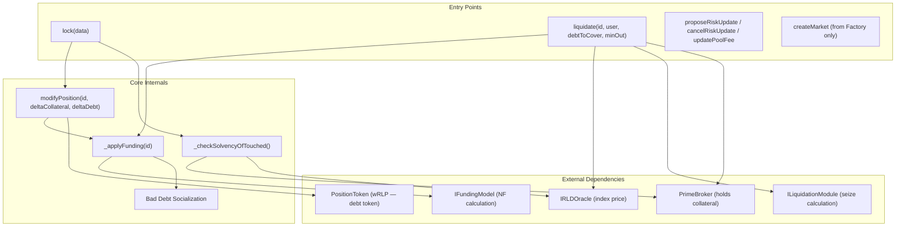
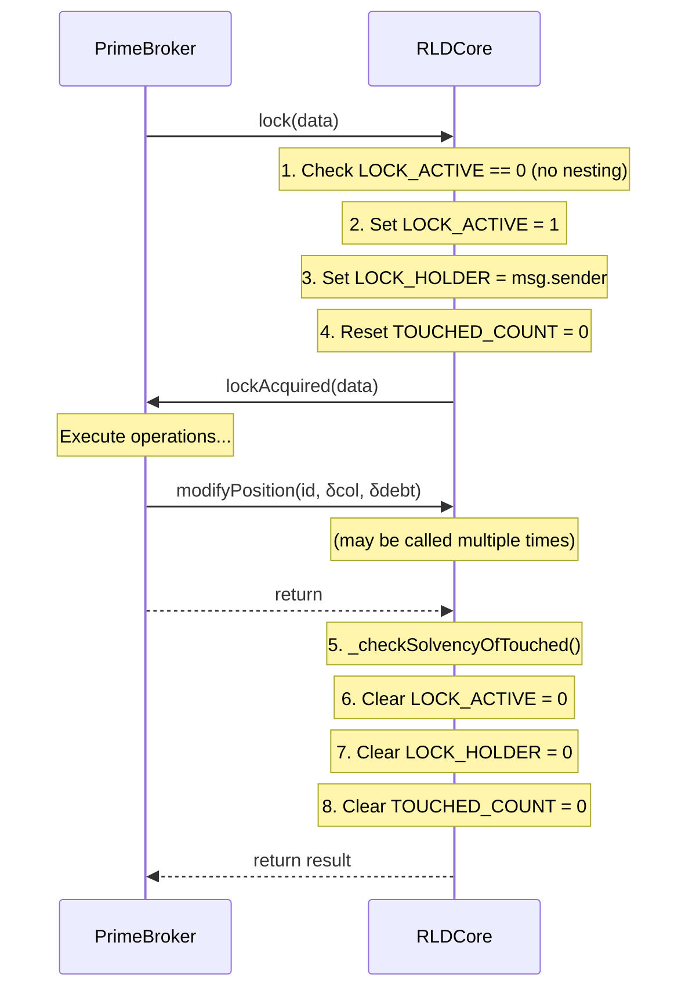
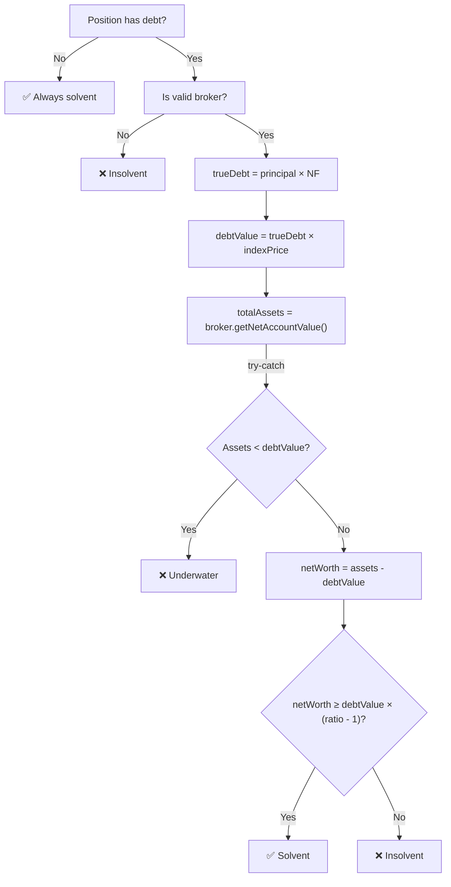
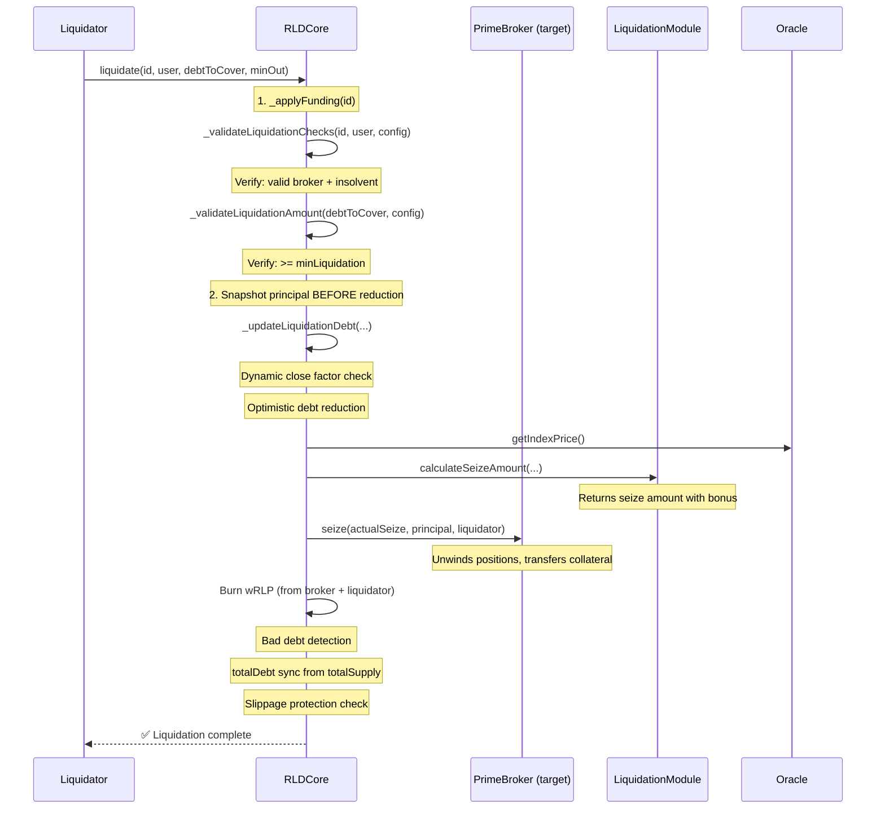

# RLD Core Singleton — Paranoid Reference

Every opcode-level detail of the RLD Core, traced directly from source.

> [!IMPORTANT]
> This document covers [RLDCore.sol](file:///home/ubuntu/RLD/contracts/src/rld/core/RLDCore.sol) — the central singleton managing all markets, positions, funding, and liquidations. Storage is defined in [RLDStorage.sol](file:///home/ubuntu/RLD/contracts/src/rld/core/RLDStorage.sol). Interface in [IRLDCore.sol](file:///home/ubuntu/RLD/contracts/src/shared/interfaces/IRLDCore.sol).

---

## Architecture Overview



### Key Design Decisions

| Decision                            | Rationale                                                                                       |
| ----------------------------------- | ----------------------------------------------------------------------------------------------- |
| **Core does NOT hold collateral**   | Collateral is managed by PrimeBroker contracts; Core only tracks debt principal                 |
| **Flash accounting (lock pattern)** | Inspired by V4 — allows multiple operations in one tx, solvency checked at end                  |
| **Lazy funding**                    | NF only updates on first interaction per block, saving gas on idle markets                      |
| **Dual solvency ratios**            | Minting uses `minColRatio` (strict); maintenance uses `maintenanceMargin` (lenient)             |
| **wRLP = debt token**               | `totalSupply()` is the single source of truth for total debt; principal in storage is secondary |

---

## 0. Constructor & Immutables

[Source: lines 104-112](file:///home/ubuntu/RLD/contracts/src/rld/core/RLDCore.sol#L104-L112)

```solidity
constructor(address _factory, address _poolManager, address _twamm) {
    require(_factory != address(0), "Invalid factory");
    require(_poolManager != address(0), "Invalid poolManager");
    factory = _factory;
    poolManager = _poolManager;
    twamm = _twamm;    // Can be address(0) for testing
}
```

| Immutable     | Validated            | Purpose                                  |
| ------------- | -------------------- | ---------------------------------------- |
| `factory`     | `!= address(0)` ✅   | Only caller allowed for `createMarket()` |
| `poolManager` | `!= address(0)` ✅   | For V4 pool fee updates                  |
| `twamm`       | **Not validated** ⚠️ | Can be `address(0)` for testing          |

---

## 1. Storage Layout

Defined in [RLDStorage.sol](file:///home/ubuntu/RLD/contracts/src/rld/core/RLDStorage.sol#L38-L163).

### 1a. Permanent Storage (Standard EVM)

| Mapping                  | Type                | Purpose                                              |
| ------------------------ | ------------------- | ---------------------------------------------------- |
| `marketAddresses[id]`    | `MarketAddresses`   | Immutable infra addresses (oracles, tokens, modules) |
| `marketConfigs[id]`      | `MarketConfig`      | Risk parameters (mutable via curator timelock)       |
| `marketStates[id]`       | `MarketState`       | Dynamic state: NF, totalDebt, lastUpdate, badDebt    |
| `positions[id][user]`    | `Position`          | Per-user debt principal only                         |
| `marketExists[id]`       | `bool`              | O(1) existence check                                 |
| `pendingRiskUpdates[id]` | `PendingRiskUpdate` | Queued curator parameter changes                     |
| `CONFIG_TIMELOCK`        | `7 days`            | Delay before risk updates auto-apply                 |

### 1b. Transient Storage (EIP-1153)

Auto-cleared at end of transaction. Used for flash accounting:

| Key                 | Derivation                           | Purpose                                   |
| ------------------- | ------------------------------------ | ----------------------------------------- |
| `LOCK_HOLDER_KEY`   | `keccak256("RLD.LOCK_HOLDER")`       | Address of current lock holder            |
| `LOCK_ACTIVE_KEY`   | `keccak256("RLD.LOCK_ACTIVE")`       | Reentrancy guard for nested locks         |
| `TOUCHED_COUNT_KEY` | `keccak256("RLD.TOUCHED_COUNT")`     | Number of positions modified              |
| `TOUCHED_LIST_BASE` | `keccak256("RLD.TOUCHED_LIST_BASE")` | Array of `(MarketId, account)` pairs      |
| `ACTION_SALT`       | `keccak256("RLD.ACTION_SALT")`       | Salt for per-position action type hashing |

---

## 2. Access Control

Four modifiers gate all mutations:

| Modifier          | Check                                       | Used By                                                        |
| ----------------- | ------------------------------------------- | -------------------------------------------------------------- |
| `onlyFactory`     | `msg.sender == factory`                     | `createMarket()`                                               |
| `onlyLock`        | `LOCK_HOLDER_KEY != 0`                      | `modifyPosition()`                                             |
| `onlyLockHolder`  | `msg.sender == LOCK_HOLDER_KEY`             | `modifyPosition()`                                             |
| `onlyCurator(id)` | `msg.sender == marketAddresses[id].curator` | `proposeRiskUpdate()`, `cancelRiskUpdate()`, `updatePoolFee()` |

Additionally:

- `liquidate()` uses OZ `nonReentrant` — **permissionless** (anyone can call)
- `lock()` uses `LOCK_ACTIVE_KEY` as a custom reentrancy guard (HIGH-001 fix)

---

## 3. Flash Accounting: `lock()`

[Source: lines 233-274](file:///home/ubuntu/RLD/contracts/src/rld/core/RLDCore.sol#L233-L274)



### Critical Invariant

> All positions touched during a lock session **must be solvent** when the lock is released. If any position fails solvency, **the entire transaction reverts** — including all operations performed inside the callback.

### Reentrancy Protection (HIGH-001)

```solidity
if (TransientStorage.tload(LOCK_ACTIVE_KEY) != 0) {
    revert ReentrancyGuardActive();
}
```

This prevents nested `lock()` calls that could bypass the solvency check. Without this, a malicious broker could:

1. Acquire lock → borrow heavily
2. Call `lock()` again from within callback → release inner lock without solvency check on outer operations

---

## 4. Position Management: `modifyPosition()`

[Source: lines 302-388](file:///home/ubuntu/RLD/contracts/src/rld/core/RLDCore.sol#L302-L388)

Six-step pipeline, callable only during an active lock by the lock holder:

### 4.1 Apply Funding (Lazy)

```solidity
_applyFunding(id);
```

Updates `normalizationFactor` if stale. See [Section 6](#6-funding-application-_applyfunding) for details.

### 4.2 Update Debt Principal

```solidity
uint256 newDebt = _applyDelta(pos.debtPrincipal, deltaDebt);
pos.debtPrincipal = uint128(newDebt);
```

`_applyDelta` adds a signed delta to a uint128, reverting on underflow. Note: this is the **principal** (pre-NF), not the "true debt" (principal × NF).

### 4.3 Tokenize Debt Changes (wRLP)

| deltaDebt | Action | Token Operation                          |
| --------- | ------ | ---------------------------------------- |
| `> 0`     | Borrow | `PositionToken.mint(msg.sender, amount)` |
| `< 0`     | Repay  | `PositionToken.burn(msg.sender, amount)` |
| `= 0`     | No-op  | —                                        |

### 4.4 Debt Cap Enforcement

```solidity
uint128 cap = _getEffectiveConfig(id).debtCap;
if (cap < type(uint128).max) {
    uint256 trueTotalDebt = totalSupply().mulWad(normalizationFactor);
    if (trueTotalDebt > cap) revert DebtCapExceeded();
}
```

> [!WARNING]
> **F-07**: Debt cap is enforced in **economic terms** (principal × NF), not raw principal. As NF drifts: NF=0.5 allows 2× more principal; NF=2.0 allows half. `cap = type(uint128).max` means unlimited (skip entirely).

### 4.5 Action Type Tracking

Transient storage tracks the **most restrictive** action per position per lock session:

| Type | Meaning                       | Solvency Ratio Used      |
| ---- | ----------------------------- | ------------------------ |
| 0    | Default (no action)           | `maintenanceMargin`      |
| 1    | Maintenance (repay, withdraw) | `maintenanceMargin`      |
| 2    | Minting (borrow)              | `minColRatio` (stricter) |

```solidity
// Only upgrade, never downgrade — most restrictive wins
if (newType > currentType) {
    TransientStorage.tstore(actionKey, newType);
}
```

### 4.6 Add to Touched List

```solidity
_addTouchedPosition(id, msg.sender);
```

Appends `(MarketId, account)` to transient array. **No deduplication** — harmless redundancy, cheaper than checking.

---

## 5. Solvency Checking

[Source: lines 397-503](file:///home/ubuntu/RLD/contracts/src/rld/core/RLDCore.sol#L397-L503)

### 5a. `_checkSolvencyOfTouched()`

Iterates all touched positions and calls `_checkSolvency()` with the appropriate ratio:

```solidity
uint256 requiredRatio = actionType == 2
    ? config.minColRatio       // Minting = strict
    : config.maintenanceMargin; // Everything else = lenient
```

### 5b. `_isSolvent()` — The Core Equation



**Key details:**

| Step                | Code                                         | Notes                                            |
| ------------------- | -------------------------------------------- | ------------------------------------------------ |
| Broker verification | `IBrokerVerifier.isValidBroker(user)`        | Non-brokers are always insolvent                 |
| True debt           | `principal.mulWad(normalizationFactor)`      | Accounts for accrued interest                    |
| Debt value          | `trueDebt.mulWad(indexPrice)`                | In collateral terms                              |
| Assets              | `IPrimeBroker(user).getNetAccountValue()`    | **try-catch**: revert → insolvent (HIGH-003 fix) |
| Net worth           | `totalAssets - debtValue`                    | Prevents double-counting wRLP                    |
| Margin check        | `netWorth >= debtValue.mulWad(ratio - 1e18)` | E.g., 150% → netWorth ≥ 50% of debt              |

> [!IMPORTANT]
> **Why subtract first?** The broker's `getNetAccountValue()` includes wRLP tokens in its assets. Since wRLP = debt obligation, we subtract `debtValue` first to get **net worth**, then check if net worth covers the margin requirement. This avoids double-counting.

---

## 6. Funding Application: `_applyFunding()`

[Source: lines 520-572](file:///home/ubuntu/RLD/contracts/src/rld/core/RLDCore.sol#L520-L572)

Called lazily on first interaction per block. Two-phase operation:

### 6a. Normalization Factor Update

```solidity
(uint256 newNormFactor, int256 fundingRate) = IFundingModel(fundingModel)
    .calculateFunding(id, address(this), oldNormFactor, lastUpdateTimestamp);

state.normalizationFactor = uint128(newNormFactor);
```

The external `IFundingModel` computes the new NF based on time elapsed and market conditions. NF **compounds** — it is a multiplier applied to all debt principals:

- `NF = 1.0` → debt equals principal
- `NF = 1.05` → everyone owes 5% more than their principal
- `NF = 0.95` → everyone owes 5% less (negative funding)

> [!NOTE]
> **Event ordering (FIXED):** The `FundingApplied` event is emitted **after** bad debt socialization so that its `newNormFactor` field reflects the true final NF (including both the funding model output AND the bad debt chunk inflation). Previously it was emitted before bad debt bleeding, causing indexers to see a stale intermediate NF.

### 6b. Bad Debt Socialization (Bleeding)

```solidity
if (state.badDebt > 0 && timeDelta > 0) {
    uint256 supply = PositionToken(positionToken).totalSupply();
    uint256 minChunk = supply / MIN_CHUNK_DIVISOR;           // 0.0001% floor
    uint256 chunk = (badDebt * timeDelta) / BAD_DEBT_PERIOD; // Linear over 7 days
    if (chunk < minChunk) chunk = minChunk;                  // Floor
    if (chunk > state.badDebt) chunk = state.badDebt;        // Cap at remaining

    state.normalizationFactor += uint128((chunk * 1e18) / supply);
    state.badDebt -= uint128(chunk);
}
```

| Constant            | Value     | Purpose                           |
| ------------------- | --------- | --------------------------------- |
| `BAD_DEBT_PERIOD`   | 7 days    | Socialization window              |
| `MIN_CHUNK_DIVISOR` | 1,000,000 | Minimum chunk = 0.0001% of supply |

**Mechanism:** Bad debt from liquidations is gradually socialized across all debt holders by inflating the normalization factor. This means everyone's real debt increases slightly, absorbing the loss collectively.

> [!CAUTION]
> **`applyFunding()` external wrapper exists** (line 578). Marked as `TODO: REMOVE BEFORE PRODUCTION`. This allows anyone to trigger funding application externally — useful for testing but could be used to front-run NF changes in production.

---

## 7. Liquidation Pipeline

[Source: lines 623-878](file:///home/ubuntu/RLD/contracts/src/rld/core/RLDCore.sol#L623-L878)

**Permissionless** — anyone can call if position is below maintenance margin.



### 7a. Validation: `_validateLiquidationChecks()`

[Source: lines 675-691](file:///home/ubuntu/RLD/contracts/src/rld/core/RLDCore.sol#L675-L691)

1. **Broker validity** — must pass `IBrokerVerifier.isValidBroker(user)`, else `InvalidBroker`
2. **Insolvency** — must be below `maintenanceMargin`, else `UserSolvent`

### 7b. Validation: `_validateLiquidationAmount()`

```solidity
if (debtToCover < config.minLiquidation) revert("Liquidation amount too small");
```

### 7c. Debt Update: `_updateLiquidationDebt()`

[Source: lines 702-749](file:///home/ubuntu/RLD/contracts/src/rld/core/RLDCore.sol#L702-L749)

**Dynamic close factor (Aave-style):**

| Condition                                | Close Factor                                      |
| ---------------------------------------- | ------------------------------------------------- |
| `totalAssets >= debtValue` (above water) | Enforced: `debtToCover <= trueDebt × closeFactor` |
| `totalAssets < debtValue` (underwater)   | **Bypassed**: 100% liquidation allowed            |

```solidity
principalToCover = debtToCover.divWad(normFactor);
pos.debtPrincipal = principal - uint128(principalToCover);  // Optimistic reduction
```

### 7d. Seize Calculation: `_calculateLiquidationSeize()`

[Source: lines 751-800](file:///home/ubuntu/RLD/contracts/src/rld/core/RLDCore.sol#L751-L800)

- **Debt price**: `min(indexPrice, spotPrice)` — conservative for liquidator
- **Collateral price**: `1e18` (collateral IS the unit of account)
- Uses the **pre-reduction principal snapshot** (not post-optimistic-reduction) for correct health score
- Delegates to external `ILiquidationModule.calculateSeizeAmount()`

### 7e. Settlement: `_settleLiquidation()`

[Source: lines 802-878](file:///home/ubuntu/RLD/contracts/src/rld/core/RLDCore.sol#L802-L878)

**Negative equity protection:**

```solidity
if (seizeAmount > availableCollateral) {
    actualSeizeAmount = availableCollateral;
    // Pro-rata reduce principal covered
    // Restore uncovered principal to pos.debtPrincipal
}
```

**wRLP burn split:**

| Source            | Amount                                             | Condition        |
| ----------------- | -------------------------------------------------- | ---------------- |
| Broker's own wRLP | `min(seizeOutput.wRLPExtracted, principalToCover)` | Broker held wRLP |
| Liquidator's wRLP | `principalToCover - wRLPFromBroker`                | Remainder        |

**Bad debt detection (post-liquidation):**

```solidity
if (pos.debtPrincipal > 0 && seizeAmount > availableCollateral) {
    state.badDebt += pos.debtPrincipal;
    pos.debtPrincipal = 0;  // Fully clear position
}
```

If the position still has debt after all collateral was seized, the remaining is registered as bad debt and socialized via NF inflation (Section 6b).

**Final steps:**

- Sync `totalDebt` from `totalSupply()` (F-01 fix)
- Slippage protection: `require(collateralSeized >= minCollateralOut)`

---

## 8. Curator Governance

### 8a. `proposeRiskUpdate()`

[Source: lines 1010-1060](file:///home/ubuntu/RLD/contracts/src/rld/core/RLDCore.sol#L1010-L1060)

Only callable by `marketAddresses[id].curator`. Validates all parameters (same rules as factory), then stores a pending update with `executeAt = block.timestamp + 7 days`.

**Validated parameters:**

| Parameter           | Rule                      | Revert                  |
| ------------------- | ------------------------- | ----------------------- |
| `minColRatio`       | `> 1e18`                  | `"MinCol <= 100%"`      |
| `maintenanceMargin` | `>= 1e18`                 | `"Maintenance < 100%"`  |
| `minColRatio`       | `> maintenanceMargin`     | `"Risk Config Error"`   |
| `closeFactor`       | `> 0 && <= 1e18`          | `"Invalid CloseFactor"` |
| `fundingPeriod`     | `>= 1 day && <= 365 days` | `"Invalid period"`      |

### 8b. `cancelRiskUpdate()`

[Source: lines 1065-1073](file:///home/ubuntu/RLD/contracts/src/rld/core/RLDCore.sol#L1065-L1073)

Only callable by curator. Deletes the pending update.

### 8c. `_getEffectiveConfig()` — Lazy Timelock Application

[Source: lines 1146-1169](file:///home/ubuntu/RLD/contracts/src/rld/core/RLDCore.sol#L1146-L1169)

```solidity
if (pending.pending && block.timestamp >= pending.executeAt) {
    // Return config with pending changes applied (in memory)
    config.minColRatio = pending.minColRatio;
    // ... all other fields ...
    return config;
}
return marketConfigs[id]; // No pending or not yet expired
```

> [!WARNING]
> **The pending update is never written to storage — it's applied in-memory every time `_getEffectiveConfig()` is called.** This means `pendingRiskUpdates[id]` persists forever even after activation. A new `proposeRiskUpdate()` overwrites it, or `cancelRiskUpdate()` deletes it.

### 8d. `updatePoolFee()`

[Source: lines 1080-1126](file:///home/ubuntu/RLD/contracts/src/rld/core/RLDCore.sol#L1080-L1126)

**Immediate (no timelock)**. Curator can change V4 pool fee instantly.

| Validation       | Rule                       |
| ---------------- | -------------------------- |
| Market exists    | `marketExists[id]`         |
| TWAMM configured | `twamm != address(0)`      |
| Fee bounds       | `newFee <= 1000000` (100%) |

> [!CAUTION]
> Uses hardcoded `tickSpacing: 60` when building the PoolKey. Comment says "Real implementation should store tickSpacing in MarketAddresses." This could cause `updatePoolFee()` to construct a wrong PoolKey if the market uses a different tick spacing.

---

## 9. View Functions

| Function                          | Returns             | Notes                                                                 |
| --------------------------------- | ------------------- | --------------------------------------------------------------------- |
| `isSolvent(id, user)`             | `bool`              | Uses current NF (may be stale)                                        |
| `isSolventAfterFunding(id, user)` | `bool`              | **F-06 fix**: Simulates pending NF update for accurate off-chain view |
| `isValidMarket(id)`               | `bool`              | O(1) lookup                                                           |
| `getMarketState(id)`              | `MarketState`       | NF, totalDebt, lastUpdate, badDebt                                    |
| `getMarketAddresses(id)`          | `MarketAddresses`   | All infra addresses                                                   |
| `getMarketConfig(id)`             | `MarketConfig`      | Effective config (with timelock applied)                              |
| `getPosition(id, user)`           | `Position`          | `debtPrincipal` only — collateral is in broker                        |
| `getPendingRiskUpdate(id)`        | `PendingRiskUpdate` | Queued curator change                                                 |

---

## 10. Invariants Summary

| ID         | Invariant                                        | Enforced By                        |
| ---------- | ------------------------------------------------ | ---------------------------------- |
| **INV-01** | All touched positions solvent after lock release | `_checkSolvencyOfTouched()`        |
| **INV-02** | No nested locks                                  | `LOCK_ACTIVE_KEY` reentrancy guard |
| **INV-03** | Only lock holder can modify positions            | `onlyLockHolder` modifier          |
| **INV-04** | Minting uses stricter ratio than maintenance     | Action type 2 → `minColRatio`      |
| **INV-05** | `totalDebt` synced from `totalSupply()`          | Updated after every debt change    |
| **INV-06** | Debt cap in economic terms                       | `totalSupply × NF > cap` reverts   |
| **INV-07** | Liquidation only if below maintenance            | `_isSolvent()` check               |
| **INV-08** | Close factor bypassed when underwater            | Dynamic Aave-style                 |
| **INV-09** | Bad debt linearly socialized over 7 days         | NF inflation via chunk             |
| **INV-10** | Risk updates require 7-day timelock              | `CONFIG_TIMELOCK = 7 days`         |
| **INV-11** | Only factory can create markets                  | `onlyFactory` modifier             |
| **INV-12** | Only curator can propose risk changes            | `onlyCurator(id)` modifier         |

---

## 11. Known Issues & TODOs

| ID           | Issue                                                                             | Severity | Location                           |
| ------------ | --------------------------------------------------------------------------------- | -------- | ---------------------------------- |
| **TODO-01**  | `applyFunding()` external wrapper should be removed before production             | Medium   | Line 578                           |
| **TODO-02**  | `updatePoolFee()` uses hardcoded `tickSpacing: 60`                                | Medium   | Line 1106                          |
| **TODO-03**  | `_getEffectiveConfig()` never writes pending update to storage (persists forever) | Low      | Line 1146                          |
| **TODO-04**  | `deltaCollateral` parameter in `modifyPosition()` is unused (interface compat)    | Info     | Line 307                           |
| **FIXED-01** | `FundingApplied` event emitted stale NF (before bad debt socialization)           | Medium   | Line 544 → moved to after bad debt |
